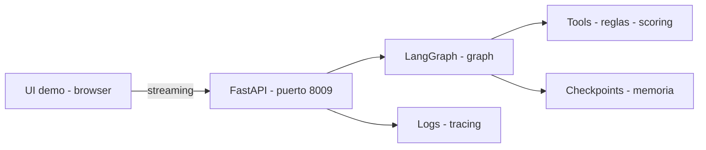

# 🚀 LangGraph – 25 casos del mundo real (repo de demos)

## 🧭 ¿Por dónde empezar? (Elige tu camino)

| Si eres... | Te recomendamos leer... | ¿Qué aprenderás? |
| :--- | :--- | :--- |
| **💼 Reclutador / Manager** | [**Guía para Reclutadores**](RECRUITER.md) | Valor de negocio, madurez técnica y casos de éxito. |
| **💻 Desarrollador / DevOps** | [**Caso 09 (Standard)**](cases/09-rrhh-screening-agenda/README.md) | Implementación real: FastAPI, streaming y resiliencia. |
| **🔒 Experto en Seguridad** | [**SECURITY.md**](SECURITY.md) | Detalles de SAST, Secret Scanning y endurecimiento. |
| **🛠️ Contribuidor** | [**CONTRIBUTING.md**](CONTRIBUTING.md) | Cómo completar los scaffolds de los casos 01–25. |

---

## 🚀 Hub CLI (Novedad)
Este repo incluye un **Hub CLI** estandarizado para gestionar los casos sin romper la estructura original.
```bash
python hub.py list      # Listar casos y su estado
python hub.py doctor    # Verificar entorno
make case-up CASE=09    # Levantar un caso específico
```
> [!NOTE]
> El Hub es completamente **opcional** y respeta la filosofía Python-first del repo.
> Ver documentación completa en [docs/HUB.md](docs/HUB.md).

> [!TIP]
> **👔 ¿Eres reclutador/a?** Lee la [Guía para Reclutadores](RECRUITER.md) para una evaluación rápida del proyecto (5 min).

[](https://github.com/vladimiracunadev-create/langgraph-realworld/actions/workflows/ci.yml)
[](https://github.com/vladimiracunadev-create/langgraph-realworld/actions/workflows/security.yml)
[](https://github.com/pre-commit/pre-commit)

Repositorio de portafolio con **25 escenarios reales** donde **LangGraph** brilla: flujos con **estado**, **rutas condicionales**, **tools**, **memoria**, **checkpoints** y una capa sólida de **resiliencia**.

**TL;DR (30s):**
- ✅ **Caso 09** completo: **FastAPI + LangGraph** + **Resiliencia (Tenacity)** + **UI streaming**.
- 🚧 **Casos 01–08 y 10–25**: scaffold + UI demo para completar lógica real.
- 🧪 **Enfoque portafolio**: estructura repetible + CI + demos navegables.

----

## 🛡️ Seguridad
Este repositorio aplica prácticas modernas de seguridad:
- **Secret Scanning**: Pre-commit hooks (`detect-secrets`) y escaneo en CI.
- **Supply Chain**: Escaneo de dependencias en `requirements.txt`.
- **Infrastructure Hardening**:
  - Contenedores **Non-Root** (usuario 1000/101).
  - Políticas de red (NetworkPolicies) restrictivas.
  - Tags de imagen fijos (no `latest`).
- **Ver más**: Consulta [SECURITY.md](SECURITY.md) y [killed.md](killed.md) para detalles técnicos.

---

## 🚦 Estado del repo
- ✅ **Caso 09 (RR.HH. Screening + Agenda)**: implementado (backend + UI streaming).
- 🚧 Casos 01–08 y 10–25: scaffold + demo UI (plantilla).

---

## 📚 Índice de casos (resumen rápido)

| Caso | Nombre | Estado |
|------|--------|--------|
| 09 | RR.HH. Screening + Agenda | ✅ Implementado (Standardized) |
| 01 | Soporte Cliente Omnicanal | 🚧 Scaffold (Standardized) |
| 02–08 | Varios | 🚧 Scaffold (Legacy) |
| 10–25 | Varios | 🚧 Scaffold (Legacy) |

---

## 🛠️ Estructura
- Cada caso vive en: `cases/<NN>-<slug>/`
- Índice moderno: `indexado.html` (raíz)
- Caso 09 completo:
  - `cases/09-rrhh-screening-agenda/backend/` (FastAPI + LangGraph)
  - `cases/09-rrhh-screening-agenda/data/` (datos simulados)
  - `cases/09-rrhh-screening-agenda/demo/` (UI estática que apunta a `localhost:8009`)

---

## 🏗️ Arquitectura Caso 09 (alto nivel)


