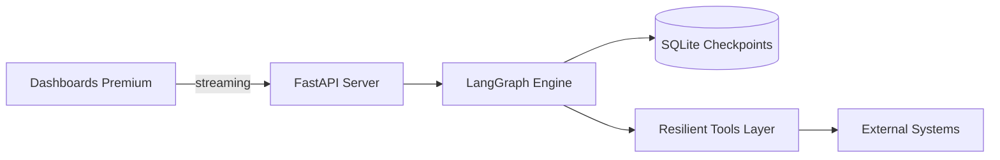

# 🚀 LangGraph – Agentic Resilience Hub

**Portafolio de arquitectura de agentes con estado, flujos cíclicos y capas de resiliencia empresarial.** Este repositorio demuestra cómo llevar LangGraph a producción con un enfoque en seguridad, observabilidad y recuperación ante fallos.

---

## 🛠️ Mejoras Recientes e Implementaciones (v3.1.0)

Para elevar el proyecto a un estándar profesional "Real-World", se han realizado las siguientes modificaciones:

1.  **Punto de Entrada Unificado**: Consolidación del portal premium en **`index.html`** (eliminando `indexado.html`).
2.  **Diseño Premium**: Implementación de tipografía **Inter** y efectos **Glassmorphism** avanzados.
3.  **Resiliencia Activa**: Persistencia en **SQLite** mediante `SqliteSaver` y lógica de reintento en hilos.
4.  **Dual-Mode Execution**: Soporte para **Modo IA Real** (LLM) y **Modo Instant Demo** (Mock).
5.  **Interconectividad**: Sincronización global de links y reconstrucción de la Wiki técnica.

> [!TIP]
> Consulta el historial técnico detallado en el [CHANGELOG.md](CHANGELOG.md).

---

## 🧭 ¿Por dónde empezar? (Rutas Personalizadas)

| Perfil | Ruta Recomendada | Objetivo |
| :--- | :--- | :--- |
| **💼 Reclutador / Manager** | [**Guía para Reclutadores**](RECRUITER.md) | Entender el valor de negocio y madurez técnica. |
| **💻 Desarrollador / DevOps** | [**Caso 09 (Reference Case)**](cases/09-rrhh-screening-agenda/README.md) | Explorar código real: FastAPI, streaming y grafos. |
| **🔒 Experto en Seguridad** | [**SECURITY.md**](SECURITY.md) | Analizar protocolos de SAST y Hardening. |
| **🐣 Principiante** | [**Guía para Principiantes**](docs/BEGINNERS_GUIDE.md) | Primeros pasos con el repo y el Hub. |

---

## 🏗️ Arquitectura de Alto Nivel



---

## 🚀 Operación del Hub (Orquestación)

Gestiona los 25 casos de forma centralizada. El **Hub CLI** (`hub.py`) es una herramienta en Python que orquesta tanto la ejecución local como el lanzamiento de contenedores Docker.

```bash
# 1. Operación Directa (Nivel 1: Laboratorio)
python serve_site.py             # Portal 8080
python cases/09-*/backend/mock_api.py   # Backend 8009

# 2. Operación vía Hub (Nivel 2: Orquestación)
python hub.py list      # Listar casos y su estado
python hub.py doctor    # Verificar salud del entorno
make case-up CASE=09    # Lanzar Caso 09 (Usa Docker si está disponible)
```

> [!NOTE]
> Para una guía completa de despliegue (Docker, K8s, Local), consulta la [**Guía de Instalación**](docs/INSTALL.md).

---

## 🛡️ Seguridad y Gobernanza

Este repositorio aplica un modelo de **Defensa en Profundidad**:

- 🔍 **Secret Scanning**: Auditoría constante con `detect-secrets`.
- 📦 **Non-Root Containers**: Aislamiento de privilegios en todas las imágenes.
- 🔄 **Exponential Backoff**: Resiliencia ante fallos de APIs externas mediante `tenacity`.
- 📜 **Killed.md**: Documentación de antipatrones prohibidos en el desarrollo.

---

## 📚 Documentación Técnica Completa

- 🏗️ [**Arquitectura Detallada**](docs/ARCHITECTURE.md): Diagramas y motor de persistencia.
- 🛠️ [**Especificaciones Técnicas**](docs/TECHNICAL_SPECS.md): Tech stack y contratos de API.
- 📋 [**Requisitos del Sistema**](docs/REQUIREMENTS.md): Hardware y compatibilidad.
- 🛣️ [**Roadmap**](ROADMAP.md): Hitos y visión a futuro.

---

[](https://github.com/vladimiracunadev-create/langgraph-realworld/actions/workflows/ci.yml)
[](https://github.com/vladimiracunadev-create/langgraph-realworld/actions/workflows/security.yml)
[](LICENSE)

---
> [!IMPORTANT]
> **He diseñado este repositorio para que sea fácil de auditar.** El **Caso 09** es el punto de referencia para evaluar mi capacidad de integrar IA en flujos de trabajo empresariales complejos.
