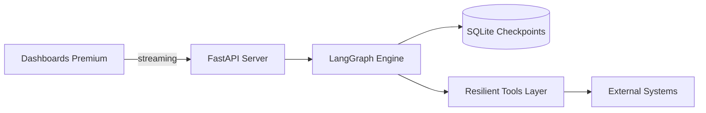

# 🚀 LangGraph – Agentic Resilience Hub (25 Real World Cases)

---

## 🛠️ Mejoras Recientes e Implementaciones

Para elevar el proyecto a un estándar profesional "Real-World", se han realizado las siguientes modificaciones y mejoras:

1.  **Punto de Entrada Unificado**: Se eliminó `indexado.html` y se consolidó todo el portal premium en **`index.html`**, eliminando redirecciones y simplificando el acceso.
2.  **Diseño Premium (UI/UX)**:
    - Implementación de la tipografía **Inter** en todo el ecosistema.
    - Aplicación de **Glassmorphism** avanzado (backdrop-filter) en los dashboards.
    - Refactorización visual del Caso 09 para coincidir con estándares corporativos.
3.  **Resiliencia y Residencia de Datos**:
    - Documentación técnica sobre la persistencia en **SQLite** mediante `SqliteSaver` de LangGraph.
    - Soporte para recuperación de hilo mediante `thread_id`.
4.  **Flexibilidad de Ejecución (4 Modos)**:
    - **Modo Desarrollador**: Scripts `serve_site.py` y `mock_api.py` para correr todo sin Docker.
    - **Modo IA Requerido**: Guía clara para activar el motor real de agentes usando `.env`.
5.  **Conectividad Robusta**: Sincronización masiva de links internos para asegurar que la navegación entre el portal (Puerto 8080) y los demos (Puerto 8009) sea bidireccional y sin errores.
6.  **Wiki Reconstruida**: Mapeo completo de la documentación técnica local hacia la Wiki de GitHub para mantener una fuente de verdad única y profesional.

---

**Portafolio de arquitectura de agentes con estado, flujos cíclicos y capas de resiliencia empresarial.** Este repositorio demuestra cómo llevar LangGraph a producción con un enfoque en seguridad, observabilidad y recuperación ante fallos.

---

## 🧭 ¿Por dónde empezar? (Elige tu camino)

| Si eres... | Te recomendamos leer... | ¿Qué aprenderás? |
| :--- | :--- | :--- |
| **💼 Reclutador / Manager** | [**Guía para Reclutadores**](RECRUITER.md) | Valor de negocio, madurez técnica y casos de éxito. |
| **💻 Desarrollador / DevOps** | [**Caso 09 (Reference Case)**](cases/09-rrhh-screening-agenda/README.md) | Implementación real: FastAPI, streaming y resiliencia. |
| **🔒 Experto en Seguridad** | [**SECURITY.md**](SECURITY.md) | Detalles de SAST, Secret Scanning y endurecimiento. |
| **🐣 Principiante** | [**Guía para Principiantes**](docs/BEGINNERS_GUIDE.md) | Recorrido por las carpetas y conceptos básicos. |
| **🛠️ Dev Senior** | [**Especs Técnicas**](docs/TECHNICAL_SPECS.md) | Stack, patrones 12-factor y contratos de salud. |

---

## 🚀 Hub CLI (Novedad)
Gestiona los 25 casos de forma estandarizada con nuestra herramienta centralizada.
```bash
python hub.py list      # Listar casos y su estado
python hub.py doctor    # Verificar entorno
make case-up CASE=09    # Levantar un caso específico
```
> [!NOTE]
> El Hub es completamente **opcional** y respeta la filosofía Python-first del repo. Documentación en [docs/HUB.md](docs/HUB.md).

---

## 🛡️ Seguridad (Defense in Depth)

Este repositorio aplica un modelo de **Defensa en Profundidad**:

| Capa | Práctica | Propósito |
| :--- | :--- | :--- |
| **Código** | `tenacity` retries | Resiliencia ante fallos de APIs externas. |
| **Estática** | `detect-secrets` | Auditoría de secretos en tiempo de commit/CI. |
| **Infra** | `Non-Root Docker` | Aislamiento de privilegios en contenedores. |
| **Red** | `K8s NetPol` | Políticas de red restrictivas por defecto. |
| **Observabilidad** | `JSON Logging` | Trazabilidad estructurada para debugging. |

---

## 🏗️ Arquitectura de Alto Nivel



---

## 📚 Documentación Avanzada

- 🏗️ [**Arquitectura Detallada**](docs/ARCHITECTURE.md): Diagramas de flujo y secuenciales.
- 🚀 [**Guía de Instalación**](docs/INSTALL.md): Despliegue en local, Docker y K8s.
- 📋 [**Requisitos**](docs/REQUIREMENTS.md): Hardware, software y compatibilidad.
- 🛠️ [**Especificaciones Técnicas**](docs/TECHNICAL_SPECS.md): Estándares y tech stack.
- 📅 [**Roadmap**](ROADMAP.md): Próximos pasos y hitos.
- ❌ [**Killed.md**](killed.md): Listado de prácticas prohibidas.

---

[](https://github.com/vladimiracunadev-create/langgraph-realworld/actions/workflows/ci.yml)
[](https://github.com/vladimiracunadev-create/langgraph-realworld/actions/workflows/security.yml)
[](https://github.com/pre-commit/pre-commit)

---
> [!TIP]
> **👔 ¿Buscando talento?** He diseñado este repositorio para que sea fácil de auditar técnicamente. Recomiendo empezar por el **Caso 09**.
