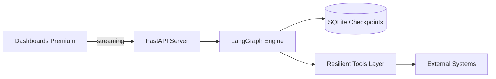

# 🚀 LangGraph – Agentic Resilience Hub

[](https://github.com/vladimiracunadev-create/langgraph-realworld/actions/workflows/ci.yml)
[](https://github.com/vladimiracunadev-create/langgraph-realworld/actions/workflows/security.yml)
[](LICENSE)

**Portafolio de arquitectura de agentes con estado, flujos cíclicos y capas de resiliencia empresarial.** Este repositorio demuestra cómo llevar LangGraph a producción con un enfoque en seguridad, observabilidad y recuperación ante fallos.

---

## �️ Implementación Industrial (v3.2.0)

Para elevar el proyecto a un estándar profesional "Real-World", se han realizado las siguientes modificaciones:

1.  **Punto de Entrada Unificado**: Consolidación del portal premium en **`index.html`** (eliminando `indexado.html`).
2.  **Diseño Premium**: Implementación de tipografía **Inter** y efectos **Glassmorphism** avanzados.
3.  **Resiliencia e Integridad**: Persistencia con `SqliteSaver` y validación de estado mediante **Pydantic**.
4.  **Telemetría Ready**: Rastrabilidad de flujos con `trace_id` inyectado en logs JSON.
5.  **Dual-Mode Execution**: Soporte para **Modo IA Real** (LLM) y **Modo Instant Demo** (Mock).
6.  **Interconectividad**: Sincronización global de links y reconstrucción de la Wiki técnica.

> [!TIP]
> Consulta el historial técnico detallado en el [CHANGELOG.md](CHANGELOG.md).

### 🛠️ Taxonomía de Implementación
Para asegurar la transparencia técnica, cada caso se clasifica en uno de estos tres niveles:
- **🛡️ Industrial (v3.3)**: Casos de referencia con FastAPI, Streaming, Pydantic y Observabilidad (Casos 09 y 10).
- **🏗️ Scaffold (v1.0)**: Estándar base con orquestación y Docker Ready (Caso 01).
- **📜 Legacy**: Plantillas de arquitectura para futura expansión.

### 📊 Estado de los Casos

| Case ID | Nombre | Estado | Stack |
| :--- | :--- | :--- | :--- |
| **01** | [Simple Router](cases/01-simple-router/README.md) | `SCAFFOLD` | LangGraph Basics |
| **09** | [RRHH Screening Agenda](cases/09-rrhh-screening-agenda/README.md) | `COMPLETADO` | FastAPI + Sqlite + Pydantic + Resilience |
| **10** | [Onboarding Empleados](cases/10-onboarding-empleados/README.md) | `COMPLETADO` | Multi-node RBAC + LLM Checklist + Notifications |

---

---

## 🧭 ¿Por dónde empezar? (Rutas Personalizadas)

| Perfil | Ruta Recomendada | Objetivo |
| :--- | :--- | :--- |
| **💼 Reclutador / Manager** | [**Guía para Reclutadores**](RECRUITER.md) | Entender el valor de negocio y madurez técnica. |
| **💻 Desarrollador / DevOps** | [**Caso 09 (Reference Case - Industrial)**](cases/09-rrhh-screening-agenda/README.md) | Explorar código real: FastAPI, streaming, Pydantic y grafos. |
| **🔒 Experto en Seguridad** | [**SECURITY.md**](SECURITY.md) | Analizar protocolos de SAST y Hardening. |
| **🐣 Principiante** | [**Guía para Principiantes**](docs/BEGINNERS_GUIDE.md) | Primeros pasos con el repo y el Hub. |

---

## 🏗️ Arquitectura de Alto Nivel


```mermaid
flowchart LR
  UI[Dashboards Premium] -->|streaming| API[FastAPI Server]
  API --> LG[LangGraph Engine]
  LG --> CK[(SQLite Checkpoints)]
  LG --> TL[Resilient Tools Layer]
  TL --> EXT[External Systems]
```

---

## 🚀 Ejecución Unificada (Ecosistema Completo)

Para ver el **Caso 09** (RR.HH. Screening) y el **Caso 10** (Onboarding) funcionando juntos desde el portal central, utiliza Docker. Ambos casos están implementados sobre **FastAPI** y transmiten su progreso en tiempo real utilizando **Streaming NDJSON** (`stream_mode=\"values\"` en LangGraph) hacia sus dashboards web.

> [!WARNING]
> En entornos de desarrollo locales con versiones recientes de Python (ej. Windows con Python 3.14), existen dependencias específicas como `httptools`, `tiktoken` u `ormsgpack` que pueden fallar al no encontrar el compilador local. Por eso, **levantar el ecosistema con Docker es la vía oficial y garantizada**.

### 🐳 Con Docker Compose (Recomendado)

Desde la raíz del repositorio, ejecuta:

```bash
docker compose up --build
```

Esto levantará los tres servicios en paralelo:
- **Portal Principal**: [http://localhost:8080](http://localhost:8080)
- **Caso 09 Backend**: [http://localhost:8009](http://localhost:8009)
- **Caso 10 Backend**: [http://localhost:8010](http://localhost:8010)

## 🏗️ Operación del Hub (Orquestación)

Gestiona los 25 casos de forma centralizada. El **Hub CLI** (`hub.py`) es una herramienta en Python que orquesta tanto la ejecución local como el lanzamiento de contenedores Docker.

```bash
# 1. Operación Directa (Nivel 1: Laboratorio)
python serve_site.py             # Portal 8080
python cases/09-*/backend/mock_api.py   # Backend 8009 (Modo Demo)

# 2. Operación vía Hub (Nivel 2: Orquestación)
python hub.py list      # Listar casos y su estado
python hub.py doctor    # Verificar salud del entorno
make case-up CASE=09    # Lanzar Caso 09 (Usa Docker si está disponible)
```

### 🧠 Activación de la IA Real (OpenAI)
Para habilitar el razonamiento avanzado en el Caso 09 (sustituyendo el modo demo):

1. **Localiza el Destino**: Entra en `cases/09-rrhh-screening-agenda/backend/`.
2. **Crea el Archivo**: Crea un archivo llamado `.env` y pega tu `OPENAI_API_KEY`.
3. **Inicia el Backend**: Ejecuta `cd cases/09-rrhh-screening-agenda/backend && uvicorn src.api:app --port 8009`.

**Mapa de Activación:**
```text
[Raíz del Repo]
└── cases/
    └── 09-rrhh-screening-agenda/
        └── backend/
            └── .env  <-- Crear este archivo aquí
```

### 🔍 Modo Demo vs. IA Real (Híbrido)
El Caso 09 detecta automáticamente la presencia de una API Key y ajusta su "cerebro":

| Característica | 🧪 Modo Demo (Mock) | 🧠 Modo IA Real (OpenAI) |
| :--- | :--- | :--- |
| **Lógica de Scoring** | Basada en reglas fijas (strings/num) | Análisis semántico y contextual |
| **Preguntas Entrevista** | Fallback estático (idéntico) | Generación dinámica y personalizada |
| **Costo** | $0 (Laboratorio local) | Consumo de tokens (Producción) |
| **Resiliencia** | Probada localmente | Usa `tenacity` para reintentar fallos |

> [!NOTE]
> Para una guía completa de despliegue (Docker, K8s, Local), consulta la [**Guía de Instalación**](docs/INSTALL.md).

---

## 🛡️ Seguridad y Gobernanza

Este repositorio aplica un modelo de **Defensa en Profundidad**:

- 🔍 **Secret Scanning**: Auditoría constante con `detect-secrets`.
- 📦 **Non-Root Containers**: Aislamiento de privilegios en todas las imágenes.
- 🔄 **Exponential Backoff**: Resiliencia ante fallos de APIs externas mediante `tenacity`.
- 📜 **Killed.md**: Documentación de antipatrones prohibidos en el desarrollo.

---

## 📚 Documentación Técnica Completa

- 🏗️ [**Arquitectura Detallada**](docs/ARCHITECTURE.md): Diagramas y motor de persistencia.
- 🛠️ [**Especificaciones Técnicas**](docs/TECHNICAL_SPECS.md): Tech stack y contratos de API.
- 📋 [**Requisitos del Sistema**](docs/REQUIREMENTS.md): Hardware y compatibilidad.
- 🛣️ [**Roadmap**](ROADMAP.md): Hitos y visión a futuro.

---


---
> [!IMPORTANT]
> **He diseñado este repositorio para que sea fácil de auditar.** El **Caso 09** es el punto de referencia para evaluar mi capacidad de integrar IA en flujos de trabajo empresariales complejos.
