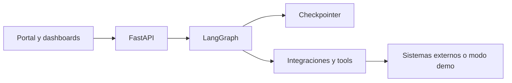

# LangGraph Realworld

[](https://github.com/vladimiracunadev-create/langgraph-realworld/actions/workflows/ci.yml)
[](https://github.com/vladimiracunadev-create/langgraph-realworld/actions/workflows/security.yml)
[](LICENSE)

Portafolio de casos de uso con LangGraph, FastAPI y demos empresariales. El repositorio combina una capa documental fuerte con cuatro casos operables: 01, 09, 10 y 13.

---

## Implementación Industrial (v3.5.0)

El estándar actual del repositorio se apoya en estos pilares:

1. **Portal unificado**: `index.html` como entrada principal para navegar el portafolio.
2. **Casos de referencia reales**: backends FastAPI y UIs activas en los casos 01, 09, 10 y 13.
3. **Estado tipado**: contratos explícitos de estado con `TypedDict` y flujos compatibles con LangGraph.
4. **Observabilidad**: endpoints `/health` y `/ready`, además de trazabilidad por eventos o `trace_id` según el caso.
5. **Modo dual**: demos offline y ruta clara para activar integraciones reales mediante variables de entorno.
6. **Operación portable**: ejecución por Docker, Hub CLI o entorno local según el caso.

> [!TIP]
> Consulta el detalle técnico en [CHANGELOG.md](CHANGELOG.md), [docs/ARCHITECTURE.md](docs/ARCHITECTURE.md) y [docs/TECHNICAL_SPECS.md](docs/TECHNICAL_SPECS.md).

### Taxonomía de Implementación

- **Operational (v3.5.0)**: caso 01 con backend real, ruteo omnicanal, modo DEMO/LIVE y UI operativa.
- **Industrial (v3.4.0)**: casos con backend real, streaming, estado tipado, observabilidad y documentación operativa.
- **Legacy / Scaffold**: demos o plantillas listas para evolucionar sin pretender hoy el mismo nivel operativo.

### Estado de los Casos Clave

| Case ID | Nombre | Estado | Stack principal |
| :--- | :--- | :--- | :--- |
| **01** | [Soporte Cliente Omnicanal](cases/01-soporte-cliente-omnicanal/README.md) | `OPERATIVO` | FastAPI + LangGraph + Routing + DEMO/LIVE |
| **09** | [RRHH Screening Agenda](cases/09-rrhh-screening-agenda/README.md) | `COMPLETADO` | FastAPI + LangGraph + MemorySaver + Resilience |
| **10** | [Onboarding Empleados](cases/10-onboarding-empleados/README.md) | `COMPLETADO` | FastAPI + RBAC + Integrations + MemorySaver |
| **13** | [BI Data Analyst](cases/13-bi-analista-datos/README.md) | `COMPLETADO` | FastAPI + SQL Agent + Chart.js + DEMO/LLM |

---

## ¿Por dónde empezar?

| Perfil | Ruta recomendada | Qué mirar |
| :--- | :--- | :--- |
| Dev / DevOps | [Caso 01](cases/01-soporte-cliente-omnicanal/README.md) | Triage omnicanal, routing y fallback DEMO/LIVE |
| Dev / DevOps | [Caso 09](cases/09-rrhh-screening-agenda/README.md) | Resiliencia, streaming y observabilidad |
| Dev / DevOps | [Caso 10](cases/10-onboarding-empleados/README.md) | Flujo empresarial, RBAC e integraciones |
| Analista / BI | [Caso 13](cases/13-bi-analista-datos/README.md) | SQL seguro, visualización y UX de datos |
| Principiante | [docs/BEGINNERS_GUIDE.md](docs/BEGINNERS_GUIDE.md) | Mapa del repositorio |
| Seguridad | [SECURITY.md](SECURITY.md) | Postura de hardening y manejo de secretos |

---

## Arquitectura de Alto Nivel


```mermaid
flowchart LR
  UI[Portal y dashboards] --> API[FastAPI]
  API --> LG[LangGraph]
  LG --> CK[Checkpointer]
  LG --> TL[Integraciones y tools]
  TL --> EXT[Sistemas externos o modo demo]
```

---

## Ejecución Rápida

### Docker Compose

```bash
docker compose up --build
```

Servicios principales:
- Portal: [http://localhost:8080](http://localhost:8080)
- Caso 01: [http://localhost:8001](http://localhost:8001)
- Caso 09: [http://localhost:8009](http://localhost:8009)
- Caso 10: [http://localhost:8010](http://localhost:8010)
- Caso 13: [http://localhost:8013](http://localhost:8013)

### Hub CLI

```bash
python hub.py list
python hub.py doctor
python hub.py serve 01
```

### Local directo

```bash
python serve_site.py
cd cases/01-soporte-cliente-omnicanal/backend
uvicorn src.api:app --port 8001
```

---

## Infraestructura de Agentes

El repositorio es `agent-aware` y expone habilidades locales para automatizar tareas de alto valor.

| Skill | Ruta | Uso principal |
| :--- | :--- | :--- |
| Actualizar Documentación | [.agents/skills/actualizar_doc/SKILL.md](.agents/skills/actualizar_doc/SKILL.md) | Sincronizar README, docs y wiki local |
| Crear Caso LangGraph | [.agents/skills/crear_caso/SKILL.md](.agents/skills/crear_caso/SKILL.md) | Estandarizar nuevos casos |
| Validar Caso LangGraph | [.agents/skills/validar_caso/SKILL.md](.agents/skills/validar_caso/SKILL.md) | Validar casos existentes y detectar fallas de CI, Docker y docs |

Más detalle en [docs/AGENTS_AND_SKILLS.md](docs/AGENTS_AND_SKILLS.md).

---

## Documentación Técnica

- [docs/ARCHITECTURE.md](docs/ARCHITECTURE.md)
- [docs/TECHNICAL_SPECS.md](docs/TECHNICAL_SPECS.md)
- [docs/INSTALL.md](docs/INSTALL.md)
- [docs/REQUIREMENTS.md](docs/REQUIREMENTS.md)
- [ROADMAP.md](ROADMAP.md)
- [CHANGELOG.md](CHANGELOG.md)
