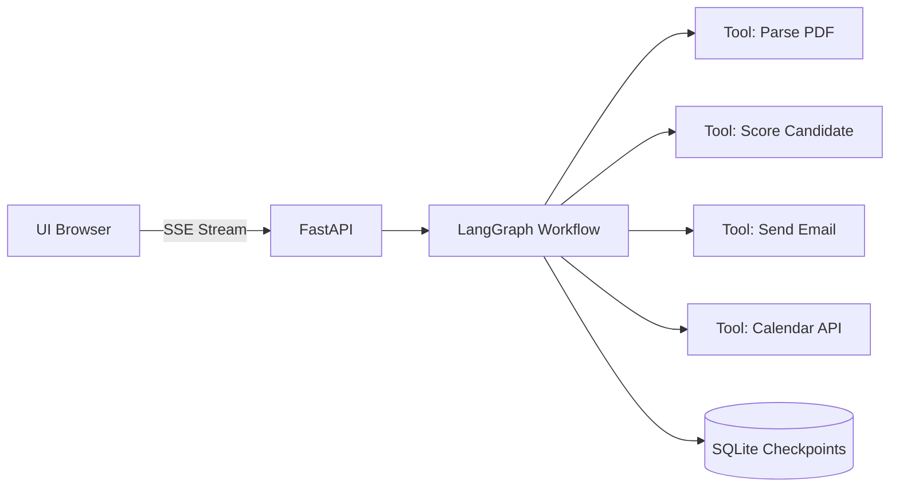

# 👔 Guía para Reclutadores

> **TL;DR**: Este repositorio demuestra capacidad para construir sistemas de IA complejos y production-ready usando LangGraph, con énfasis en arquitectura, seguridad y DevOps.

---

## 🎯 ¿Qué es este proyecto?

Este es un **portafolio técnico** que muestra **25 casos de uso reales** de aplicaciones LLM con estado, implementados con **LangGraph** (framework de LangChain para workflows complejos).

**Valor de negocio**: Cada caso resuelve un problema empresarial concreto:
- **RR.HH.**: Screening automatizado de candidatos con scoring y agenda
- **Soporte**: Asistente omnicanal con memoria de conversaciones
- **IT/SRE**: Respuesta a incidentes con runbooks automatizados
- **Compliance**: Auditorías y análisis de documentos regulatorios

---

## 🏆 Caso Destacado: **Caso 09 - RR.HH. Screening + Agenda**

### ¿Qué hace?
Un sistema completo de reclutamiento que:
1. Recibe CVs en PDF
2. Extrae información estructurada (skills, experiencia)
3. Aplica scoring basado en reglas de negocio
4. Envía emails automáticos a candidatos aprobados
5. Agenda entrevistas en calendario

### Stack Técnico
```
Frontend:  HTML/CSS/JS (streaming en tiempo real)
Backend:   FastAPI + LangGraph
LLM:       OpenAI GPT-4 (configurable)
Storage:   SQLite (checkpoints para persistencia)
Deploy:    Docker + Kubernetes
```

### Arquitectura


### Demo Rápida
```bash
# Clonar y ejecutar en 3 comandos
git clone https://github.com/vladimiracunadev-create/langgraph-realworld.git
cd langgraph-realworld
make case-up CASE=09  # Levanta backend + UI en localhost:8009
```

**Resultado**: Interfaz web donde puedes subir un CV y ver el proceso de screening en tiempo real con streaming.

---

## 🛠️ Habilidades Técnicas Demostradas

### 1. **Arquitectura de Software**
- ✅ Separación de concerns (backend/frontend/data)
- ✅ Workflows con estado usando grafos (LangGraph)
- ✅ Persistencia de checkpoints para recuperación ante fallos
- ✅ Streaming de eventos en tiempo real (SSE)

### 2. **DevOps & Infrastructure**
- ✅ **Docker**: Multi-stage builds, non-root users, health checks
- ✅ **Kubernetes**: Deployments, Services, NetworkPolicies, ResourceLimits
- ✅ **CI/CD**: GitHub Actions (tests, linting, security scans, Docker builds)
- ✅ **Makefile**: Comandos estandarizados para desarrollo

### 3. **Seguridad (Hardening)**
- ✅ Contenedores **non-root** (usuarios 1000/101)
- ✅ Tags de imagen fijos (no `latest`)
- ✅ **Secret scanning**: Pre-commit hooks + CI (TruffleHog)
- ✅ **Dependency scanning**: Safety checks en CI
- ✅ **Network Policies**: Deny-all por defecto + allowlist
- ✅ **SecurityContext**: `runAsNonRoot`, `allowPrivilegeEscalation: false`

### 4. **Python & LLMs**
- ✅ FastAPI para APIs asíncronas
- ✅ LangGraph para workflows complejos con estado
- ✅ LangChain tools para integración con servicios externos
- ✅ Prompt engineering y manejo de contexto
- ✅ Testing con pytest

### 5. **Documentación & Comunicación**
- ✅ README claro con quickstart
- ✅ Wiki con guías técnicas (Hub CLI, Seguridad)
- ✅ Código comentado y estructurado
- ✅ Este documento para reclutadores 😉

---

## 📂 Estructura del Repositorio

```
langgraph-realworld/
├── cases/
│   ├── 01-soporte-cliente-omnicanal/    # Scaffold standardized
│   ├── 09-rrhh-screening-agenda/        # ✅ IMPLEMENTADO COMPLETO
│   │   ├── backend/                     # FastAPI + LangGraph
│   │   ├── data/                        # Datos de prueba
│   │   └── demo/                        # UI estática
│   └── 10-25.../                        # Scaffolds (plantillas)
├── k8s/                                 # Manifiestos Kubernetes
├── .github/workflows/                   # CI/CD (ci.yml, security.yml)
├── docs/wiki/                           # Documentación Wiki
├── hub.py                               # CLI para gestionar casos
├── Makefile                             # Comandos de desarrollo
└── SECURITY.md                          # Política de seguridad
```

---

## 🚀 Cómo Evaluar Este Proyecto (5 minutos)

### Opción 1: Revisar el Código (sin ejecutar)
1. **Backend**: [`cases/09-rrhh-screening-agenda/backend/src/`](cases/09-rrhh-screening-agenda/backend/src/)
   - `api.py`: FastAPI con streaming SSE
   - `graph.py`: Definición del workflow LangGraph
   - `tools.py`: Implementación de herramientas (PDF, email, calendar)

2. **Infraestructura**: [`k8s/cases/09-rrhh-screening-agenda/`](k8s/cases/09-rrhh-screening-agenda/)
   - `deployment.yaml`: SecurityContext, ResourceLimits
   - `network-policy.yaml`: Políticas de red restrictivas

3. **CI/CD**: [`.github/workflows/`](.github/workflows/)
   - `ci.yml`: Tests, linting, Docker builds (25 casos)
   - `security.yml`: Secret scanning, dependency checks

### Opción 2: Ejecutar el Demo (10 minutos)
```bash
# Prerrequisitos: Docker, Python 3.11+, Make
git clone https://github.com/vladimiracunadev-create/langgraph-realworld.git
cd langgraph-realworld

# Configurar API keys
cp .env.example .env
# Editar .env con tu OPENAI_API_KEY

# Levantar caso 09
make case-up CASE=09

# Abrir http://localhost:8009 en el navegador
# Subir un CV de prueba desde cases/09-rrhh-screening-agenda/data/
```

### Opción 3: Ver la Wiki
- [Home](../../wiki/Home): Visión general
- [Hub CLI](../../wiki/Hub-CLI): Herramienta de gestión
- [Security](../../wiki/Security): Prácticas de hardening

---

## 💼 Perfil del Desarrollador

**Fortalezas evidenciadas en este repo:**
- ✅ Capacidad para trabajar con tecnologías emergentes (LLMs, LangGraph)
- ✅ Mentalidad DevOps (CI/CD, containerización, K8s)
- ✅ Conciencia de seguridad (hardening, secret management)
- ✅ Documentación clara y orientada a audiencias diversas
- ✅ Código limpio y mantenible (linting, tests, estructura)

**Ideal para roles de:**
- Senior Backend Engineer (Python/FastAPI)
- ML/AI Engineer (LLM Applications)
- DevOps Engineer (K8s, CI/CD)
- Full-Stack Engineer (con énfasis en backend)

---

## 📞 Contacto

Para preguntas técnicas o discusión de casos de uso específicos, por favor abre un [Issue](../../issues) en este repositorio.

---

## 🔗 Enlaces Rápidos

- [README Principal](README.md) - Quickstart y estado del proyecto
- [SECURITY.md](SECURITY.md) - Política de seguridad y reportes
- [Wiki](../../wiki) - Documentación técnica completa
- [GitHub Actions](../../actions) - Estado de CI/CD en tiempo real
