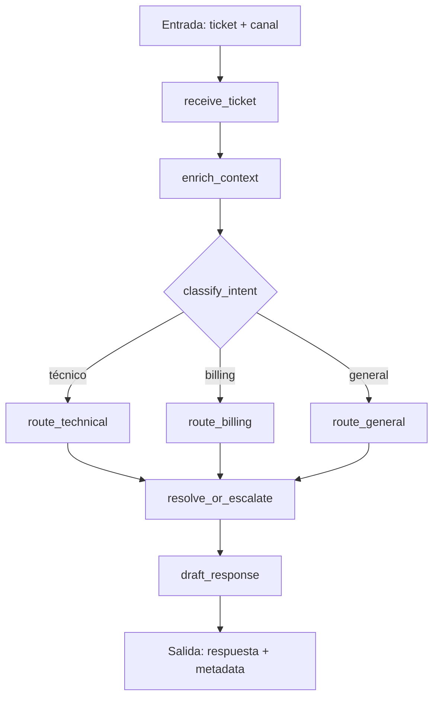

# Caso 01 — Soporte Cliente Omnicanal

> [!NOTE]
> **Estado**: `✅ OPERATIVO` | **Versión repo**: 4.0.0 | **Puerto**: `8001`
> **Patrón**: Clasificación de intención + priorización + routing condicional (DEMO/LIVE)

Agente de soporte omnicanal que clasifica tickets entrantes por canal (email, chat, llamada),
enriquece el contexto con historial del cliente y aplica routing condicional hacia el flujo de resolución adecuado.
Funciona en DEMO sin credenciales; activa LLM real con `OPENAI_API_KEY`.

---

## Flujo principal (LangGraph)



---

## Controles y compatibilidad

- Fallback DEMO por defecto cuando no existe `OPENAI_API_KEY`.
- Validación de `ticket_id` y `thread_id` en endpoints operativos.
- `DEMO_AUTH_TOKEN` y `RATE_LIMIT_RPM` opcionales para exposición externa controlada.
- Formulario de APIs accesible desde la interfaz para exportar el `.env` del caso.
- Imagen Docker: `python:3.11.10-slim`, usuario `appuser` (non-root).

---

## Cómo ejecutar

```bash
# Con Docker
docker compose up case01

# En local
cd cases/01-soporte-cliente-omnicanal/backend
uvicorn src.api:app --reload --port 8001
```

UI del caso: [http://localhost:8001/web/](http://localhost:8001/web/)

---

## Variables de entorno

| Variable | Descripción | Requerida |
|:---|:---|:---:|
| `OPENAI_API_KEY` | Activa modo LIVE con LLM real | No |
| `OPENAI_MODEL` | Modelo a usar (default: `gpt-4o-mini`) | No |
| `DEMO_AUTH_TOKEN` | Token para proteger endpoints | No |
| `RATE_LIMIT_RPM` | Límite de requests por minuto | No |

---

> [!TIP]
> Ver [SECURITY.md](../../SECURITY.md) para el detalle de los controles de hardening activos en este caso.
