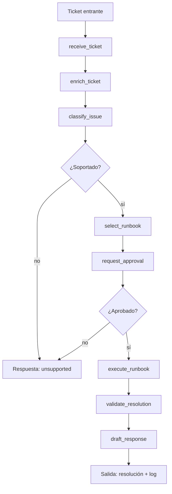

# Caso 02 — Mesa de Ayuda TI / Runbooks

> [!NOTE]
> **Estado**: `✅ OPERATIVO` | **Versión repo**: 4.0.0 | **Puerto**: `8002`
> **Patrón**: Clasificación + ejecución de runbooks con doble router (categoría + aprobación)

Sistema de respuesta autónoma para Helpdesk corporativo, MLOps e incidentes SRE.
Combina enriquecimiento de contexto desde CMDB mock, clasificación guiada por LangGraph,
HITL simulado y ejecución estéril de runbooks.

---

## Flujo principal (LangGraph)



---

## Controles y compatibilidad

- Fallback DEMO por defecto cuando no existe `OPENAI_API_KEY`.
- Bypass temprano para tickets `unsupported`.
- Validación de `thread_id` y payloads en la API.
- `DEMO_AUTH_TOKEN` y `RATE_LIMIT_RPM` opcionales para exposición externa controlada.
- Suite propia de tests para API, auth opcional, rate limiting y flujo LangGraph.
- Imagen Docker: `python:3.11.10-slim`, usuario `appuser` (non-root).

---

## Cómo ejecutar

```bash
# Con Docker
docker compose up case02

# En local
cd cases/02-mesa-ayuda-ti-runbooks/backend
uvicorn src.api:app --reload --port 8002
```

UI del caso: [http://localhost:8002/web/](http://localhost:8002/web/)

---

## Variables de entorno

| Variable | Descripción | Requerida |
|:---|:---|:---:|
| `OPENAI_API_KEY` | Activa modo LIVE con LLM real | No |
| `DEMO_AUTH_TOKEN` | Token para proteger endpoints | No |
| `RATE_LIMIT_RPM` | Límite de requests por minuto | No |
| `ALLOWED_ORIGINS` | CORS allowlist | No |

---

> [!TIP]
> Ver [SECURITY.md](../../SECURITY.md) para el detalle de los controles de hardening activos en este caso.
