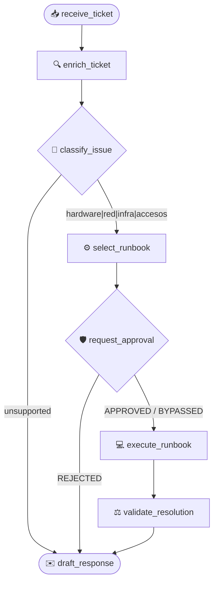

# 🖥️ Caso 02: Soporte Técnico de Empleados / SRE Helpdesk

> [!NOTE]
> **Estado:** `OPERATIVO` (v3.7.0) | **Arquitectura:** FastAPI + LangGraph + SRE Terminal

Sistema de respuesta autónomo para Helpdesk corporativo, MLOps e Incidentes SRE. Diagnóstico con IA, uso de CMDB (Mock) para perfilación, reglas restrictivas y simulación técnica de runbooks.

## 🕸️ Arquitectura LangGraph (SRE Pipeline)



Este caso se diseñó para enseñar cómo utilizar grafos para controlar, restringir y robustecer la toma de decisiones pura de un LLM. El `StateGraph` (`HelpdeskState`) cuenta con 8 fases ricas en interacciones de negocios y operaciones SRE:

1. **`receive_ticket`**: 📥 Ingesta la solicitud inicial (Ticket).
2. **`enrich_ticket`**: 🔍 (*Consultas Externas*) Recupera información técnica del usuario que envió el Ticket de una "CMDB Mock" (ej. IP, Equipo y Status).
3. **`classify_issue`**: 🧠 El LLM categoriza el problema cruzando el contexto enriquecido con la consulta del Ticket. Permite la detección de intentos lúdicos (`unsupported`).
4. **`Condición de Seguridad`**: 🔀 Un edge estricto que si la categoría es `unsupported`, bypassa de inmediato toda la operación previniendo corridas en falso.
5. **`select_runbook`**: 📑 Escoge el set de instrucciones de terminal exactas.
6. **`request_approval`**: 🛡️ (*HITL - Human In The Loop*) Detiene el flujo de máquina temporalmente simulando requerir aprobación de un SRE Lead si la categoría toca infraestructura.
7. **`execute_runbook`**: 💻 Ejecución en consola estéril simulada y logueada línea por línea.
8. **`validate_resolution`** y **`draft_response`**: ⚖️ Checkeo de log vs ticket de origen, redactando el correo a cliente cerrando el incidente.

## 🌓 Dual Mode (DEMO / LIVE)
> [!WARNING]
> Por defecto, funciona enteramente con **Fallback Mockers** si no configuraste una Key OpenAI válida en `.env`. Los logs, selecciones de runbook y demás correrán solos bajo reglas internas para demostrar la solidez de la UI frente a clientes de alto rango.

## 📺 Frontend Activo (Terminal Dinámica SRE)
El frontend web hace gala de un Server-Sent Event feed (NDJSON) consumiendo los outputs de LangGraph en directo. Actualizará un Tracker de fases UI y renombrará su consola SRE con los bash y procesos activos, ideal para entender conceptualmente grafos autónomos.

## Cómo ejecutar

```bash
cd backend
uvicorn src.api:app --port 8002
```
Abre en tu navegador: [http://localhost:8002/web/](http://localhost:8002/web/)
