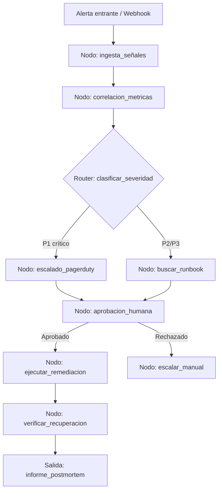

# Caso 03 — Incident Response SRE

> [!NOTE]
> **Estado**: `✅ OPERATIVO` | **Versión repo**: 4.0.0 | **Puerto**: `8003`
> **Patrón**: Router por severidad (P1→PagerDuty) + remediación con aprobación + postmortem

Automatiza la respuesta a incidentes de infraestructura coordinando la ingesta de métricas y logs, la clasificación de severidad y la ejecución de acciones de remediación con validación humana obligatoria antes de cualquier cambio en producción. Reduce el tiempo medio de resolución (MTTR) al eliminar el trabajo manual repetitivo del runbook y permite que los equipos SRE se concentren en análisis de causa raíz.

---

## Objetivo de negocio

Los equipos SRE de empresas con alta disponibilidad reciben cientos de alertas diarias: la mayoría son ruido o falsos positivos. Este agente correlaciona señales de múltiples fuentes (Prometheus, Datadog, logs de aplicación), determina la severidad real del incidente, propone acciones correctivas del runbook y solicita aprobación humana antes de ejecutarlas, generando un registro de auditoría completo de cada decisión.

## Flujo propuesto (LangGraph)

### Nodos principales

| Nodo | Descripción |
|---|---|
| `ingesta_señales` | Recibe y normaliza alertas de Prometheus, Datadog y logs estructurados |
| `correlacion_metricas` | Agrupa señales relacionadas y elimina duplicados/ruido |
| `clasificar_severidad` | Determina prioridad P1–P4 según umbrales configurables |
| `buscar_runbook` | Recupera los pasos de remediación del playbook correspondiente |
| `escalado_pagerduty` | Notifica al on-call y abre el puente de incidente para P1 |
| `aprobacion_humana` | Presenta el plan de acción al SRE y espera confirmación explícita |
| `ejecutar_remediacion` | Invoca herramientas de infraestructura (restart, rollback, scale-out) |
| `verificar_recuperacion` | Comprueba que las métricas volvieron a niveles normales |
| `informe_postmortem` | Genera el borrador del postmortem con timeline y acciones tomadas |

## Stack técnico previsto

| Capa | Tecnología |
|---|---|
| Orquestación | LangGraph `StateGraph` |
| API | FastAPI + uvicorn |
| LLM | OpenAI GPT-4o-mini (modo LIVE) / respuestas mock (modo DEMO) |
| Herramientas | Prometheus API, Datadog API, kubectl, AWS SSM |
| Aprobación humana | LangGraph `interrupt()` + canal de Slack/webhook |
| Almacenamiento | PostgreSQL (registro de incidentes y auditoría) |

## Estado actual

Este caso es un **scaffold**: la estructura de la demo estática existe,
la implementación del backend con LangGraph está pendiente.

Para contribuir o elevar este caso, consulta [CONTRIBUTING.md](../../CONTRIBUTING.md).

---

> [!TIP]
> Ver los casos **09**, **10** y **13** como referencia de implementación industrial.
