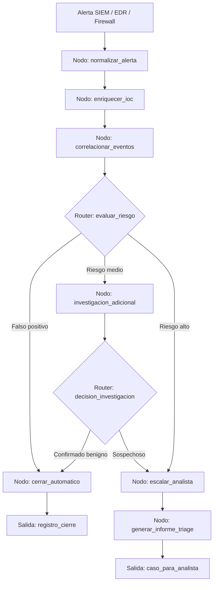

# Caso 04: SOC Triage de Alertas

> [!NOTE]
> **Estado**: `SCAFFOLD` | **Versión repo**: 3.9.0 | **Tipo**: Agente reactivo con enriquecimiento de contexto

Automatiza el primer nivel de análisis en un Centro de Operaciones de Seguridad (SOC) correlacionando alertas de múltiples fuentes, enriqueciéndolas con inteligencia de amenazas y clasificando su prioridad real para reducir la fatiga de alertas y el tiempo de detección (MTTD). Permite que los analistas de seguridad senior se enfoquen únicamente en los incidentes que requieren intervención humana.

---

## Objetivo de negocio

Los SOC de empresas medianas y grandes enfrentan miles de alertas diarias de SIEM, EDR y firewalls, de las cuales más del 80% son falsos positivos. Este agente ingiere alertas de múltiples plataformas, las correlaciona con indicadores de compromiso (IOCs), consulta fuentes de threat intelligence (VirusTotal, MISP), determina si la amenaza es real y escala únicamente los casos que superan el umbral de riesgo, generando un informe enriquecido listo para el analista.

## Flujo propuesto (LangGraph)

### Nodos principales

| Nodo | Descripción |
|---|---|
| `normalizar_alerta` | Parsea y normaliza alertas de SIEM, EDR y firewall a esquema común |
| `enriquecer_ioc` | Consulta VirusTotal, AbuseIPDB y MISP para cada IOC encontrado |
| `correlacionar_eventos` | Agrupa alertas relacionadas por host, usuario o campaña |
| `evaluar_riesgo` | Calcula score de riesgo y decide el camino de triage |
| `investigacion_adicional` | Ejecuta queries adicionales en el SIEM para ganar contexto |
| `escalar_analista` | Asigna el caso al analista de turno con prioridad y contexto |
| `generar_informe_triage` | Produce el resumen estructurado con evidencias y recomendaciones |
| `cerrar_automatico` | Cierra el ticket con justificación auditada para falsos positivos |

## Stack técnico previsto

| Capa | Tecnología |
|---|---|
| Orquestación | LangGraph `StateGraph` |
| API | FastAPI + uvicorn |
| LLM | OpenAI GPT-4o-mini (modo LIVE) / respuestas mock (modo DEMO) |
| Herramientas | VirusTotal API, AbuseIPDB, MISP, Splunk/Elastic API |
| Integraciones | SIEM (Splunk/Elastic), EDR (CrowdStrike/SentinelOne), ticketing (JIRA/ServiceNow) |
| Almacenamiento | PostgreSQL (casos), Redis (caché de IOCs) |

## Estado actual

Este caso es un **scaffold**: la estructura de la demo estática existe,
la implementación del backend con LangGraph está pendiente.

Para contribuir o elevar este caso, consulta [CONTRIBUTING.md](../../CONTRIBUTING.md).

---

> [!TIP]
> Ver los casos **09**, **10** y **13** como referencia de implementación industrial.
