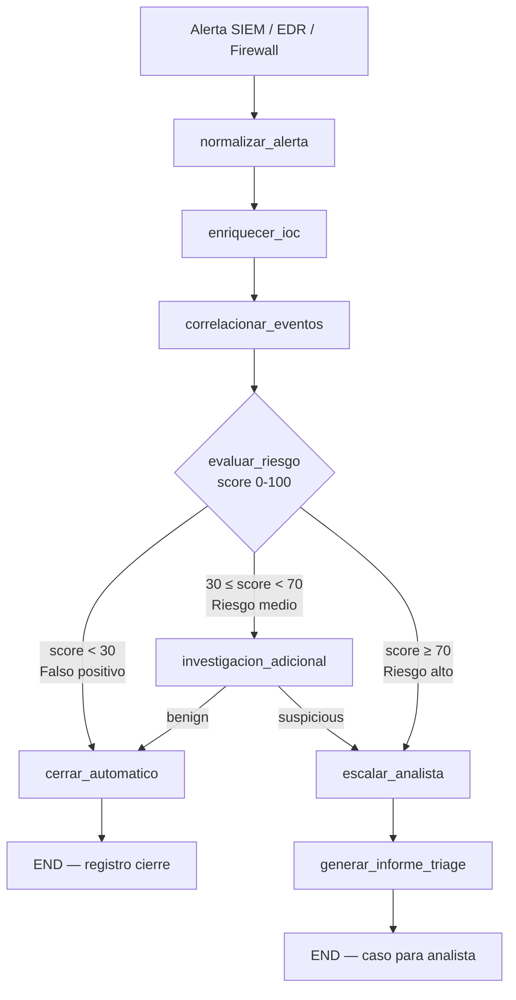

# Caso 04: SOC Triage de Alertas

> [!NOTE]
> **Estado**: `OPERATIVO` | **Versión repo**: 4.1.0 | **Tipo**: Agente reactivo con enriquecimiento de contexto y router de riesgo

Automatiza el primer nivel de análisis en un Centro de Operaciones de Seguridad (SOC) correlacionando alertas de múltiples fuentes, enriqueciéndolas con inteligencia de amenazas y clasificando su prioridad real para reducir la fatiga de alertas y el tiempo de detección (MTTD). Permite que los analistas de seguridad senior se enfoquen únicamente en los incidentes que requieren intervención humana.

---

## Objetivo de negocio

Los SOC de empresas medianas y grandes enfrentan miles de alertas diarias de SIEM, EDR y firewalls, de las cuales más del 80% son falsos positivos. Este agente:

1. **Ingiere** alertas de SIEM (Splunk/Elastic), EDR (CrowdStrike/SentinelOne) y Firewall (Palo Alto).
2. **Enriquece** cada IOC (IP, hash, dominio) contra VirusTotal, AbuseIPDB y MISP.
3. **Correlaciona** con contexto adicional del SIEM (baseline del host, fallos de login, anomalías de proceso).
4. **Evalúa** el riesgo con un score compuesto (0-100) y enruta a la vía correcta.
5. **Cierra automáticamente** los falsos positivos con justificación auditada.
6. **Escala** los casos reales al analista adecuado con informe de triage completo.

## Flujo implementado (LangGraph)



### Nodos implementados

| Nodo | Descripción |
|---|---|
| `normalizar_alerta` | Parsea y normaliza a esquema común (SIEM/EDR/Firewall → modelo único) |
| `enriquecer_ioc` | Consulta VirusTotal / AbuseIPDB / MISP + mapeo MITRE ATT&CK |
| `correlacionar_eventos` | Query SIEM para contexto del host/usuario (baseline, anomalías) |
| `evaluar_riesgo` | Score compuesto (IOC + SIEM baseline + severidad) → router de 3 vías |
| `investigacion_adicional` | Query ampliada (72h) para confirmar o descartar amenaza en casos medios |
| `escalar_analista` | Asigna caso al analista de turno con SLA + crea ticket (JIRA/ServiceNow) |
| `generar_informe_triage` | Informe estructurado: evidencias, IOCs, MITRE, contexto SIEM, acciones |
| `cerrar_automatico` | Cierra con justificación auditada para falsos positivos |

## Stack técnico

| Capa | Tecnología |
|---|---|
| Orquestación | LangGraph `StateGraph` + `MemorySaver` checkpointer |
| API | FastAPI + uvicorn, streaming NDJSON |
| LLM (modo LIVE) | OpenAI GPT-4o-mini — razonamiento sobre alertas y contexto |
| Modo DEMO | Lógica determinista sobre `alerts.json` + `threat_intel.json` |
| Threat Intel | VirusTotal, AbuseIPDB, MISP (stubs en DEMO) |
| SIEM | Splunk / Elastic (stubs en DEMO) |
| Ticketing | JIRA / ServiceNow (stubs en DEMO) |
| Auth | X-Demo-Token (DEMO) / Bearer JWT OAuth2 (LIVE, opt-in) |
| Observabilidad | Logs JSON estructurados + LangSmith tracing (opcional) |

## Modos de ejecución

| Variable | DEMO (default) | LIVE |
|---|---|---|
| `OPENAI_API_KEY` | no requerida | requerida |
| Análisis IOCs | `threat_intel.json` local | VirusTotal real |
| Scoring riesgo | algoritmo determinista | ajuste LLM |
| Informe triage | plantilla estructurada | LLM narrativo |
| SIEM queries | datos mock | API Splunk/Elastic |

## Ejecutar localmente

```bash
# Desde cases/04-soc-triage-alertas/backend/
cp .env.example .env
pip install -r requirements.txt

# Servidor de desarrollo
uvicorn src.api:app --reload --port 8004

# Tests
pytest tests/ -v

# Docker
docker compose up --build
```

## Endpoints

| Método | Ruta | Descripción |
|---|---|---|
| GET | `/health` | Liveness check |
| GET | `/ready` | Readiness check (verifica grafo) |
| GET | `/metrics` | Métricas de uso (requests, latencia, modo) |
| POST | `/api/run` | Ejecuta triage completo, devuelve snapshot final |
| GET | `/api/stream` | Streaming NDJSON — actualización nodo a nodo |

### Ejemplo de uso

```bash
# Triage de alerta ALT-001 (brute force SSH — riesgo alto)
curl -X POST http://localhost:8004/api/run \
  -H "Content-Type: application/json" \
  -d '{"thread_id": "mi-sesion-1", "alert_id": "ALT-001"}'

# Streaming en tiempo real
curl http://localhost:8004/api/stream?alert_id=ALT-003
```

### Alertas de demostración incluidas

| ID | Alerta | Resultado esperado |
|---|---|---|
| `ALT-001` | Brute force SSH — IP Tor (score 92) | Riesgo alto → escalar |
| `ALT-002` | Escaneo de puertos interno (nmap) | Riesgo medio → investigar |
| `ALT-003` | Hash Emotet detectado por EDR | Riesgo alto → escalar |
| `ALT-004` | DNS exfiltración hacia dominio C2 | Riesgo alto → escalar |
| `ALT-005` | Login fuera de horario (sin IOC) | Falso positivo → cerrar |

## Estructura de archivos

```
04-soc-triage-alertas/
├── backend/
│   ├── src/
│   │   ├── graph.py         # StateGraph LangGraph (8 nodos + 2 routers)
│   │   ├── api.py           # FastAPI + streaming NDJSON
│   │   ├── integrations.py  # Stubs VirusTotal/AbuseIPDB/SIEM/Ticketing
│   │   ├── auth.py          # Middleware auth + rate limiting
│   │   └── settings.py      # Configuración y rutas
│   ├── tests/
│   │   ├── conftest.py
│   │   ├── test_graph_flow.py
│   │   └── test_api.py
│   ├── requirements.txt
│   ├── Dockerfile
│   ├── compose.yml
│   └── .env.example
├── data/
│   ├── alerts.json          # 5 alertas reales de SIEM/EDR/Firewall
│   └── threat_intel.json    # IOC reputation + MITRE ATT&CK mapping
├── demo/                    # Frontend estático
└── case.yml
```

---

> [!TIP]
> Este caso complementa el **Caso 03** (Incident Response SRE): el 04 detecta y prioriza,
> el 03 responde y remedia. Son la cadena completa de detección-respuesta.

> Ver también: **Caso 01** (soporte omnicanal), **Caso 09** (RRHH screening) como referencia de patrones industriales.
