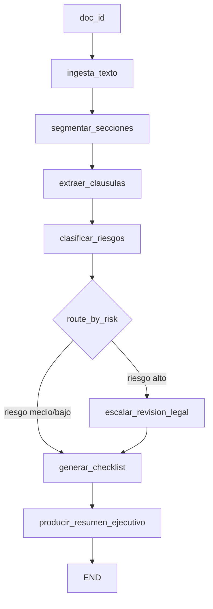

# Caso 05: Analista de Documentos

> [!NOTE]
> **Estado**: `OPERATIVO` | **Versión repo**: 4.2.0 | **Tipo**: Pipeline secuencial con router de riesgo

Analiza contratos, NDAs, SLAs y licitaciones extrayendo cláusulas clave, clasificando riesgos,
generando checklists de cumplimiento y resúmenes ejecutivos. Reduce el tiempo de revisión
de documentos legales de horas a segundos, con trazabilidad completa de cada decisión del agente.

---

## Objetivo de negocio

Los equipos legales, de compliance y de procura revisan decenas de contratos por semana.
Este agente ingiere documentos (PDF, DOCX o texto), segmenta cada sección, detecta cláusulas
de penalidad, SLA, confidencialidad, terminación y más, las clasifica por nivel de riesgo
y genera un informe estructurado con checklist y resumen ejecutivo listo para firmar o escalar.

---

## Flujo LangGraph



### Nodos

| Nodo | Descripción |
|:---|:---|
| `ingesta_texto` | Carga el texto del documento desde JSON local (DEMO) o PDF/DOCX real (LIVE) |
| `segmentar_secciones` | Divide el texto en secciones por headers contractuales (CLÁUSULA, ARTÍCULO, etc.) |
| `extraer_clausulas` | Detecta cláusulas clave por keyword matching sobre cada sección |
| `clasificar_riesgos` | Calcula `risk_score` (0-100) y determina `risk_level` (bajo/medio/alto) |
| `escalar_revision_legal` | Genera nota de escalación para revisión legal senior (solo riesgo alto) |
| `generar_checklist` | Produce lista de verificación de cumplimiento y puntos de negociación |
| `producir_resumen_ejecutivo` | Resumen ejecutivo en lenguaje natural (plantilla DEMO, LLM en LIVE) |

---

## Stack técnico

| Capa | Tecnología |
|:---|:---|
| Orquestación | LangGraph `StateGraph` + `MemorySaver` |
| API | FastAPI + uvicorn |
| LLM | OpenAI GPT-4o-mini (modo LIVE) / lógica determinista (modo DEMO) |
| Extracción PDF | PyMuPDF `fitz` (opt-in, instalar con `pip install pymupdf`) |
| Extracción DOCX | python-docx (opt-in, instalar con `pip install python-docx`) |
| Datos DEMO | JSON local — 3 documentos (NDA, Servicios TI, Licitación) |

---

## Datos DEMO

| ID | Tipo | Riesgo esperado | Ruta del grafo |
|:---|:---|:---:|:---|
| `DOC-001` | NDA / Acuerdo de No Divulgación | 🟢 BAJO | `clasificar_riesgos → generar_checklist → resumen` |
| `DOC-002` | Contrato de Servicios TI con SLA | 🟡 MEDIO | `clasificar_riesgos → generar_checklist → resumen` |
| `DOC-003` | Licitación Pública Internacional | 🔴 ALTO | `clasificar_riesgos → escalar_revision_legal → checklist → resumen` |

---

## Modo DEMO y LIVE

| Variable | Efecto |
|:---|:---|
| Sin `OPENAI_API_KEY` | **DEMO**: análisis determinista con keyword matching y plantillas |
| `OPENAI_API_KEY=sk-...` | **LIVE**: ajuste de score con GPT-4o-mini, resumen narrativo |
| `pymupdf` instalado | Extracción real de archivos PDF en modo LIVE |
| `python-docx` instalado | Extracción real de archivos DOCX en modo LIVE |

---

## Cómo ejecutar

```bash
# Con Docker (recomendado)
cd cases/05-analista-documentos/backend
docker compose up case05

# En local (desarrollo)
cd cases/05-analista-documentos/backend
pip install -r requirements.txt
uvicorn src.api:app --reload --port 8005
```

UI del caso: [http://localhost:8005/web/](http://localhost:8005/web/)

### Endpoints

| Método | Ruta | Descripción |
|:---|:---|:---|
| `GET` | `/health` | Liveness + modo actual (DEMO/LIVE) |
| `GET` | `/ready` | Readiness (grafo compilado) |
| `GET` | `/metrics` | Métricas en memoria |
| `POST` | `/api/run` | Análisis completo (JSON final) |
| `GET` | `/api/stream` | Análisis en streaming NDJSON |
| `GET` | `/web/` | Interfaz web interactiva |

### Tests

```bash
cd cases/05-analista-documentos/backend
pytest tests/ -v
```

---

> [!TIP]
> Ver los casos **09**, **10** y **13** como referencia de implementación industrial.
> Para elevar a INDUSTRIAL: agregar `compose.smoke.yml`, logging JSON estructurado
> con `ContextVar`, y `/metrics` documentado con OAuth2 opt-in verificado en tests.
