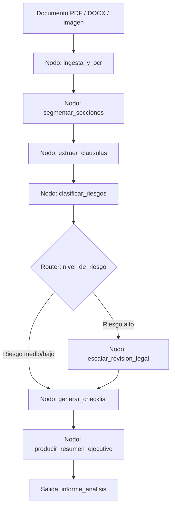

# Caso 05: Analista de Documentos

> [!NOTE]
> **Estado**: `SCAFFOLD` | **Versión repo**: 3.9.0 | **Tipo**: Agente con estado y memoria de documento

Automatiza el análisis exhaustivo de documentos contractuales y legales extrayendo cláusulas críticas, identificando riesgos, generando checklists de cumplimiento y produciendo resúmenes ejecutivos, reduciendo el tiempo de revisión de contratos de horas a minutos. Permite que los equipos legales y de procura procesen un volumen mayor de documentos con mayor consistencia y trazabilidad.

---

## Objetivo de negocio

Los equipos legales, de compliance y de procura de empresas revisan decenas de contratos, NDAs, SLAs y licitaciones por semana. Este agente ingiere documentos en múltiples formatos (PDF, DOCX, imágenes escaneadas), segmenta y analiza cada sección, extrae cláusulas de penalidad, plazos, exclusiones y obligaciones, las clasifica por nivel de riesgo y genera un informe estructurado con checklist de puntos a negociar o escalar al equipo legal senior.

## Flujo propuesto (LangGraph)

### Nodos principales

| Nodo | Descripción |
|---|---|
| `ingesta_y_ocr` | Extrae texto del documento usando OCR si es necesario (Tesseract/Textract) |
| `segmentar_secciones` | Divide el documento en secciones lógicas (considerandos, cláusulas, anexos) |
| `extraer_clausulas` | Identifica y extrae cláusulas clave: penalidades, plazos, exclusiones, SLA |
| `clasificar_riesgos` | Asigna nivel de riesgo (alto/medio/bajo) a cada cláusula extraída |
| `escalar_revision_legal` | Marca y justifica los puntos que requieren revisión de abogado |
| `generar_checklist` | Produce lista de verificación de cumplimiento y puntos de negociación |
| `producir_resumen_ejecutivo` | Genera resumen en lenguaje natural para el firmante o directivo |

## Stack técnico previsto

| Capa | Tecnología |
|---|---|
| Orquestación | LangGraph `StateGraph` |
| API | FastAPI + uvicorn |
| LLM | OpenAI GPT-4o-mini (modo LIVE) / respuestas mock (modo DEMO) |
| Extracción de texto | PyMuPDF, python-docx, Amazon Textract (OCR) |
| Almacenamiento | S3/MinIO (documentos), PostgreSQL (resultados) |
| Embeddings | OpenAI text-embedding-3-small + pgvector |

## Estado actual

Este caso es un **scaffold**: la estructura de la demo estática existe,
la implementación del backend con LangGraph está pendiente.

Para contribuir o elevar este caso, consulta [CONTRIBUTING.md](../../CONTRIBUTING.md).

---

> [!TIP]
> Ver los casos **09**, **10** y **13** como referencia de implementación industrial.
