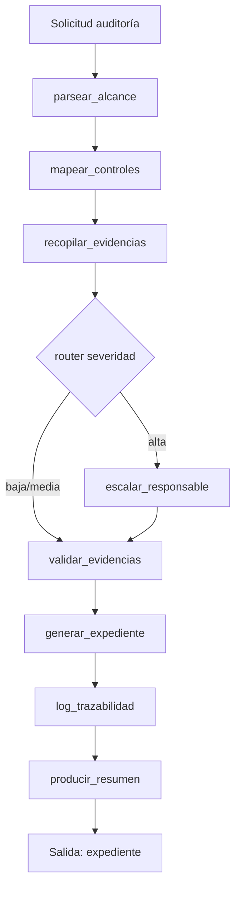

# Caso 06: Compliance & Auditorías

> [!NOTE]
> **Estado**: `OPERATIVO` | **Versión repo**: 4.6.0 | **Tipo**: Agente con cadena de custodia inmutable | **Puerto**: 8006

Automatiza el ciclo completo de preparación de auditorías: parsea el alcance, mapea cada control del marco regulatorio (ISO 27001, SOC 2, GDPR) a su fuente y owner, recopila evidencias, detecta faltantes, escala a los responsables cuando hay gaps de criticidad alta, valida fechas y formato, genera el expediente con score de cumplimiento y sella cada acción en una cadena de custodia SHA-256 encadenada (append-only) lista para el auditor externo.

---

## Objetivo de negocio

Los equipos de compliance dedican semanas a recopilar evidencias dispersas en múltiples sistemas (IAM, SIEM, ITSM, Git, documentación) antes de cada auditoría. Este agente reduce el ciclo de días-persona a minutos y elimina los riesgos de evidencia mal clasificada o fuera de período. La cadena de custodia inmutable es directamente exportable para el auditor externo.

## Flujo LangGraph



### Nodos

| Nodo | Descripción |
|---|---|
| `parsear_alcance` | Lee el alcance: marco, periodo, controles en scope |
| `mapear_controles` | Relaciona cada control con su fuente y owner desde el catálogo |
| `recopilar_evidencias` | Indexa evidencias por control y calcula cobertura/faltantes |
| `verificar_completitud` | **Router**: severidad alta → escalar; baja/media → validar |
| `escalar_responsable` | Genera notificación por email a cada owner con gap de alta criticidad |
| `validar_evidencias` | Verifica fechas dentro de periodo, antigüedad, campos obligatorios |
| `generar_expediente` | Compila índice + métricas + score 0-100 + indicador verde/amarillo/rojo |
| `log_trazabilidad` | Sella cierre del expediente en la cadena de custodia |
| `producir_resumen` | Resumen ejecutivo (LLM opt-in) para CISO/DPO/Compliance Officer |

### Cadena de custodia

Cada acción del agente queda registrada como una entrada con:

- `seq` — secuencial 1..N
- `ts` — timestamp UTC ISO-8601
- `accion` — nombre del nodo
- `detalle` — payload de la acción
- `prev_hash` — hash de la entrada anterior (`GENESIS` para la primera)
- `hash` — `SHA-256(prev_hash || canonical_json(seq, accion, detalle))`

Las entradas son **append-only** y modificar cualquier `detalle` rompe la cadena en todas las entradas posteriores.

## Escenarios DEMO

| ID | Marco | Periodo | Resultado esperado |
|---|---|---|---|
| `AUD-001` | ISO 27001 | 2026-Q1 | 🟢 Score 100 · sin escalaciones · riesgo BAJO |
| `AUD-002` | SOC 2 | 2026-Q1 | 🟡/🔴 Faltantes en CC6.1/CC7.2 · escalaciones a IAM y SOC |
| `AUD-003` | GDPR | 2026-Q1 | 🔴 ROPA y DPIA vencidas · evidencias inválidas · DPO escalado |

## Stack

| Capa | Tecnología |
|---|---|
| Orquestación | LangGraph `StateGraph` + `MemorySaver` |
| API | FastAPI + uvicorn |
| LLM (opt-in) | OpenAI GPT-4o-mini para resumen ejecutivo |
| Tracing (opt-in) | LangSmith |
| Auth (opt-in) | OAuth2/OIDC con JWT (RS256/ES256) o `X-Demo-Token` |
| Trazabilidad | SHA-256 encadenado append-only |

## Endpoints

| Método | Ruta | Descripción |
|---|---|---|
| `GET` | `/health` · `/healthz` | Estado y modo (DEMO/LIVE) |
| `GET` | `/ready` | Readiness check (compila el grafo) |
| `GET` | `/metrics` | Contadores y latencias |
| `POST` | `/api/run` | Ejecuta auditoría completa |
| `GET` | `/api/stream` | Stream NDJSON con snapshots por nodo |
| `GET` | `/` | Interfaz web |

## Cómo ejecutar

### Local

```bash
cd cases/06-compliance-auditorias/backend
pip install -r requirements.txt
uvicorn src.api:app --host 0.0.0.0 --port 8006
# http://localhost:8006/
```

### Docker

```bash
cd cases/06-compliance-auditorias/backend
docker compose up --build
```

### Tests

```bash
cd cases/06-compliance-auditorias/backend
pytest -q
# 26 tests
```

## Modo LIVE

Crear `backend/.env` desde `.env.example` y agregar `OPENAI_API_KEY=sk-...` para activar la narrativa LLM en el resumen ejecutivo. El resto del flujo (mapeo, recopilación, validación, trazabilidad) es **determinista y funciona idéntico en DEMO**.

> [!TIP]
> Casos de referencia para patrones industriales: **09**, **10**, **13**, **14**.
