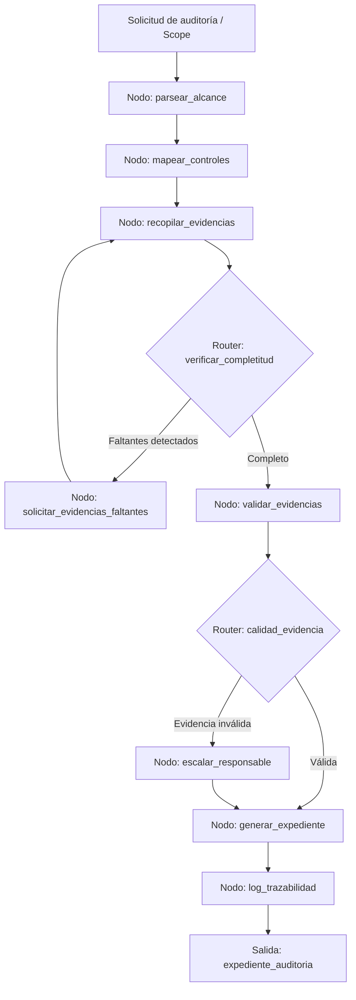

# Caso 06: Compliance y Auditorías

> [!NOTE]
> **Estado**: `SCAFFOLD` | **Versión repo**: 3.9.0 | **Tipo**: Agente con estado y trazabilidad completa

Automatiza el ciclo completo de preparación de auditorías recopilando evidencias, identificando faltantes, mapeando controles a marcos regulatorios (ISO 27001, SOC 2, GDPR) y generando el expediente de auditoría con trazabilidad de cada hallazgo. Reduce el tiempo de preparación de auditorías de semanas a días y elimina los riesgos de evidencia incompleta o mal clasificada.

---

## Objetivo de negocio

Los equipos de compliance de empresas reguladas (fintech, salud, manufactura) dedican semanas a recopilar evidencias dispersas en múltiples sistemas antes de cada auditoría. Este agente recibe el alcance de la auditoría (norma, periodo, controles en scope), mapea automáticamente los controles a los sistemas de evidencia correspondientes, solicita o extrae las evidencias, detecta faltantes y genera el expediente completo con índice, referencias cruzadas y log de trazabilidad inmutable para el auditor externo.

## Flujo propuesto (LangGraph)

### Nodos principales

| Nodo | Descripción |
|---|---|
| `parsear_alcance` | Interpreta el alcance de la auditoría: norma, periodo, controles en scope |
| `mapear_controles` | Relaciona cada control con su fuente de evidencia y responsable |
| `recopilar_evidencias` | Extrae evidencias de sistemas (ITSM, SIEM, HR, git, cloud) |
| `verificar_completitud` | Detecta controles sin evidencia o con evidencia fuera de periodo |
| `solicitar_evidencias_faltantes` | Envía recordatorios automáticos a los responsables de control |
| `validar_evidencias` | Verifica formato, fecha y suficiencia de cada evidencia recibida |
| `escalar_responsable` | Notifica al owner del control y al CISO en caso de incumplimiento |
| `generar_expediente` | Compila el paquete de auditoría con índice y referencias cruzadas |
| `log_trazabilidad` | Registra cada acción con hash inmutable para la cadena de custodia |

## Stack técnico previsto

| Capa | Tecnología |
|---|---|
| Orquestación | LangGraph `StateGraph` |
| API | FastAPI + uvicorn |
| LLM | OpenAI GPT-4o-mini (modo LIVE) / respuestas mock (modo DEMO) |
| Integraciones | ServiceNow, Jira, GitHub, AWS Config, Google Workspace |
| Almacenamiento | PostgreSQL (controles y evidencias), S3/MinIO (archivos) |
| Trazabilidad | Registro append-only con hash SHA-256 por entrada |

## Estado actual

Este caso es un **scaffold**: la estructura de la demo estática existe,
la implementación del backend con LangGraph está pendiente.

Para contribuir o elevar este caso, consulta [CONTRIBUTING.md](../../CONTRIBUTING.md).

---

> [!TIP]
> Ver los casos **09**, **10** y **13** como referencia de implementación industrial.
