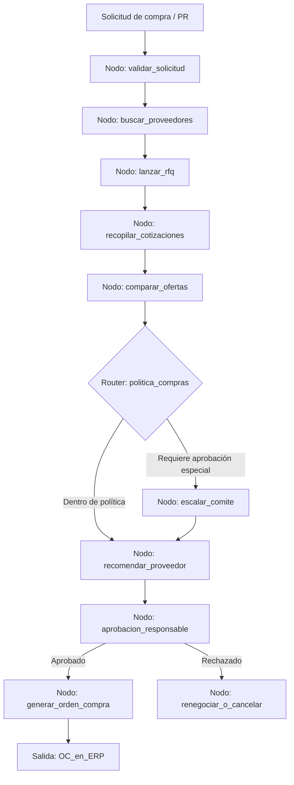

# Caso 07: Compras y Abastecimiento

> [!NOTE]
> **Estado**: `SCAFFOLD` | **Versión repo**: 3.9.0 | **Tipo**: Agente con estado y aprobación humana

Automatiza el ciclo de compras desde la solicitud hasta la orden de compra: cotiza automáticamente a proveedores homologados, compara ofertas por criterios configurables (precio, plazo, calidad, riesgo de proveedor), genera la recomendación justificada y produce la orden de compra lista para aprobación. Reduce el ciclo de adquisición de días a horas y garantiza la aplicación consistente de la política de compras.

---

## Objetivo de negocio

Los departamentos de compras de empresas medianas y grandes procesan cientos de solicitudes de adquisición mensuales, muchas de ellas repetitivas y de bajo valor estratégico. Este agente recibe una solicitud de compra (descripción, cantidad, presupuesto máximo, fecha requerida), consulta el catálogo de proveedores homologados, lanza RFQs automatizadas, compara las cotizaciones recibidas aplicando la política corporativa de compras y genera la orden de compra en el ERP con toda la trazabilidad del proceso para la aprobación del responsable.

## Flujo propuesto (LangGraph)

### Nodos principales

| Nodo | Descripción |
|---|---|
| `validar_solicitud` | Verifica que la PR tenga presupuesto, centro de costo y especificaciones completas |
| `buscar_proveedores` | Consulta el catálogo de proveedores homologados para la categoría de compra |
| `lanzar_rfq` | Envía solicitudes de cotización estandarizadas a los proveedores seleccionados |
| `recopilar_cotizaciones` | Ingesta y normaliza las respuestas de los proveedores |
| `comparar_ofertas` | Evalúa precio, plazo, condiciones y score de riesgo del proveedor |
| `politica_compras` | Aplica reglas de política (montos, proveedores preferidos, restricciones) |
| `recomendar_proveedor` | Genera el análisis comparativo y la recomendación justificada |
| `escalar_comite` | Eleva a comité de compras cuando supera umbrales o hay excepciones |
| `aprobacion_responsable` | Solicita aprobación digital al responsable del centro de costo |
| `generar_orden_compra` | Crea la OC en el ERP con todos los datos y referencias del proceso |

## Stack técnico previsto

| Capa | Tecnología |
|---|---|
| Orquestación | LangGraph `StateGraph` |
| API | FastAPI + uvicorn |
| LLM | OpenAI GPT-4o-mini (modo LIVE) / respuestas mock (modo DEMO) |
| Integraciones ERP | SAP / Oracle Fusion / Odoo (via API REST) |
| Email / RFQ | SendGrid o Microsoft Graph API |
| Almacenamiento | PostgreSQL (solicitudes, cotizaciones, órdenes) |

## Estado actual

Este caso es un **scaffold**: la estructura de la demo estática existe,
la implementación del backend con LangGraph está pendiente.

Para contribuir o elevar este caso, consulta [CONTRIBUTING.md](../../CONTRIBUTING.md).

---

> [!TIP]
> Ver los casos **09**, **10** y **13** como referencia de implementación industrial.
