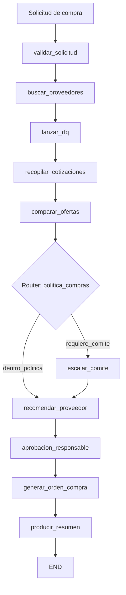

# Caso 07: Compras y Abastecimiento

> [!NOTE]
> **Estado**: `OPERATIVO` | **Versión**: 4.8.0 | **Puerto**: 8007 | **Tipo**: Adquisición con score multi-criterio + política de comité

Automatiza el ciclo de compras desde la solicitud hasta la orden de compra: valida la PR,
filtra el catálogo de proveedores homologados por categoría, lanza RFQs, recopila
cotizaciones, las puntúa por criterios configurables (precio 40 / plazo 30 / riesgo 30),
aplica la política corporativa (umbrales de comité y de proveedor preferido), recomienda
con justificación, simula la aprobación del responsable del centro de costo y emite la OC
con hash SHA-256 de trazabilidad.

Reduce el ciclo típico de adquisición de **días-persona a minutos** y garantiza la
aplicación consistente de la política de compras.

---

## Objetivo de negocio

Los departamentos de compras procesan cientos de solicitudes mensuales — la mayoría
repetitivas y de bajo valor estratégico, pero todas exigen aplicar políticas, mantener
trazabilidad y justificar decisiones. Este agente toma cada PR, ejecuta el proceso
end-to-end y entrega al responsable una recomendación justificada y una OC firmada con
hash que no puede modificarse sin romper la cadena.

## Flujo LangGraph



**10 nodos · 1 router condicional · `MemorySaver` · streaming NDJSON · sin dependencias numéricas externas.**

El router `politica_compras` activa el camino con comité cuando el monto del top supera el
umbral configurable (`umbral_comite_clp`, 25M CLP por defecto), cuando el mejor proveedor
no es preferido y supera el umbral menor (`umbral_no_preferido_clp`, 5M), o cuando la PR
llegó incompleta. Las dos ramas convergen en `recomendar_proveedor`; el estado de la
aprobación final marca la OC como `EMITIDA` o `PENDIENTE_COMITE`.

### Nodos

| Nodo | Descripción |
|---|---|
| `validar_solicitud` | Valida completitud (centro de costo, presupuesto, items, categoría) y estima monto |
| `buscar_proveedores` | Filtra catálogo homologado por categoría; fallback al universo homologado |
| `lanzar_rfq` | Genera RFQ determinística por proveedor candidato |
| `recopilar_cotizaciones` | Carga cotizaciones del escenario y las normaliza |
| `comparar_ofertas` | Aplica score 0-100 multi-criterio (precio 40 / plazo 30 / riesgo 30) y ordena |
| `politica_compras` (router) | Ramifica entre vía rápida y comité según umbrales |
| `escalar_comite` | Genera nota formal con razones y monto para el comité |
| `recomendar_proveedor` | Recomendación justificada (LLM opt-in) sobre el top de la comparativa |
| `aprobacion_responsable` | Aprobación digital determinista: APROBADA / CONDICIONAL / RECHAZADA |
| `generar_orden_compra` | Emite OC con `po_numero`, items, `sha256` para trazabilidad |
| `producir_resumen` | Resumen ejecutivo en Markdown para el responsable |

### Datos DEMO — 3 escenarios que ejercitan los 3 caminos del router

| Escenario | Centro de costo | Presupuesto | Resultado esperado |
|---|---|---|---|
| `PR-001` | ADM-OFICINA | 4.5M CLP | 🟢 **APROBADA** · proveedor preferido · OC emitida directamente |
| `PR-002` | TI-INFRA | 18M CLP | 🟢 **APROBADA** · 3 cotizaciones cerradas (~3% diferencia) · top preferido |
| `PR-003` | ING-PROYECTOS | 95M CLP | 🟡 **CONDICIONAL** · monto >25M activa comité · OC con `PENDIENTE_COMITE` |

Datos completos en `data/`: `scenarios.json`, `suppliers.json`, `procurement_policy.json`.

## Stack técnico

| Capa | Tecnología |
|---|---|
| Orquestación | LangGraph `StateGraph` + `MemorySaver` |
| API | FastAPI + uvicorn |
| Score multi-criterio | Python puro (pesos configurables, clamp 0-100) |
| Trazabilidad | SHA-256 sobre payload canonicalizado de la OC |
| LLM (LIVE) | OpenAI GPT-4o-mini opt-in para recomendación + resumen ejecutivo |
| Auth | DEMO + OAuth2/OIDC opt-in |
| Integraciones (LIVE) | Diseñado para SAP MM / Oracle Fusion Procurement / Coupa / Odoo |
| UI | HTML/CSS/JS vanilla, comparativa, score, tarjetas por sección |

## Ejecutar

### Local
```bash
cd cases/07-compras-abastecimiento/backend
pip install -r requirements.txt
uvicorn src.api:app --reload --port 8007
# UI: http://localhost:8007
```

### Docker (compose aislado)
```bash
cd cases/07-compras-abastecimiento/backend
docker compose up --build
```

### Docker (compose raíz, con portal)
```bash
docker compose up case07
# Portal: http://localhost:8080  ·  Caso 07: http://localhost:8007
```

### Modo LIVE
```bash
export OPENAI_API_KEY=sk-proj-...
# Badge cambia a LIVE; recomendar_proveedor y producir_resumen usan GPT-4o-mini.
# Ver costos en docs/COSTS.md
```

## Endpoints

| Método | Ruta | Descripción |
|---|---|---|
| GET | `/` | UI |
| GET | `/health`, `/healthz` | salud + modo |
| GET | `/ready` | grafo compilado |
| GET | `/metrics` | uptime, requests, errores, modo |
| POST | `/api/run` | adquisición completa (snapshot final) |
| GET | `/api/stream` | streaming NDJSON snapshot por nodo |

```bash
curl -X POST http://localhost:8007/api/run \
  -H "Content-Type: application/json" \
  -d '{"solicitud_id":"PR-003","thread_id":"t1"}' | jq .
```

## Tests

```bash
cd cases/07-compras-abastecimiento/backend
pytest -q
# 20 tests: helpers (score, hash), validación, router en sus 4 ramas,
# 3 flujos end-to-end + API
```

## Referencias

- Costos LIVE: [docs/COSTS.md](../../docs/COSTS.md)
- Skill estándar: [`.agents/skills/crear_caso/SKILL.md`](../../.agents/skills/crear_caso/SKILL.md)
- Casos referencia: 14 (finanzas), 06 (compliance), 17 (legal intake)
