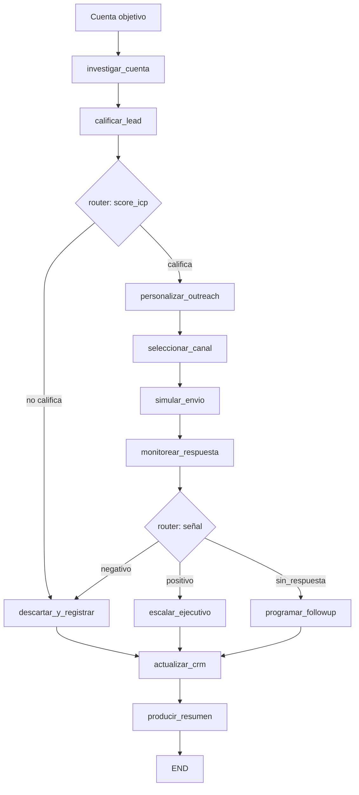

# Caso 08: Ventas B2B + CRM

> [!NOTE]
> **Estado**: `OPERATIVO` | **Versión**: 4.4.0 | **Puerto**: 8008 | **Tipo**: Outbound automatizado con CRM integrado

Automatiza el ciclo de prospección B2B: investiga la cuenta, calcula score ICP, decide si
califica, personaliza el mensaje por industria, selecciona canal y cadencia, simula el envío,
registra la señal del prospect, y decide entre escalar al AE, programar follow-up o
descartar — persistiendo todo en el CRM con `deal_stage` automático.

El AE solo ve cuentas calientes con contexto completo. Las descartadas y los nurturing
quedan archivados con razón explícita.

---

## Objetivo de negocio

Los equipos de ventas B2B dedican >50% de su tiempo a tareas no comerciales: investigar
cuentas, redactar correos, actualizar CRM, planificar seguimientos. Este agente recibe la
lista de cuentas objetivo y procesa cada una en segundos: enriquecimiento, scoring ICP
contra criterios configurables, redacción del primer toque, simulación de envío y registro
de la respuesta. Resultado: el AE recibe únicamente cuentas con respuesta positiva
(`Meeting Scheduled`) o follow-ups con contexto, no 200 cuentas frías por día.

## Flujo LangGraph



**10 nodos · 2 routers (`score_icp`, `señal_interes`) · MemorySaver · streaming NDJSON.**

### Nodos

| Nodo | Descripción |
|---|---|
| `investigar_cuenta` | Carga + enriquecimiento (tech stack, noticias, señales, headcount) |
| `calificar_lead` | Score ICP 0-100 ponderando industria, tamaño, stack moderno, señales, noticias |
| `descartar_y_registrar` | Termina la cuenta con motivo (no_califica / respuesta negativa) |
| `personalizar_outreach` | Mensaje con plantilla por industria (logistics, fintech, media, default) |
| `seleccionar_canal` | C-level → email + LinkedIn (3 toques); otros → email solo (2 toques) |
| `simular_envio` | Envío del primer toque con timestamp + tracking pixel |
| `monitorear_respuesta` | Lee respuesta del prospect (intent_score, fragmento) |
| `programar_followup` | Calcula próximo toque según cadencia |
| `escalar_ejecutivo` | Asigna AE por industria/país y menor `deals_activos` |
| `actualizar_crm` | Define `deal_stage` final + notas + next_step |
| `producir_resumen` | Resumen ejecutivo para sales manager |

### Datos DEMO — 4 cuentas que ejercitan los 4 caminos del pipeline

| Cuenta | Industria | Tamaño | Resultado |
|---|---|---|---|
| `ACC-001` NorthPeak Logistics | Logística | mid-market 850 emp. | ICP 98 alto · positivo → **Meeting Scheduled** + AE asignado |
| `ACC-002` Synthwave Studios | Gaming/Media | startup 35 emp. | ICP 68 medio · sin respuesta → **Nurturing** con next touch |
| `ACC-003` Andina Comercializadora | Retail tradicional | small 50 emp. | ICP 18 fuera_icp → **Disqualified** sin enviar mail |
| `ACC-004` FinSecure Bank | Banca | enterprise 12k emp. | ICP 65 medio · negativo → **Closed Lost** (freeze de vendors) |

Datos completos en `data/`: `accounts.json`, `icp.json`, `outreach_templates.json`,
`responses.json`, `sales_reps.json`.

## Stack técnico

| Capa | Tecnología |
|---|---|
| Orquestación | LangGraph `StateGraph` + `MemorySaver` |
| API | FastAPI + uvicorn |
| LLM (LIVE) | OpenAI GPT-4o-mini opt-in via `OPENAI_API_KEY` |
| Auth | DEMO + OAuth2/OIDC opt-in |
| CRM (LIVE) | Diseñado para HubSpot / Salesforce / Pipedrive |
| Enriquecimiento (LIVE) | Diseñado para Apollo.io / Clearbit / LinkedIn Sales Navigator |
| UI | HTML/CSS/JS vanilla, streaming NDJSON con email mock-up |

## Ejecutar

### Local
```bash
cd cases/08-ventas-b2b-crm/backend
pip install -r requirements.txt
uvicorn src.api:app --reload --port 8008
# UI: http://localhost:8008
```

### Docker (compose aislado)
```bash
cd cases/08-ventas-b2b-crm/backend
docker compose up --build
```

### Docker (compose raíz, con portal)
```bash
docker compose up case08
# Portal: http://localhost:8080  ·  Caso 08: http://localhost:8008
```

### Modo LIVE
```bash
export OPENAI_API_KEY=sk-proj-...
# Badge cambia a LIVE; personalizar_outreach y resumen usan GPT-4o-mini
```

## Endpoints

| Método | Ruta | Descripción |
|---|---|---|
| GET | `/` | UI |
| GET | `/health`, `/healthz` | salud + modo |
| GET | `/ready` | grafo compilado |
| GET | `/metrics` | uptime, requests, errores, modo |
| POST | `/api/run` | pipeline completo (snapshot final) |
| GET | `/api/stream` | streaming NDJSON snapshot por nodo |

```bash
curl -X POST http://localhost:8008/api/run \
  -H "Content-Type: application/json" \
  -d '{"account_id":"ACC-001","thread_id":"t1"}' | jq .
```

## Tests

```bash
cd cases/08-ventas-b2b-crm/backend
pytest -q
# 23 tests: compilación + nodos + routers + 4 flujos end-to-end + API
```

## Referencias

- Plan de elevación: [implementation_plan.md](implementation_plan.md)
- Skill estándar: [`.agents/skills/crear_caso/SKILL.md`](../../.agents/skills/crear_caso/SKILL.md)
- Casos referencia: 17 (legal intake), 09 (RRHH), 13 (BI)
