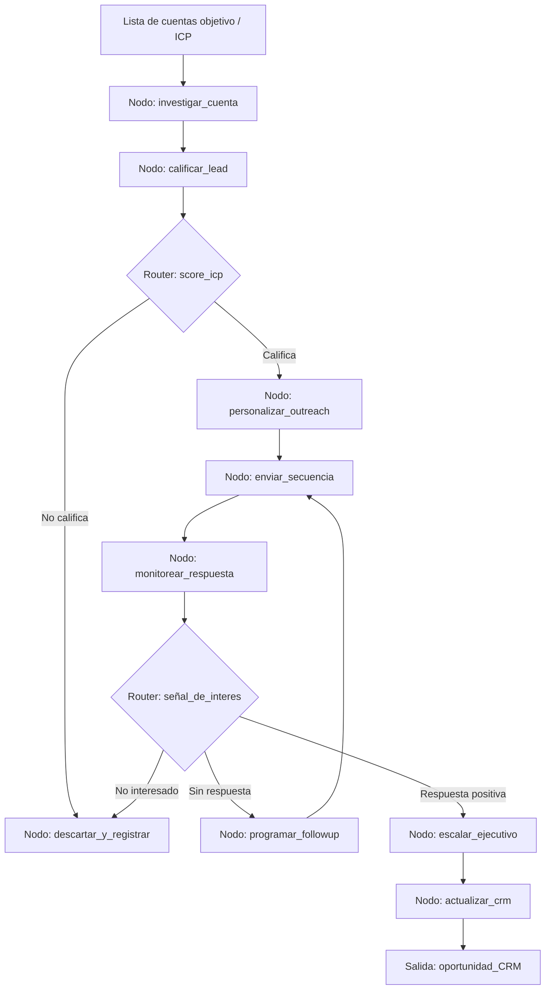

# Caso 08: Ventas B2B y CRM

> [!NOTE]
> **Estado**: `SCAFFOLD` | **Versión repo**: 3.9.0 | **Tipo**: Agente con estado y memoria conversacional

Automatiza el ciclo de prospección y seguimiento B2B identificando leads cualificados, personalizando el outreach en función del perfil de cada cuenta, registrando cada interacción en el CRM y proponiendo los siguientes pasos de seguimiento. Permite que los equipos comerciales multipliquen su capacidad de pipeline sin aumentar headcount, manteniendo la personalización que exige la venta consultiva.

---

## Objetivo de negocio

Los equipos de ventas B2B dedican más de la mitad de su tiempo a tareas no comerciales: investigar cuentas, redactar correos, actualizar el CRM y planificar seguimientos. Este agente recibe una lista de cuentas objetivo, investiga cada empresa (industria, tamaño, noticias recientes, tecnologías usadas), personaliza secuencias de outreach multicanal (email, LinkedIn), registra respuestas y señales de intención en el CRM y orquesta el seguimiento automático con el mensaje correcto en el momento adecuado, escalando al ejecutivo comercial cuando detecta interés cualificado.

## Flujo propuesto (LangGraph)

### Nodos principales

| Nodo | Descripción |
|---|---|
| `investigar_cuenta` | Enriquece datos de la cuenta con LinkedIn, web corporativa y noticias |
| `calificar_lead` | Evalúa fit con el ICP según industria, tamaño, pain points y presupuesto |
| `personalizar_outreach` | Genera mensajes personalizados por rol y contexto de la cuenta |
| `enviar_secuencia` | Orquesta el envío por email y LinkedIn respetando cadencias y horarios |
| `monitorear_respuesta` | Detecta aperturas, clics, respuestas y señales de intención |
| `programar_followup` | Calcula el timing óptimo y el mensaje del siguiente toque |
| `escalar_ejecutivo` | Notifica al AE con el resumen de la cuenta y el historial de interacciones |
| `actualizar_crm` | Registra todas las actividades, notas y el stage del deal en el CRM |

## Stack técnico previsto

| Capa | Tecnología |
|---|---|
| Orquestación | LangGraph `StateGraph` |
| API | FastAPI + uvicorn |
| LLM | OpenAI GPT-4o-mini (modo LIVE) / respuestas mock (modo DEMO) |
| CRM | Salesforce / HubSpot / Pipedrive (via API REST) |
| Enriquecimiento | Apollo.io, Clearbit, LinkedIn Sales Navigator API |
| Email | SendGrid / Microsoft Graph / Gmail API |

## Estado actual

Este caso es un **scaffold**: la estructura de la demo estática existe,
la implementación del backend con LangGraph está pendiente.

Para contribuir o elevar este caso, consulta [CONTRIBUTING.md](../../CONTRIBUTING.md).

---

> [!TIP]
> Ver los casos **09**, **10** y **13** como referencia de implementación industrial.
