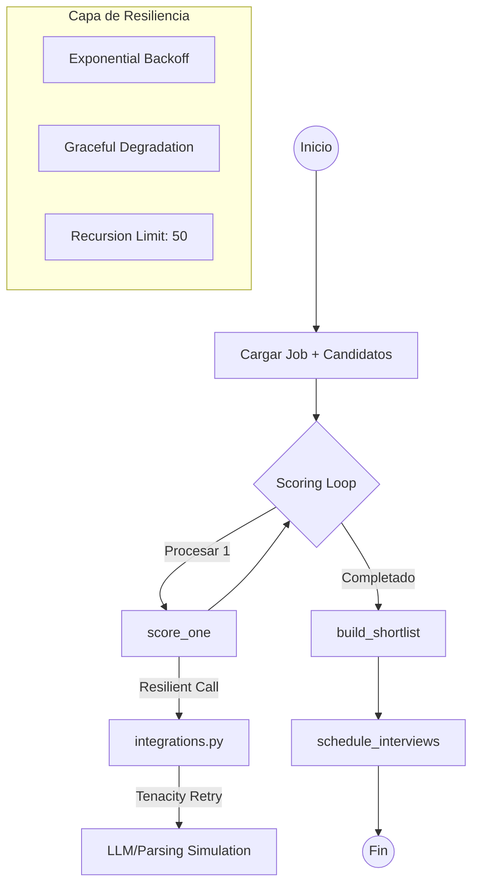

# 🤖 Caso 09: RR.HH. Screening + Agenda (Standardized)

**Detección de talento y agendamiento automatizado** con una arquitectura de agentes altamente resiliente. Este caso sirve como el **estándar de oro** del repositorio para implementaciones de producción.

## 🏗️ Arquitectura del Flujo



---

## 🛡️ Resiliencia y Guardrails (Enterprise Grade)

| Característica | Implementación | Propósito |
| :--- | :--- | :--- |
| **Retries** | `tenacity` (backoff exponencial) | Manejo de errores intermitentes en APIs externas. |
| **Error Handling** | `try/except` en nodos del grafo | Evita el colapso del flujo; captura errores y continúa. |
| **Step Limits** | `recursion_limit: 50` | Previene bucles infinitos en el agente. |
| **Checkpoints** | `SqliteSaver` | Persistencia de estado e idempotencia. |
| **Health Checks** | `/health` & `/ready` | Monitoreo de liveness y readiness para CI/CD. |

---

## 🛠️ Tech Stack

- **Core**: [LangGraph](https://github.com/langchain-ai/langgraph) (Orquestación de agentes con estado).
- **Backend API**: [FastAPI](https://fastapi.tiangolo.com/) (Streaming NDJSON).
- **Resilience**: [Tenacity](https://tenacity.readthedocs.io/) (Estrategias de reintento).
- **Quality**: [Ruff](https://beta.ruff.rs/docs/) (Linting & Formatting).
- **Container**: [Docker](https://www.docker.com/) (Entorno reproducible).

---

## 🚀 Cómo empezar

### Ejecución Local

```bash
cd backend
python -m venv .venv
source .venv/bin/activate  # Windows: .\.venv\Scripts\Activate.ps1
pip install -r requirements.txt
uvicorn src.api:app --reload --port 8009
```
Abre: `http://localhost:8009`

### Validación con Docker (Smoke Tests)

Para validar la resiliencia y el flujo completo:
```bash
cd backend
docker compose -f compose.smoke.yml up --build --abort-on-container-exit
```

---

## 🧭 Roadmap de Implementación "Real"

Para convertir este demo en un sistema productivo, sigue este orden:
1. **Parsing**: Implementa `parse_resume_to_text` en `backend/src/integrations.py` (usando `pypdf`/`docx`).
2. **Database**: Conecta un motor real (Postgres/S3) para la carga de CVs.
3. **Calendar**: Activa las credenciales de Google API en `create_google_calendar_event`.

---
> [!IMPORTANT]
> Los logs están configurados en formato **JSON estructurado** para facilitar la integración con Datadog, ELK o CloudWatch.
