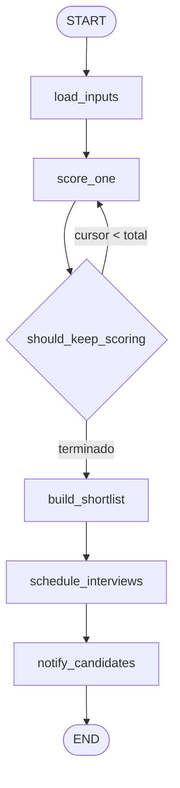

# Caso 09 — RRHH Screening y Agenda

> [!NOTE]
> **Estado**: `🏭 INDUSTRIAL` | **Versión repo**: 4.0.0 | **Puerto**: `8009`
> **Patrón**: Scoring iterativo por candidato + shortlist + agendamiento + notificaciones

## Flujo (LangGraph)


```mermaid
graph TD
    A([START]) --> B[load_inputs]
    B --> C[score_one]
    C --> D{should_keep_scoring}
    D -->|cursor < total| C
    D -->|terminado| E[build_shortlist]
    E --> F[schedule_interviews]
    F --> G[notify_candidates]
    G --> H([END])
```

Agente de screening y agenda para RRHH que evalúa CVs, puntúa candidatos con criterios configurables
y agenda entrevistas integrándose con Google Calendar y notificaciones por email.
Incluye resiliencia con reintentos, MemorySaver para estado persistente y streaming de progreso.

---

## Integraciones opcionales

| Servicio | Variable | Descripción |
|:---|:---|:---|
| OpenAI | `OPENAI_API_KEY` | Scoring y análisis con LLM |
| Google Calendar | `GOOGLE_CREDS_JSON` | Agendamiento real de entrevistas |
| SMTP / SendGrid | `SMTP_*` / `SENDGRID_API_KEY` | Notificaciones por email |
| AWS S3 | `AWS_*` | Almacenamiento de CVs |

Funciona en **DEMO** sin ninguna de estas variables.

---

## Controles de seguridad

- Imagen Docker: `python:3.11.10-slim`, usuario `appuser` (non-root).
- `DEMO_AUTH_TOKEN` y `RATE_LIMIT_RPM` opcionales para exposición externa controlada.
- Formulario de APIs en la UI para exportar el `.env` del caso.

---

## Cómo ejecutar

```bash
# Con Docker
docker compose up case09

# En local
cd cases/09-rrhh-screening-agenda/backend
uvicorn src.api:app --reload --port 8009
```

UI del caso: [http://localhost:8009/web/](http://localhost:8009/web/)

---

> [!TIP]
> Ver [SECURITY.md](../../SECURITY.md) para el detalle de los controles de hardening activos en este caso.
