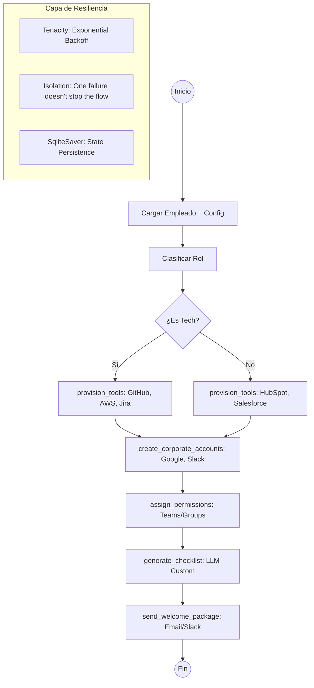

# 🚀 Caso 10: Onboarding de Empleados (Industrial)

**Automatización de la incorporación de talento** con una arquitectura de agentes orientada a eventos y aprovisionamiento dinámico. Este caso demuestra cómo manejar flujos ramificados y herramientas externas con resiliencia empresarial.

## 🏗️ Arquitectura del Flujo



### 🔄 Los 4 Pilares del Onboarding

1.  **Lectura (Fase 1) 📄**: Carga de perfiles y reglas de negocio según departamento.
2.  **Análisis (Fase 2) 🧠**: El LLM genera un checklist de tareas personalizado para el primer mes del empleado.
3.  **Acción (Fase 3-5) 🔧**: Creación de cuentas, accesos y grupos de seguridad en tiempo real.
4.  **Notificación (Fase 7) 📧**: Bienvenida omnicanal (Email para el empleado, Slack para el manager).

---

## 🧠 Arquitectura Híbrida (Demo vs. Real IA)

Al igual que el Caso 09, este sistema detecta automáticamente la configuración en el `.env`:

| Característica | 🧪 Modo Demo (Mock) | 🧠 Modo IA Real |
| :--- | :--- | :--- |
| **Checklist** | Plantilla estática por rol | Generación dinámica con GPT-4o-mini |
| **Aprovisionamiento** | Simulación de éxito con delay | Llamadas reales a APIs (GitHub, AWS, etc.) |
| **Notificaciones** | Logs visuales en Dashboard | Emails y mensajes de Slack reales |
| **Costo** | $0 | Tokens + API Consumption |

---

## 🛡️ Resiliencia Industrial

| Característica | Implementación | Propósito |
| :--- | :--- | :--- |
| **Aislamiento de Fallos** | `try/except` por herramienta | Si falla GitHub, el empleado sigue recibiendo su Slack y Email. |
| **Retries** | `tenacity` | Manejo de Timeouts y rate-limits en APIs de terceros. |
| **Persistencia** | `SqliteSaver` | Permite auditar cada paso y retomar flujos interrumpidos. |
| **Tracing** | `trace_id` | Seguimiento completo de la solicitud desde el portal hasta los logs. |

---

## 🛠️ Tech Stack

-   **Core**: [LangGraph](https://github.com/langchain-ai/langgraph) (Orquestación con estado).
-   **API**: [FastAPI](https://fastapi.tiangolo.com/) (Streaming NDJSON para feedback vivo).
-   **Integraciones**: Google Admin SDK, Slack SDK, Boto3 (AWS), GitHub API.
-   **UI**: Vanilla JS Premium (Glassmorphism + Dark Mode).

---

## 🚀 Cómo empezar

### Ejecución Local

```bash
cd backend
python -m venv .venv
source .venv/bin/activate  # Windows: .\.venv\Scripts\Activate.ps1
pip install -r requirements.txt
uvicorn src.api:app --reload --port 8010
```
Abre: `http://localhost:8010`

### Validación con Docker

```bash
cd backend
docker compose up --build
```

---

## 🧭 Activación de Integraciones Reales

Para pasar de "Modo Demo" a "Modo Real", añade estas llaves al archivo `cases/10-onboarding-empleados/backend/.env`:

```env
OPENAI_API_KEY=sk-...
# Opcionales para aprovisionamiento real:
GITHUB_TOKEN=ghp_...
SLACK_BOT_TOKEN=xoxb-...
GOOGLE_ADMIN_CREDENTIALS_JSON=...
SMTP_SERVER=...
```

---
> [!IMPORTANT]
> El Caso 10 complementa al Caso 09 cerrando el ciclo de vida del talento: desde el agendamiento de la entrevista hasta el primer día de trabajo productivo.
