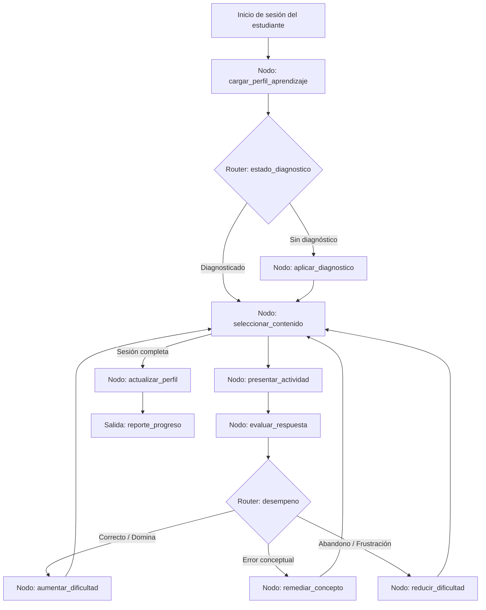

# Caso 11: Tutor Adaptativo

> [!NOTE]
> **Estado**: `SCAFFOLD` | **Versión repo**: 3.9.0 | **Tipo**: Agente con estado y memoria de aprendizaje

Automatiza la experiencia de tutoría personalizada diagnosticando el nivel inicial del estudiante, seleccionando contenidos y ejercicios adaptados a su desempeño, ajustando la dificultad en tiempo real y generando reportes de progreso para docentes e instituciones. Democratiza el acceso a tutoría de calidad individual en plataformas educativas con miles de usuarios simultáneos.

---

## Objetivo de negocio

Las plataformas EdTech y las instituciones educativas enfrentan el reto de personalizar el aprendizaje a escala: un solo docente no puede adaptar el contenido para cada estudiante en tiempo real. Este agente evalúa el nivel de conocimiento inicial mediante un diagnóstico adaptativo, selecciona la ruta de aprendizaje óptima del catálogo de contenidos, presenta ejercicios calibrados a la zona de desarrollo próximo del estudiante, analiza los errores para detectar conceptos erróneos y ajusta la dificultad y el formato (explicación, ejemplo, práctica) en cada interacción, manteniendo un perfil de aprendizaje persistente.

## Flujo propuesto (LangGraph)

### Nodos principales

| Nodo | Descripción |
|---|---|
| `cargar_perfil_aprendizaje` | Recupera el historial, nivel actual y objetivos del estudiante |
| `aplicar_diagnostico` | Evalúa conocimientos iniciales con preguntas adaptativas (IRT) |
| `seleccionar_contenido` | Elige el próximo concepto y formato según la ruta de aprendizaje |
| `presentar_actividad` | Entrega el ejercicio, explicación o video adaptado al nivel actual |
| `evaluar_respuesta` | Analiza la respuesta e identifica el tipo de error o concepto erróneo |
| `remediar_concepto` | Presenta una explicación alternativa y ejercicios de refuerzo |
| `aumentar_dificultad` | Sube el nivel de complejidad cuando el estudiante domina el concepto |
| `reducir_dificultad` | Baja la complejidad para evitar frustración y mantener el engagement |
| `actualizar_perfil` | Persiste el progreso, nivel y métricas de la sesión |

## Stack técnico previsto

| Capa | Tecnología |
|---|---|
| Orquestación | LangGraph `StateGraph` |
| API | FastAPI + uvicorn |
| LLM | OpenAI GPT-4o-mini (modo LIVE) / respuestas mock (modo DEMO) |
| Modelo IRT | Algoritmo adaptativo basado en Teoría de Respuesta al Ítem |
| Almacenamiento | PostgreSQL (perfiles y progreso), Redis (sesión activa) |
| Contenidos | Base de conocimiento vectorial (pgvector + embeddings) |

## Estado actual

Este caso es un **scaffold**: la estructura de la demo estática existe,
la implementación del backend con LangGraph está pendiente.

Para contribuir o elevar este caso, consulta [CONTRIBUTING.md](../../CONTRIBUTING.md).

---

> [!TIP]
> Ver los casos **09**, **10** y **13** como referencia de implementación industrial.
