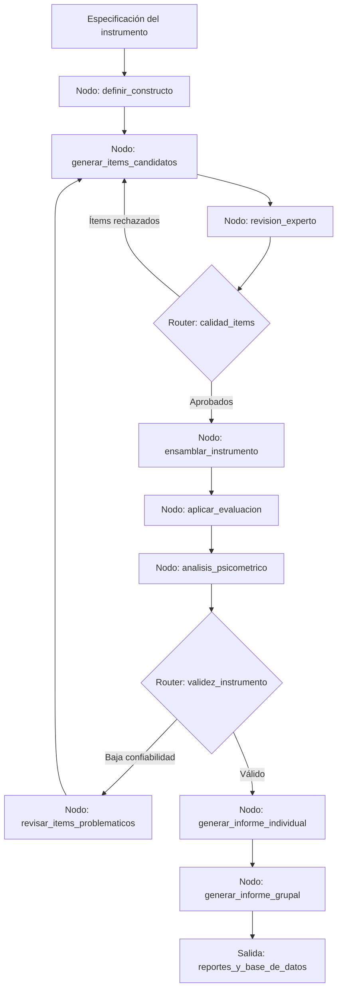

# Caso 12: Psicometría y Evaluaciones

> [!NOTE]
> **Estado**: `SCAFFOLD` | **Versión repo**: 3.9.0 | **Tipo**: Agente con estado y validación experta

Automatiza la generación, validación psicométrica y aplicación de instrumentos de evaluación (tests, cuestionarios, baterías de selección) produciendo ítems calibrados, análisis de resultados con métricas de confiabilidad y validez, e informes individuales y grupales. Permite a los equipos de recursos humanos, psicólogos educativos e investigadores escalar la producción de evaluaciones de alta calidad técnica.

---

## Objetivo de negocio

Las áreas de RRHH, selección de talento e instituciones educativas necesitan instrumentos de evaluación válidos y confiables, pero su construcción manual requiere expertos en psicometría y semanas de trabajo. Este agente recibe las especificaciones del instrumento (constructo, población objetivo, número de ítems, formato de respuesta), genera ítems candidatos aplicando buenas prácticas psicométricas, ejecuta análisis de sesgo y dificultad sobre datos piloto, calibra el instrumento y produce los informes individuales con interpretación de resultados en lenguaje no técnico para el evaluado y en lenguaje técnico para el evaluador.

## Flujo propuesto (LangGraph)

### Nodos principales

| Nodo | Descripción |
|---|---|
| `definir_constructo` | Estructura la tabla de especificaciones y los dominios del instrumento |
| `generar_items_candidatos` | Produce ítems variados respetando niveles cognitivos y formatos |
| `revision_experto` | Aplica criterios técnicos de claridad, sesgo y representatividad |
| `ensamblar_instrumento` | Selecciona y ordena los ítems aprobados, balancea la dificultad |
| `aplicar_evaluacion` | Administra el instrumento con lógica adaptativa si corresponde |
| `analisis_psicometrico` | Calcula alpha de Cronbach, índices de dificultad y discriminación (IRT) |
| `revisar_items_problematicos` | Identifica y excluye ítems que degradan la confiabilidad |
| `generar_informe_individual` | Produce perfil del evaluado con percentiles e interpretación |
| `generar_informe_grupal` | Sintetiza resultados del grupo con distribuciones y tendencias |

## Stack técnico previsto

| Capa | Tecnología |
|---|---|
| Orquestación | LangGraph `StateGraph` |
| API | FastAPI + uvicorn |
| LLM | OpenAI GPT-4o-mini (modo LIVE) / respuestas mock (modo DEMO) |
| Análisis estadístico | Python (scipy, pingouin, py-irt) |
| Almacenamiento | PostgreSQL (ítems, aplicaciones, resultados) |
| Reportes | Jinja2 + WeasyPrint (PDF) |

## Estado actual

Este caso es un **scaffold**: la estructura de la demo estática existe,
la implementación del backend con LangGraph está pendiente.

Para contribuir o elevar este caso, consulta [CONTRIBUTING.md](../../CONTRIBUTING.md).

---

> [!TIP]
> Ver los casos **09**, **10** y **13** como referencia de implementación industrial.
