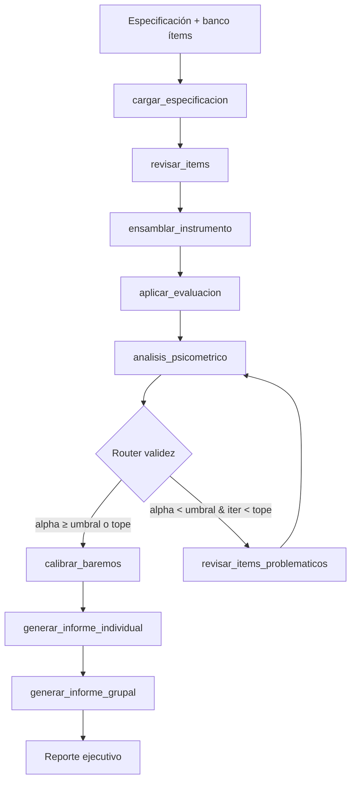

# Caso 12 — Psicometría y Evaluaciones

> [!NOTE]
> **Estado**: `OPERATIVO` | **Versión repo**: 4.11.0 | **Tipo**: Validador psicométrico de instrumentos con loop de revisión

Construcción, validación y baremación de instrumentos de evaluación (tests de selección, escalas de clima). El agente toma la especificación del instrumento, revisa el banco de ítems candidatos, ensambla la versión final, simula su aplicación a la cohorte piloto y produce un análisis psicométrico completo con métricas clásicas (α de Cronbach, dificultad, discriminación, DIF entre grupos), baremos por percentiles, informes individuales con banda de desempeño e informe grupal ejecutivo.

---

## Objetivo de negocio

Las áreas de selección de talento, evaluación educativa y clima organizacional necesitan instrumentos válidos y confiables, pero su construcción manual requiere expertos en psicometría y semanas de trabajo. Este agente recibe las especificaciones (constructo, formato, n_items, población, grupos a comparar), aplica criterios técnicos sobre los ítems candidatos, ejecuta el pilotaje simulado, mide la calidad psicométrica del instrumento, itera excluyendo ítems problemáticos hasta lograr una confiabilidad aceptable o agotar el presupuesto de iteraciones, y entrega tres productos: baremos, informes individuales interpretados y un informe ejecutivo para el comité técnico.

## Flujo (LangGraph)



**10 nodos · 1 router (validez) · 1 loop con tope (`max_iteraciones_validez = 2`).**

### Nodos

| Nodo | Descripción |
|---|---|
| `cargar_especificacion` | Carga instrumento, política, banco de ítems candidatos y cohorte declarada |
| `revisar_items` | Revisión experta determinista: excluye por claridad, representatividad o sesgo estimado |
| `ensamblar_instrumento` | Selecciona hasta `n_items_objetivo` balanceando conceptos |
| `aplicar_evaluacion` | Simula la matriz de respuestas piloto (modelo Rasch‐like dicotómico o Likert) |
| `analisis_psicometrico` | Calcula α de Cronbach, dificultad `p`, discriminación item-total y DIF entre grupos |
| `revisar_items_problematicos` | Excluye ítems con dificultad fuera de rango, discriminación baja o DIF alto |
| `calibrar_baremos` | Calcula media, mediana, P25/P50/P75 sobre los puntajes totales |
| `generar_informe_individual` | Asigna percentil + banda interpretativa por evaluado |
| `generar_informe_grupal` | Distribución por banda, medias por grupo, reporte ejecutivo (LLM opt-in) |

## Stack técnico

| Capa | Tecnología |
|---|---|
| Orquestación | LangGraph `StateGraph` + `MemorySaver` |
| API | FastAPI + uvicorn |
| Streaming | `GET /api/stream` (NDJSON, `stream_mode="values"`) |
| Psicometría | Cálculos puros en `statistics` + `math` (sin scipy) |
| LLM | OpenAI (LIVE opt-in vía `OPENAI_API_KEY`) — reporte ejecutivo enriquecido |
| Auth | DEMO sin token · OAuth2/OIDC opt-in (`USE_OAUTH2=true`) |
| Observabilidad | Logging JSON estructurado con `trace_id`, `/metrics` |

## Endpoints

| Método | Ruta | Propósito |
|---|---|---|
| `GET` | `/` | UI web embebida |
| `GET` | `/web/` | Recursos estáticos |
| `GET` | `/health`, `/healthz` | Liveness + modo DEMO/LIVE |
| `GET` | `/ready` | Readiness (compila el grafo) |
| `GET` | `/metrics` | Latencias, requests, errores |
| `POST` | `/api/run` | Ejecuta el flujo completo y devuelve el snapshot final |
| `GET` | `/api/stream` | Streaming NDJSON con snapshots por paso |

## Modo DEMO / LIVE

- **DEMO** (sin `OPENAI_API_KEY`): pipeline 100% funcional — revisión, pilotaje simulado, métricas, baremos, informes y reporte ejecutivo fallback. Determinista por cohorte y por id de ítem (crc32).
- **LIVE** (con `OPENAI_API_KEY`): el reporte ejecutivo grupal se redacta con GPT-4o-mini bajo prompt acotado (≤ 220 palabras, español).

Modo visible en `GET /health.mode` y como badge en la UI.

## Datos DEMO (`data/`)

| Archivo | Contenido |
|---|---|
| [`instruments.json`](data/instruments.json) | 3 instrumentos: 2 dicotómicos + 1 Likert |
| [`item_banks.json`](data/item_banks.json) | Bancos de ítems candidatos por instrumento (12, 10, 8 ítems) |
| [`policy.json`](data/policy.json) | Umbrales transversales: tope iteraciones, bandas de percentil |

### Escenarios cubiertos

| Instrumento | Formato | Cohorte | Caso de uso |
|---|---|---:|---|
| `INST-COMP-DIG-01` | Dicotómico | 40 | Competencias digitales — selección admin |
| `INST-RAZ-LOG-02` | Dicotómico | 35 | Razonamiento lógico — admisión técnica (loop psicométrico activado por DIF) |
| `INST-ESC-BIE-03` | Likert 5 pts | 50 | Bienestar laboral — clima por área |

## Ejecutar

### Local

```bash
cd cases/12-psicometria-evaluaciones/backend
pip install -r requirements.txt
uvicorn src.api:app --host 0.0.0.0 --port 8012
# Abrir http://localhost:8012/
```

### Docker (caso aislado)

```bash
cd cases/12-psicometria-evaluaciones/backend
docker compose up --build
```

### Compose raíz

```bash
docker compose up --build case12
```

## Tests

```bash
cd cases/12-psicometria-evaluaciones/backend
python -m pytest tests/ -q
```

**29 tests** — 19 de grafo (helpers psicométricos + routers + flujos e2e por instrumento) + 10 de API.

---

> [!TIP]
> Ver casos **09**, **10** y **13** como referencia técnica viva. Este caso reutiliza el patrón de auth/middleware/metrics de los casos 04, 05, 07, 11 y 14.
