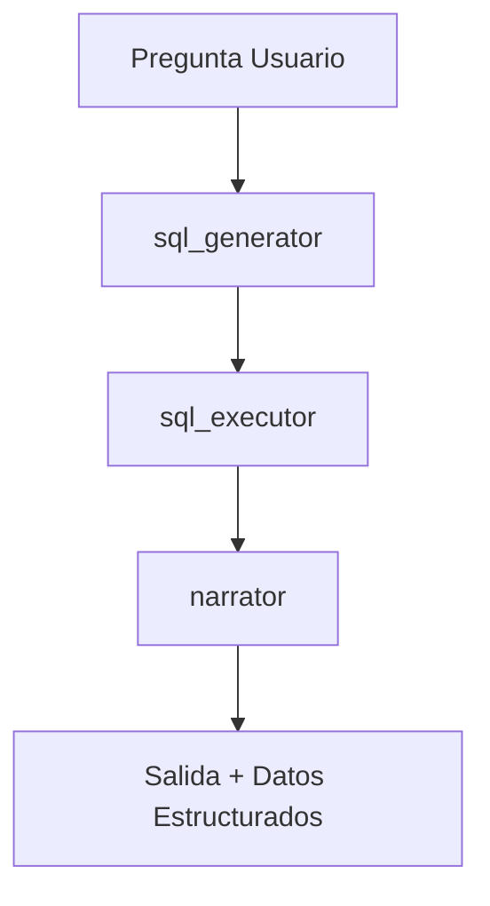

# 📊 Caso 13: Analista de Datos BI (Industrial v3.4.0)

> [!IMPORTANT]
> **Estado**: Industrial | **Versión**: 3.4.0 | **Referencia**: Agentic SQL & Data Viz

**LangGraph Powered SQL Agent** que transforma preguntas en lenguaje natural en consultas SQL precisas, las ejecuta y visualiza los resultados mediante gráficos dinámicos.

## 🚀 Capacidades Industriales

- **Generación SQL Robusta**: Capacidad de realizar Joins entre tablas de Ventas, Productos y Clientes.
- **Visualización Dinámica**: Integración con **Chart.js** para generar gráficos de pastel y barras automáticamente.
- **Modo Dual (Demo/LLM)**: Funciona 100% offline mediante un motor de reglas de negocio o con el cerebro de **GPT-4o** para análisis profundo.
- **Dashboard Premium**: Interfaz glassmorphism con sistema de sugerencias reactivo.

## 🏗️ Arquitectura del Grafo



## 🛠️ Ejecución

### Vía Docker (Recomendado)
```bash
docker compose up -d --build case13
```
Acceso: [http://localhost:8013](http://localhost:8013)

### Vía Local (Desarrollo)
1. Instalar dependencias: `pip install -r backend/requirements.txt`
2. Lanzar API: `uvicorn src.api:app --port 8013`
