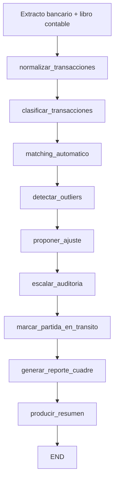

# Caso 14: Finanzas — Conciliación

> [!NOTE]
> **Estado**: `OPERATIVO` | **Versión**: 4.5.0 | **Puerto**: 8014 | **Tipo**: Conciliación bancaria + contable con detección de anomalías

Automatiza el cierre mensual: cruza extracto bancario vs. asientos contables, detecta
discrepancias, las clasifica en error contable, posible fraude o partida en tránsito,
propone los ajustes correspondientes, escala anomalías a auditoría interna y emite el
reporte de cuadre con indicador de riesgo verde/amarillo/rojo.

Reduce el cierre típico de **2-3 días-persona a minutos**, con cobertura del 100% de las
transacciones (no muestreo).

---

## Objetivo de negocio

El equipo de tesorería + contabilidad emplea decenas de horas mensuales conciliando
manualmente extractos bancarios contra el libro mayor. Los errores y fraudes pueden pasar
inadvertidos durante meses. Este agente toma ambas fuentes, normaliza, clasifica por
categoría contable, hace matching automático multi-criterio (monto, fecha, referencia,
contraparte), aplica detección de outliers por z-score sobre el histórico del propio
escenario, separa los hallazgos en (a) error contable con asiento sugerido, (b) posible
fraude que escala a auditoría interna, (c) diferencia de timing legítima (cheques en
tránsito, depósitos en cola), y produce el reporte de cuadre con KPIs y resumen ejecutivo
para el controller.

## Flujo LangGraph



**9 nodos · `MemorySaver` · streaming NDJSON · sin dependencias numéricas externas.**

Las 3 ramas de discrepancia (`proponer_ajuste`, `escalar_auditoria`,
`marcar_partida_en_transito`) se ejecutan en serie y cada una filtra el array `outliers`
por su `tipo` correspondiente — patrón limpio que evita merge de estado por bifurcación.

### Nodos

| Nodo | Descripción |
|---|---|
| `normalizar_transacciones` | Carga el escenario y estandariza claves de transacciones |
| `clasificar_transacciones` | Asigna cuenta contable + centro de costo + categoría por keyword |
| `matching_automatico` | Empareja con score 1.0/0.7/0.6 por (ref+fecha+monto) / (fecha+monto) / (contraparte+monto) |
| `detectar_outliers` | Clasifica unmatched + matches anómalos en error/fraude/tránsito (z-score=2.5) |
| `proponer_ajuste` | Asiento contable sugerido para errores con cuenta origen+destino |
| `escalar_auditoria` | Nota formal a auditoría interna para anomalías de fraude |
| `marcar_partida_en_transito` | Etiqueta cheques emitidos/depósitos en cola al cierre |
| `generar_reporte_cuadre` | Métricas (total banco/contable/conciliado/pendiente, %) + indicador verde/amarillo/rojo |
| `producir_resumen` | Resumen ejecutivo en lenguaje natural para el controller |

### Datos DEMO — 3 escenarios que ejercitan los 3 niveles de riesgo

| Escenario | Período | Resultado esperado |
|---|---|---|
| `SCN-001` | 2026-03 | 🟢 100% conciliado · sin discrepancias · **riesgo VERDE** |
| `SCN-002` | 2026-04 | 🟡 ~91% conciliado · ajustes contables + 2 partidas en tránsito · **riesgo AMARILLO** |
| `SCN-003` | 2026-04 | 🔴 ~20% conciliado · transferencia offshore de 47.8M CLP escalada a auditoría · **riesgo ROJO** |

Datos completos en `data/`: `scenarios.json`, `matching_rules.json`, `account_mapping.json`.

## Stack técnico

| Capa | Tecnología |
|---|---|
| Orquestación | LangGraph `StateGraph` + `MemorySaver` |
| API | FastAPI + uvicorn |
| Análisis numérico | Python puro (z-score, math, sin pandas/numpy) |
| LLM (LIVE) | OpenAI GPT-4o-mini opt-in para justificación contable + resumen ejecutivo |
| Auth | DEMO + OAuth2/OIDC opt-in |
| Integraciones (LIVE) | Diseñado para SAP / Oracle / Quickbooks via API o CSV; MT940/CAMT.053 para extractos |
| UI | HTML/CSS/JS vanilla, KPIs, tabla de matches, tarjetas por outlier, reporte tipográfico |

## Ejecutar

### Local
```bash
cd cases/14-finanzas-conciliacion/backend
pip install -r requirements.txt
uvicorn src.api:app --reload --port 8014
# UI: http://localhost:8014
```

### Docker (compose aislado)
```bash
cd cases/14-finanzas-conciliacion/backend
docker compose up --build
```

### Docker (compose raíz, con portal)
```bash
docker compose up case14
# Portal: http://localhost:8080  ·  Caso 14: http://localhost:8014
```

### Modo LIVE
```bash
export OPENAI_API_KEY=sk-proj-...
# Badge cambia a LIVE; proponer_ajuste y resumen usan GPT-4o-mini
```

## Endpoints

| Método | Ruta | Descripción |
|---|---|---|
| GET | `/` | UI |
| GET | `/health`, `/healthz` | salud + modo |
| GET | `/ready` | grafo compilado |
| GET | `/metrics` | uptime, requests, errores, modo |
| POST | `/api/run` | conciliación completa (snapshot final) |
| GET | `/api/stream` | streaming NDJSON snapshot por nodo |

```bash
curl -X POST http://localhost:8014/api/run \
  -H "Content-Type: application/json" \
  -d '{"scenario_id":"SCN-003","thread_id":"t1"}' | jq .
```

## Tests

```bash
cd cases/14-finanzas-conciliacion/backend
pytest -q
# 22 tests: helpers (z-score, classify), nodos, matching, 3 flujos end-to-end + API
```

## Referencias

- Plan de elevación: [implementation_plan.md](implementation_plan.md)
- Skill estándar: [`.agents/skills/crear_caso/SKILL.md`](../../.agents/skills/crear_caso/SKILL.md)
- Casos referencia: 17 (legal intake), 08 (B2B), 09 (RRHH)
