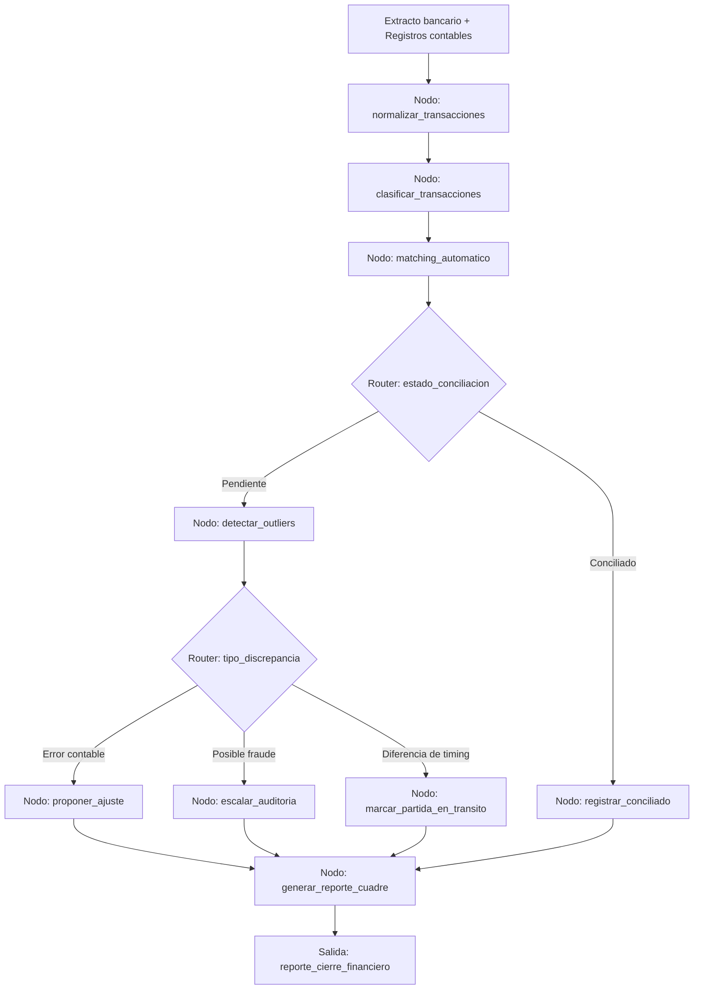

# Caso 14: Finanzas y Conciliación

> [!NOTE]
> **Estado**: `SCAFFOLD` | **Versión repo**: 4.0.0 | **Tipo**: Agente con estado y detección de anomalías

Automatiza el proceso de conciliación contable y bancaria clasificando transacciones, detectando outliers y discrepancias, sugiriendo acciones correctivas y generando los reportes de cuadre para el cierre financiero. Reduce el tiempo de conciliación mensual de días a horas y aumenta la cobertura de revisión al 100% de las transacciones.

---

## Objetivo de negocio

Los equipos de contabilidad y tesorería de empresas medianas y grandes dedican decenas de horas al mes a conciliar extractos bancarios, cuentas contables y sistemas de facturación. Los errores y fraudes pueden pasar inadvertidos durante meses. Este agente ingiere extractos bancarios y registros contables, aplica reglas de matching y modelos de clasificación para emparejar transacciones, detecta outliers estadísticos y patrones sospechosos, propone el asiento de ajuste o la acción correctiva para cada discrepancia y genera el reporte de cuadre con indicadores de riesgo para el controller.

## Flujo propuesto (LangGraph)

### Nodos principales

| Nodo | Descripción |
|---|---|
| `normalizar_transacciones` | Estandariza formatos de extractos bancarios y asientos contables |
| `clasificar_transacciones` | Asigna cuenta contable, centro de costo y categoría a cada movimiento |
| `matching_automatico` | Empareja transacciones bancarias con registros contables por monto, fecha y referencia |
| `detectar_outliers` | Identifica transacciones fuera de patrón histórico (monto, frecuencia, contraparte) |
| `proponer_ajuste` | Genera el asiento de ajuste sugerido para diferencias contables |
| `escalar_auditoria` | Marca transacciones sospechosas y notifica al equipo de auditoría interna |
| `marcar_partida_en_transito` | Identifica diferencias de timing legítimas (cheques en tránsito, transferencias) |
| `generar_reporte_cuadre` | Produce el informe de conciliación con indicadores de riesgo y pendientes |

## Stack técnico previsto

| Capa | Tecnología |
|---|---|
| Orquestación | LangGraph `StateGraph` |
| API | FastAPI + uvicorn |
| LLM | OpenAI GPT-4o-mini (modo LIVE) / respuestas mock (modo DEMO) |
| Análisis numérico | Python (pandas, scikit-learn para detección de outliers) |
| Integraciones | SAP / Oracle / Quickbooks (via API o CSV) |
| Almacenamiento | PostgreSQL (transacciones, resultados de conciliación) |

## Estado actual

Este caso es un **scaffold**: la estructura de la demo estática existe,
la implementación del backend con LangGraph está pendiente.

Para contribuir o elevar este caso, consulta [CONTRIBUTING.md](../../CONTRIBUTING.md).

---

> [!TIP]
> Ver los casos **09**, **10** y **13** como referencia de implementación industrial.
