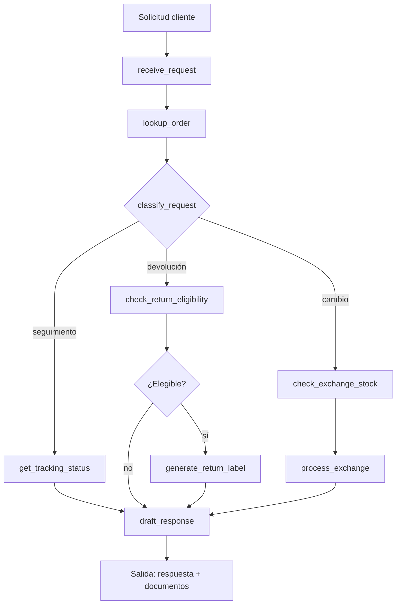

# Caso 15: E-commerce Postventa

> [!NOTE]
> **Estado**: `SCAFFOLD` | **Versión repo**: 3.9.0 | **Tipo**: Agente reactivo con estado

Agente de gestión postventa para e-commerce que maneja solicitudes de seguimiento de pedidos,
devoluciones, cambios y generación de etiquetas de envío. Automatiza el flujo desde la
consulta del cliente hasta la resolución, integrándose con sistemas de logística y ERP.

---

## Objetivo de negocio

Los equipos de soporte postventa dedican hasta el 40% del tiempo a consultas repetitivas sobre
estado de pedidos y gestión de devoluciones. Este agente automatiza la clasificación, verificación
de elegibilidad y generación de documentos (etiquetas, notas de crédito), liberando al equipo
para casos complejos que requieren juicio humano.

---

## Flujo propuesto (LangGraph)

### Nodos principales

| Nodo | Descripción |
|:---|:---|
| `receive_request` | Parsea la solicitud y extrae número de pedido |
| `lookup_order` | Consulta el estado del pedido en el ERP/OMS |
| `classify_request` | Determina el tipo: seguimiento / devolución / cambio |
| `check_return_eligibility` | Valida política de devoluciones (plazo, condición) |
| `generate_return_label` | Genera etiqueta de envío vía API de logística |
| `process_exchange` | Reserva stock y procesa el cambio |
| `draft_response` | Redacta la respuesta con información y documentos |

---

## Stack técnico previsto

| Capa | Tecnología |
|:---|:---|
| Orquestación | LangGraph `StateGraph` |
| API | FastAPI + uvicorn |
| LLM | OpenAI GPT-4o-mini (modo LIVE) / respuestas mock (modo DEMO) |
| Logística | API de operador logístico (stub en DEMO) |
| ERP/OMS | REST API del sistema de órdenes (stub en DEMO) |
| Base de datos | SQLite (órdenes y políticas de devolución) |

---

## Estado actual

Este caso es un **scaffold**: la estructura de la demo estática existe,
la implementación del backend con LangGraph está pendiente.

Para contribuir o elevar este caso, consulta [CONTRIBUTING.md](../../CONTRIBUTING.md).

---

> [!TIP]
> Ver los casos **01** y **02** como referencia de implementación operativa con routing condicional.
