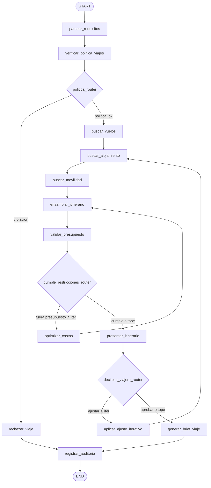

# Caso 16 — Planificador de Viajes

> [!NOTE]
> **Estado**: `✅ OPERATIVO` | **Versión repo**: 4.14.0 | **Puerto**: `8016`
> **Patrón**: 2 routers + loop de optimización de costos + loop de ajuste iterativo del viajero

Automatiza la planificación de itinerarios de viaje corporativos y personales respetando
restricciones de presupuesto, política de viajes y preferencias del viajero. El agente parsea
los requisitos, valida la política corporativa, busca vuelos / alojamiento / movilidad,
ensambla el itinerario, optimiza costos si excede el presupuesto e incorpora ajustes
iterativos del viajero hasta producir un brief final aprobado.

---

## Flujo (LangGraph)



```
parsear_requisitos → verificar_politica_viajes
     → politica_router
          ├─ violación  → rechazar_viaje ─────────────────────┐
          └─ política ok → buscar_vuelos → buscar_alojamiento → buscar_movilidad
                         → ensamblar_itinerario → validar_presupuesto
     → cumple_restricciones_router
          ├─ fuera ∧ iter<2 → optimizar_costos → ensamblar_itinerario
          └─ cumple | tope  → presentar_itinerario
     → decision_viajero_router
          ├─ ajustar ∧ iter<2 → aplicar_ajuste_iterativo → buscar_alojamiento
          └─ aprobar | tope   → generar_brief_viaje
                                                           ├─→ registrar_auditoria → END
```

### Nodos

| Nodo | Función |
|---|---|
| `parsear_requisitos` | Carga del viaje (origen, destino, fechas, presupuesto, preferencias) |
| `verificar_politica_viajes` | Valida ciudad permitida + clase de vuelo + presupuesto máximo corporativo |
| `rechazar_viaje` | Termina con `estado_final=rechazado` y motivo |
| `buscar_vuelos` | Selecciona el vuelo más barato dentro de la clase autorizada |
| `buscar_alojamiento` | Hotel más barato dentro del rango de categoría permitido |
| `buscar_movilidad` | Transfer aeropuerto + transporte local × noches |
| `ensamblar_itinerario` | Calcula desglose y aplica descuento corporativo si hubo optimizaciones |
| `validar_presupuesto` | Compara costo total contra presupuesto autorizado |
| `optimizar_costos` | Aplica descuento corporativo simulado (DEMO determinista) y reintenta |
| `presentar_itinerario` | Snapshot final antes de la decisión del viajero |
| `aplicar_ajuste_iterativo` | Sube categoría de hotel según ajuste pedido y re-ensambla |
| `generar_brief_viaje` | Brief markdown (DEMO determinista / LIVE con OpenAI) |
| `registrar_auditoria` | Audit trail no regulatorio con timestamps y métricas |

### Routers

- `politica_router`: `politica_ok → buscar_vuelos`; si no → `rechazar_viaje`
- `cumple_restricciones_router`: fuera ∧ `iter_optimizacion < max` → loop; si no → `presentar_itinerario`
- `decision_viajero_router`: `decision_viajero == "ajustar"` ∧ `iter_ajuste < max` → loop; si no → `generar_brief_viaje`

---

## Política corporativa (DEMO)

`data/politica_viajes.json`:

| Regla | Valor |
|---|---|
| Clase de vuelo máxima | `economy` |
| Categoría máxima hotel | `4` |
| Presupuesto máximo corporativo | `CLP 3.000.000` |
| Per diem | `CLP 80.000` |
| Ciudades restringidas | `caracas`, `pyongyang` |
| Max iter optimización | `2` |
| Max iter ajuste viajero | `2` |

El descuento corporativo aplicado por `optimizar_costos` es 30% por iteración (multiplicativo).

---

## Stack

| Capa | Tecnología |
|---|---|
| Orquestación | LangGraph `StateGraph` con `MemorySaver` |
| API | FastAPI + uvicorn |
| LLM (opcional) | OpenAI GPT-4o-mini para brief (LIVE opt-in con `OPENAI_API_KEY`) |
| Auth | DEMO (sin token) + OAuth2/OIDC JWT opt-in (`USE_OAUTH2=true`) |
| Observabilidad | `/health`, `/ready`, `/metrics`, logs JSON con `trace_id` |

---

## Cómo correr

```bash
# Tests
cd cases/16-viajes-planificador/backend
pip install -r requirements.txt
pytest

# Servidor (DEMO)
uvicorn src.api:app --host 0.0.0.0 --port 8016

# Con Docker
docker compose -f cases/16-viajes-planificador/backend/compose.yml up --build
```

### Endpoints

| Método | Ruta | Descripción |
|---|---|---|
| `GET`  | `/health` · `/healthz` · `/ready` · `/metrics` | Observabilidad |
| `POST` | `/api/run` | Ejecuta el pipeline (`{thread_id, viaje_id}`) |
| `GET`  | `/api/stream` | Streaming NDJSON con snapshots por nodo |
| `GET`  | `/` · `/web/` | UI mínima |

### Viajes DEMO

| ID | Destino | Escenario | Resultado esperado |
|---|---|---|---|
| `V-001` | Lima | Presupuesto holgado, política OK | `aprobado`, 0 optimizaciones |
| `V-002` | Madrid | Presupuesto ajustado, requiere optimización | `aprobado`, 1 optimización (descuento 30%) |
| `V-003` | NYC | Viajero solicita ajuste (subir categoría hotel) | `aprobado`, 1 ajuste iterativo |
| `V-004` | Caracas | Ciudad restringida por política | `rechazado` (`ciudad_restringida_por_politica`) |

---

## Datos (`data/`)

| Archivo | Contenido |
|---|---|
| `viajes.json` | 4 viajes cubriendo los 3 caminos del grafo |
| `politica_viajes.json` | Reglas corporativas (clase, categoría, presupuesto, ciudades restringidas) |
| `inventario_vuelos.json` | Vuelos por ruta con precios deterministas |
| `inventario_hoteles.json` | Hoteles por ciudad con tarifa noche y categoría |
| `inventario_movilidad.json` | Transfer aeropuerto + transporte local por ciudad |

---

> [!TIP]
> Patrón análogo: caso **22** (Backoffice, routers + loop) y caso **18** (refinamiento iterativo).
