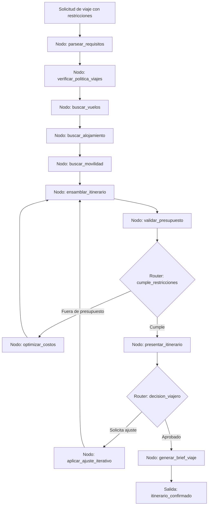

# Caso 16: Planificador de Viajes

> [!NOTE]
> **Estado**: `SCAFFOLD` | **Versión repo**: 3.9.0 | **Tipo**: Agente con estado y refinamiento iterativo

Automatiza la planificación de itinerarios de viaje corporativos y personales respetando restricciones de presupuesto, política de viajes, preferencias del viajero y disponibilidad en tiempo real, con capacidad de ajuste iterativo ante cambios. Reduce el tiempo de planificación de viajes complejos de horas a minutos y garantiza el cumplimiento de la política de viajes corporativos.

---

## Objetivo de negocio

Los travel managers y los propios viajeros invierten horas planificando itinerarios que concilien vuelos, hoteles, movilidad, reuniones y restricciones presupuestarias. En entornos corporativos, el incumplimiento de la política de viajes genera costos ocultos y problemas de reembolso. Este agente recibe las restricciones del viaje (origen, destino, fechas, presupuesto, política corporativa, preferencias del viajero), busca opciones en tiempo real, construye el itinerario óptimo, lo presenta para revisión y permite ajustes iterativos en lenguaje natural hasta que el viajero quede satisfecho, generando el brief de viaje final y los expedientes para reserva.

## Flujo propuesto (LangGraph)

### Nodos principales

| Nodo | Descripción |
|---|---|
| `parsear_requisitos` | Extrae origen, destino, fechas, presupuesto, preferencias y restricciones |
| `verificar_politica_viajes` | Valida que las opciones cumplan la política corporativa de viajes |
| `buscar_vuelos` | Consulta disponibilidad y precios en GDS o APIs de viaje |
| `buscar_alojamiento` | Busca hoteles según categoría, ubicación y política corporativa |
| `buscar_movilidad` | Planifica traslados: aeropuerto, reuniones y desplazamientos locales |
| `ensamblar_itinerario` | Combina vuelos, hoteles y movilidad en un itinerario coherente |
| `validar_presupuesto` | Verifica que el total no supere el presupuesto autorizado |
| `optimizar_costos` | Propone alternativas más económicas manteniendo las restricciones clave |
| `aplicar_ajuste_iterativo` | Incorpora cambios solicitados en lenguaje natural por el viajero |
| `generar_brief_viaje` | Produce el documento de viaje completo con confirmaciones y contactos |

## Stack técnico previsto

| Capa | Tecnología |
|---|---|
| Orquestación | LangGraph `StateGraph` |
| API | FastAPI + uvicorn |
| LLM | OpenAI GPT-4o-mini (modo LIVE) / respuestas mock (modo DEMO) |
| APIs de viaje | Amadeus, Skyscanner, Booking.com, Google Flights API |
| Política corporativa | Reglas configurables por empresa en base de datos |
| Almacenamiento | PostgreSQL (itinerarios, preferencias, política de viajes) |

## Estado actual

Este caso es un **scaffold**: la estructura de la demo estática existe,
la implementación del backend con LangGraph está pendiente.

Para contribuir o elevar este caso, consulta [CONTRIBUTING.md](../../CONTRIBUTING.md).

---

> [!TIP]
> Ver los casos **09**, **10** y **13** como referencia de implementación industrial.
