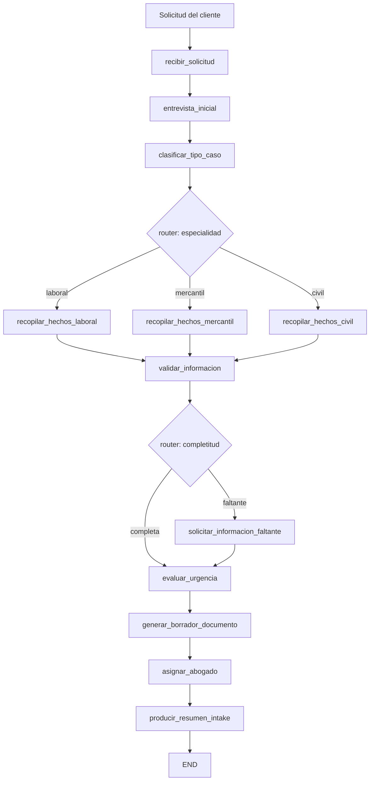

# Caso 17: Legal Intake

> [!NOTE]
> **Estado**: `OPERATIVO` | **Versión**: 4.3.0 | **Puerto**: 8017 | **Tipo**: Agente de admisión + clasificación + HITL

Automatiza el proceso de admisión de casos legales en un despacho jurídico. A partir de la
solicitud cruda del cliente (texto libre + documentos aportados), el agente clasifica la
especialidad legal, recopila los hechos relevantes, valida completitud, evalúa la urgencia
procesal, genera un borrador inicial del documento (demanda, requerimiento extrajudicial,
posesión efectiva) y asigna un abogado responsable según especialidad y carga.

Reduce el intake típico de **1–2 horas de abogado a segundos de procesamiento + minutos de
revisión humana**.

---

## Objetivo de negocio

Los despachos jurídicos invierten tiempo valioso de sus abogados en tareas mecánicas de
intake: entrevistar al cliente, clasificar el asunto, recopilar datos básicos y preparar
escritos iniciales. Este caso resuelve esa fricción: el cliente describe su situación en
lenguaje natural, el agente extrae los hechos estructurados, identifica gaps de información,
prepara el borrador del documento procesal y deja todo listo para que el abogado responsable
revise, complete los `{{PENDIENTE}}` cuando aplique, y firme.

---

## Flujo LangGraph



**10 nodos · 2 routers condicionales · MemorySaver checkpointer · streaming NDJSON.**

### Nodos

| Nodo | Descripción |
|---|---|
| `recibir_solicitud` | Carga la solicitud cruda del cliente desde `data/intakes.json` |
| `entrevista_inicial` | Extrae metadatos básicos: montos, fechas, referencias normativas |
| `clasificar_tipo_caso` | Especialidad (laboral / mercantil / civil) + subtipo por keyword scoring |
| `recopilar_hechos_laboral` | Extracción especializada para casos laborales |
| `recopilar_hechos_mercantil` | Extracción para contratos, sociedades, cobranza comercial |
| `recopilar_hechos_civil` | Extracción para sucesiones, divorcio, responsabilidad civil |
| `validar_informacion` | Compara hechos vs. campos requeridos del subtipo |
| `solicitar_informacion_faltante` | Registra preguntas pendientes para el cliente |
| `evaluar_urgencia` | Urgencia procesal según subtipo y plazos legales típicos |
| `generar_borrador_documento` | Selecciona plantilla y rellena placeholders con hechos |
| `asignar_abogado` | Asigna por especialidad + menor carga de trabajo |
| `producir_resumen_intake` | Resumen ejecutivo final del expediente |

### Datos DEMO

| Intake | Especialidad | Subtipo | Resultado |
|---|---|---|---|
| `INT-001` | laboral | despido injustificado | completa, urgencia ALTA, demanda laboral |
| `INT-002` | mercantil | incumplimiento contractual | completa, urgencia MEDIA, requerimiento extrajudicial |
| `INT-003` | civil | sucesión intestada | faltante, urgencia BAJA, posesión efectiva con `{{PENDIENTE}}` |

---

## Stack técnico

| Capa | Tecnología |
|---|---|
| Orquestación | LangGraph `StateGraph` + `MemorySaver` |
| API | FastAPI + uvicorn |
| LLM (LIVE) | OpenAI GPT-4o-mini opt-in via `OPENAI_API_KEY` |
| Auth | DEMO (token opcional) o OAuth2/OIDC opt-in |
| Plantillas | Sustitución `{{key}}` simple, agnóstica de Jinja |
| UI | HTML/CSS/JS vanilla, streaming NDJSON |

---

## Ejecutar

### Modo local

```bash
cd cases/17-legal-intake/backend
pip install -r requirements.txt
uvicorn src.api:app --reload --port 8017
# UI: http://localhost:8017
```

### Modo Docker (compose aislado)

```bash
cd cases/17-legal-intake/backend
docker compose up --build
```

### Modo Docker (compose raíz, con portal)

```bash
docker compose up case17
# Portal: http://localhost:8080  ·  Caso 17: http://localhost:8017
```

### Activar modo LIVE (LLM real)

```bash
export OPENAI_API_KEY=sk-proj-...
# El badge en la UI cambiará de DEMO (naranja) a LIVE (verde)
```

---

## Endpoints

| Método | Ruta | Descripción |
|---|---|---|
| GET | `/` | UI web |
| GET | `/health`, `/healthz` | salud + modo DEMO/LIVE |
| GET | `/ready` | readiness (grafo compilado) |
| GET | `/metrics` | uptime, requests, errores, modo |
| POST | `/api/run` | ejecuta intake completo, devuelve snapshot final |
| GET | `/api/stream` | streaming NDJSON con un snapshot por nodo |

### Ejemplo

```bash
curl -X POST http://localhost:8017/api/run \
  -H "Content-Type: application/json" \
  -d '{"intake_id":"INT-001","thread_id":"t1"}' | jq .
```

---

## Tests

```bash
cd cases/17-legal-intake/backend
pytest -q
# 26 tests: compilación + nodos + routers + flujos end-to-end + API
```

---

## Referencias

- Plan de elevación: [implementation_plan.md](implementation_plan.md)
- Skill estándar: [`.agents/skills/crear_caso/SKILL.md`](../../.agents/skills/crear_caso/SKILL.md)
- Casos referencia: 05 (analista de documentos), 09 (RRHH), 10 (onboarding)
