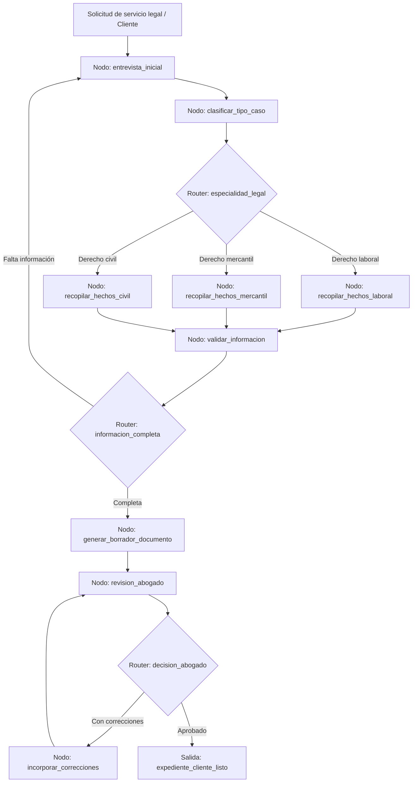

# Caso 17: Legal Intake

> [!NOTE]
> **Estado**: `SCAFFOLD` | **Versión repo**: 4.0.0 | **Tipo**: Agente conversacional con aprobación humana

Automatiza el proceso de admisión de casos legales mediante una entrevista estructurada que recopila los hechos relevantes, clasifica el tipo de asunto, genera borradores de documentos iniciales (demanda, contrato, poder notarial) y los somete a revisión del abogado antes de su envío. Permite que los despachos jurídicos atiendan más clientes reduciendo el tiempo de intake de horas a minutos.

---

## Objetivo de negocio

Los despachos de abogados y los departamentos legales corporativos invierten tiempo valioso de sus abogados en tareas de intake: entrevistar al cliente, recopilar información básica, clasificar el tipo de caso y preparar documentos iniciales. Este agente conduce una entrevista conversacional estructurada adaptada al tipo de asunto legal, valida la información recopilada, clasifica el caso según la especialidad legal requerida, genera el borrador del documento o escrito inicial, y lo presenta al abogado responsable con el expediente del cliente listo para revisión y firma, manteniendo trazabilidad de cada decisión.

## Flujo propuesto (LangGraph)

### Nodos principales

| Nodo | Descripción |
|---|---|
| `entrevista_inicial` | Conduce la conversación de intake y extrae datos básicos del cliente y el asunto |
| `clasificar_tipo_caso` | Determina la especialidad legal y el tipo de procedimiento aplicable |
| `recopilar_hechos_laboral` | Entrevista especializada para casos de derecho laboral |
| `recopilar_hechos_mercantil` | Entrevista especializada para contratos, sociedades y litigios mercantiles |
| `recopilar_hechos_civil` | Entrevista especializada para derecho civil (familia, sucesiones, responsabilidad) |
| `validar_informacion` | Verifica consistencia y completitud de los hechos recopilados |
| `generar_borrador_documento` | Redacta el documento inicial (demanda, contrato, escrito) con los datos del caso |
| `revision_abogado` | Presenta el borrador al abogado y registra sus correcciones o aprobación |
| `incorporar_correcciones` | Actualiza el documento con las indicaciones del abogado |

## Stack técnico previsto

| Capa | Tecnología |
|---|---|
| Orquestación | LangGraph `StateGraph` |
| API | FastAPI + uvicorn |
| LLM | OpenAI GPT-4o-mini (modo LIVE) / respuestas mock (modo DEMO) |
| Plantillas de documentos | Jinja2 + python-docx (DOCX) / WeasyPrint (PDF) |
| Aprobación humana | LangGraph `interrupt()` con notificación por email |
| Almacenamiento | PostgreSQL (expedientes), S3/MinIO (documentos) |

## Estado actual

Este caso es un **scaffold**: la estructura de la demo estática existe,
la implementación del backend con LangGraph está pendiente.

Para contribuir o elevar este caso, consulta [CONTRIBUTING.md](../../CONTRIBUTING.md).

---

> [!TIP]
> Ver los casos **09**, **10** y **13** como referencia de implementación industrial.
