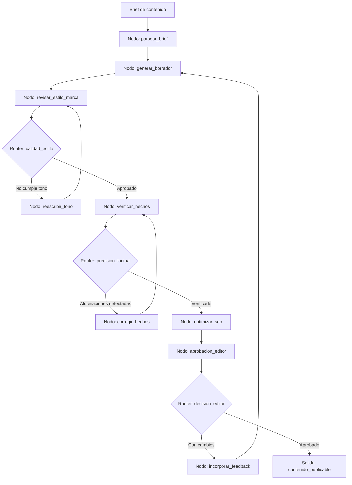

# Caso 18: Marketing de Contenido con QA

> [!NOTE]
> **Estado**: `SCAFFOLD` | **Versión repo**: 3.9.0 | **Tipo**: Multi-agente con pipeline de revisión

Automatiza la producción de contenido de marketing con un pipeline de calidad integrado: genera el contenido según el brief, lo somete a revisión de estilo y tono de marca, verifica la exactitud factual y la ausencia de alucinaciones, y lo presenta para aprobación final antes de publicación. Permite a los equipos de marketing escalar la producción de contenido sin sacrificar la coherencia de marca ni la fiabilidad de la información.

---

## Objetivo de negocio

Los equipos de marketing de contenido enfrentan una tensión permanente entre velocidad y calidad: producir más contenido implica revisar más, y la revisión manual es el cuello de botella. Este agente recibe el brief de contenido (formato, audiencia, tono, palabras clave, hechos a incluir), genera el borrador, lo pasa por un revisor de estilo que verifica coherencia con la guía de marca, lo somete a un verificador factual que contrasta afirmaciones con fuentes autorizadas, y finalmente lo presenta al editor para aprobación o retroalimentación, iterando hasta obtener el contenido publicable.

## Flujo propuesto (LangGraph)

### Nodos principales

| Nodo | Descripción |
|---|---|
| `parsear_brief` | Extrae formato, audiencia, tono, keywords y restricciones del brief |
| `generar_borrador` | Produce el contenido inicial (artículo, post, email, copy) |
| `revisar_estilo_marca` | Verifica coherencia con la guía de estilo y tono de marca de la empresa |
| `reescribir_tono` | Ajusta el contenido para alinear con la voz de marca |
| `verificar_hechos` | Contrasta afirmaciones con fuentes autorizadas y detecta alucinaciones |
| `corregir_hechos` | Reemplaza información incorrecta con datos verificados de las fuentes |
| `optimizar_seo` | Verifica densidad de keywords, meta description y estructura de encabezados |
| `aprobacion_editor` | Presenta el borrador final al editor y gestiona su retroalimentación |
| `incorporar_feedback` | Aplica los cambios solicitados por el editor en el borrador |

## Stack técnico previsto

| Capa | Tecnología |
|---|---|
| Orquestación | LangGraph `StateGraph` |
| API | FastAPI + uvicorn |
| LLM | OpenAI GPT-4o-mini (modo LIVE) / respuestas mock (modo DEMO) |
| Verificación factual | Búsqueda web + RAG sobre base de conocimiento de la empresa |
| SEO | API de análisis SEO (Semrush / Ahrefs) |
| Aprobación humana | LangGraph `interrupt()` con notificación al editor |

## Estado actual

Este caso es un **scaffold**: la estructura de la demo estática existe,
la implementación del backend con LangGraph está pendiente.

Para contribuir o elevar este caso, consulta [CONTRIBUTING.md](../../CONTRIBUTING.md).

---

> [!TIP]
> Ver los casos **09**, **10** y **13** como referencia de implementación industrial.
