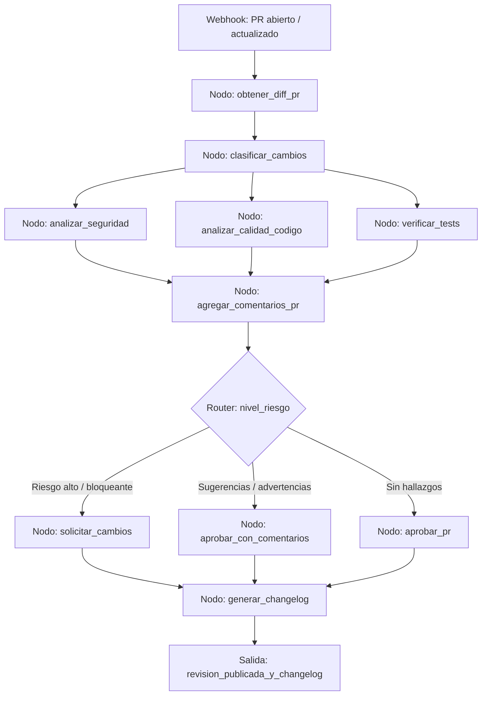

# Caso 19: DevEx — Revisión de Pull Requests

> [!NOTE]
> **Estado**: `SCAFFOLD` | **Versión repo**: 3.9.0 | **Tipo**: Agente con estado y análisis de código

Automatiza la revisión de Pull Requests analizando el diff de código para detectar riesgos de seguridad, regresiones de rendimiento, violaciones de estándares y deuda técnica, generando comentarios contextualizados en cada línea relevante y produciendo automáticamente el changelog a partir de los commits. Acelera el ciclo de revisión y libera tiempo de los engineers senior para revisiones de diseño y arquitectura.

---

## Objetivo de negocio

Los equipos de ingeniería de software dedican una parte significativa de su tiempo productivo a revisar PRs, un trabajo que es crítico para la calidad pero que a menudo se convierte en un cuello de botella: los PRs esperan días para ser revisados, y la calidad de la revisión varía según la disponibilidad del revisor. Este agente analiza automáticamente cada PR tan pronto como se abre, clasifica los cambios por área de impacto, detecta patrones problemáticos (vulnerabilidades OWASP, N+1 queries, secretos expuestos, tests faltantes), genera comentarios de revisión línea a línea con sugerencias de mejora y produce el changelog y las notas de release a partir de los mensajes de commit.

## Flujo propuesto (LangGraph)

### Nodos principales

| Nodo | Descripción |
|---|---|
| `obtener_diff_pr` | Recupera el diff completo, metadatos y commits del PR via GitHub/GitLab API |
| `clasificar_cambios` | Categoriza cambios por tipo (feature, fix, refactor, infra, docs) y área |
| `analizar_seguridad` | Detecta vulnerabilidades OWASP, secretos expuestos y dependencias vulnerables |
| `analizar_calidad_codigo` | Identifica code smells, complejidad ciclomática, duplicaciones y N+1 queries |
| `verificar_tests` | Comprueba cobertura, tests faltantes para código nuevo y tests rotos |
| `agregar_comentarios_pr` | Publica comentarios contextualizados línea a línea en el PR |
| `solicitar_cambios` | Bloquea el merge y notifica al autor con los hallazgos críticos |
| `aprobar_con_comentarios` | Aprueba el PR con sugerencias no bloqueantes para el autor |
| `generar_changelog` | Produce el changelog y las notas de release a partir de los commits |

## Stack técnico previsto

| Capa | Tecnología |
|---|---|
| Orquestación | LangGraph `StateGraph` |
| API | FastAPI + uvicorn |
| LLM | OpenAI GPT-4o-mini (modo LIVE) / respuestas mock (modo DEMO) |
| Integración VCS | GitHub API / GitLab API (webhooks + REST) |
| Análisis estático | Semgrep, Bandit, ESLint (via subprocess) |
| Seguridad deps | Trivy, OSV-Scanner |

## Estado actual

Este caso es un **scaffold**: la estructura de la demo estática existe,
la implementación del backend con LangGraph está pendiente.

Para contribuir o elevar este caso, consulta [CONTRIBUTING.md](../../CONTRIBUTING.md).

---

> [!TIP]
> Ver los casos **09**, **10** y **13** como referencia de implementación industrial.
