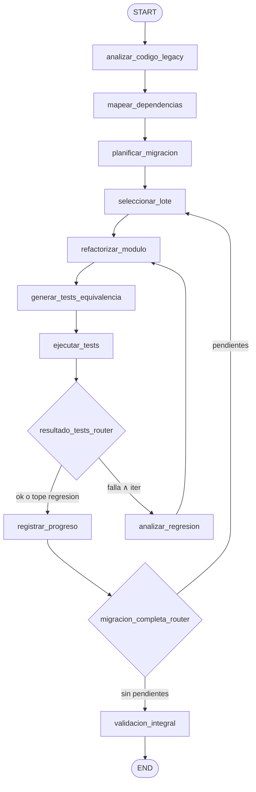

# Caso 20 — Migración de Sistemas Legacy

> [!NOTE]
> **Estado**: `✅ OPERATIVO` | **Versión repo**: 4.14.0 | **Puerto**: `8020`
> **Patrón**: 2 routers + loop de regresión por lote + loop de avance de lotes

Automatiza la migración incremental de sistemas legacy. El agente analiza el código fuente, mapea
dependencias entre módulos, planifica un orden topológico de lotes, refactoriza cada módulo al
lenguaje destino, genera tests de equivalencia, los ejecuta y reintenta con análisis de regresión
cuando fallan. Termina con una validación integral y un reporte ejecutivo determinista.

---

## Flujo (LangGraph)



```
analizar_codigo_legacy → mapear_dependencias → planificar_migracion
     → seleccionar_lote → refactorizar_modulo → generar_tests_equivalencia
     → ejecutar_tests
          → resultado_tests_router
                ├─ ok               → registrar_progreso
                ├─ falla∧iter<max   → analizar_regresion → refactorizar_modulo
                └─ falla∧tope       → registrar_progreso (workaround)
     → migracion_completa_router
          ├─ pendientes → seleccionar_lote
          └─ vacío      → validacion_integral → END
```

### Nodos

| Nodo | Función |
|---|---|
| `analizar_codigo_legacy` | Carga proyecto y métricas (LOC, complejidad, deuda) |
| `mapear_dependencias` | Construye el grafo de dependencias por módulo |
| `planificar_migracion` | Ordena los módulos por orden topológico de Kahn |
| `seleccionar_lote` | Toma el siguiente lote pendiente |
| `refactorizar_modulo` | Aplica la transformación al lenguaje destino |
| `generar_tests_equivalencia` | Genera la suite de tests de caracterización |
| `ejecutar_tests` | Corre la suite simulada y captura el resultado |
| `analizar_regresion` | Identifica la causa y propone fix, incrementa `iter_regresion` |
| `registrar_progreso` | Marca lote como `ok` o `fallido_con_workaround`, avanza |
| `validacion_integral` | Reporte final: `exitosa`, `parcial` o `sin_lotes` |

### Routers

- **`resultado_tests_router`** — `ok` → `registrar_progreso`; fallo con `iter_regresion < max` → `analizar_regresion`; fallo con tope → `registrar_progreso` (workaround).
- **`migracion_completa_router`** — `lotes_pendientes` vacío → `validacion_integral`; quedan → `seleccionar_lote`.

## Modos

- **DEMO** (sin `OPENAI_API_KEY`) — Resultados deterministas a partir de fixtures locales en `data/`.
- **LIVE** (`OPENAI_API_KEY` set) — Mismos pasos, sólo el reporte ejecutivo final pasa por LLM.

## Fixtures (`data/`)

- `proyectos.json` — P-001 (VB6→Python, limpio), P-002 (COBOL→Java, 1 regresión), P-003 (PHP5→PHP8, 1 workaround).
- `dependencias.json` — grafo por proyecto.
- `lotes_catalog.json` — por módulo: complejidad, riesgo, código simulado origen/destino, tests, flags.
- `policy.json` — `max_regresiones_por_lote=2`, umbrales, lenguajes soportados.

## Endpoints

| Método | Ruta | Descripción |
|---|---|---|
| GET | `/` | UI HTML |
| GET | `/health` `/healthz` | health check |
| GET | `/ready` | readiness (compila grafo) |
| GET | `/metrics` | métricas JSON |
| POST | `/api/run` | `{thread_id, proyecto_id}` → snapshot final |
| GET | `/api/stream` | NDJSON stream de snapshots |

## Levantar localmente

```bash
cd cases/20-migracion-legacy/backend
pip install -r requirements.txt
uvicorn src.api:app --host 0.0.0.0 --port 8020
```

O con Docker Compose:

```bash
cd cases/20-migracion-legacy/backend
docker compose up --build
```

## Tests

```bash
cd cases/20-migracion-legacy/backend
pytest -x -q
```

## Seguridad

Mismo patrón que casos 04/05/14/21/22: DEMO sin credenciales o **OAuth2/OIDC** Bearer JWT opt-in
con `USE_OAUTH2=true` (`OAUTH2_JWKS_URL`, `OAUTH2_AUDIENCE`, `OAUTH2_ISSUER`).
Rate limiting opcional vía `RATE_LIMIT_RPM`.
