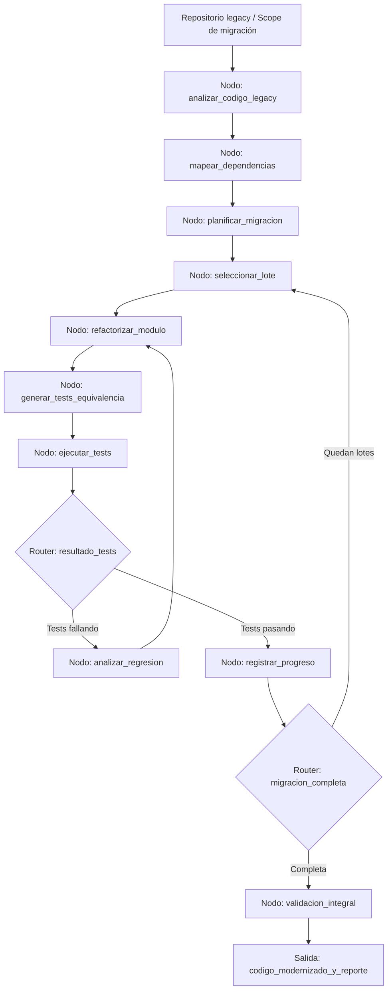

# Caso 20: Migración de Sistemas Legacy

> [!NOTE]
> **Estado**: `SCAFFOLD` | **Versión repo**: 3.9.0 | **Tipo**: Agente con estado y ejecución por lotes

Automatiza la migración de sistemas legacy coordinando el análisis del código fuente, la planificación del refactor por módulos, la transformación por lotes con validación continua y la verificación de equivalencia funcional mediante tests automáticos. Reduce el riesgo y el tiempo de proyectos de modernización que normalmente toman meses, permitiendo una migración incremental y auditable.

---

## Objetivo de negocio

Las empresas con sistemas críticos en tecnologías obsoletas (COBOL, VB6, Delphi, PHP 5, monolitos sin tests) enfrentan un riesgo creciente de falla y costos de mantenimiento exponenciales, pero la migración total es percibida como demasiado arriesgada. Este agente analiza el código legado para identificar dependencias, módulos y puntos de entrada, genera un plan de migración incremental priorizado por impacto y riesgo, ejecuta el refactor módulo a módulo usando el LLM para transformar el código, genera tests automáticos para verificar la equivalencia funcional y valida cada paso antes de continuar, produciendo un informe de progreso y los artefactos de código modernizados.

## Flujo propuesto (LangGraph)

### Nodos principales

| Nodo | Descripción |
|---|---|
| `analizar_codigo_legacy` | Parsea el código fuente y extrae métricas de complejidad, deuda y cobertura |
| `mapear_dependencias` | Construye el grafo de dependencias entre módulos y capas del sistema |
| `planificar_migracion` | Genera el plan de migración incremental ordenado por dependencias y riesgo |
| `seleccionar_lote` | Elige el próximo módulo o conjunto de funciones a migrar |
| `refactorizar_modulo` | Transforma el código legacy al lenguaje/framework objetivo |
| `generar_tests_equivalencia` | Produce tests de caracterización que verifican el comportamiento original |
| `ejecutar_tests` | Corre la suite de tests y captura el resultado |
| `analizar_regresion` | Identifica la causa de los tests fallidos y propone corrección |
| `registrar_progreso` | Actualiza el estado del plan de migración y genera el diff del módulo |
| `validacion_integral` | Ejecuta tests de integración end-to-end sobre el sistema completo migrado |

## Stack técnico previsto

| Capa | Tecnología |
|---|---|
| Orquestación | LangGraph `StateGraph` |
| API | FastAPI + uvicorn |
| LLM | OpenAI GPT-4o-mini (modo LIVE) / respuestas mock (modo DEMO) |
| Análisis de código | tree-sitter, ast (Python), Understand (para COBOL/C) |
| Tests | pytest, jest, junit (según lenguaje objetivo) |
| Almacenamiento | PostgreSQL (plan de migración, progreso), Git (versionado de artefactos) |

## Estado actual

Este caso es un **scaffold**: la estructura de la demo estática existe,
la implementación del backend con LangGraph está pendiente.

Para contribuir o elevar este caso, consulta [CONTRIBUTING.md](../../CONTRIBUTING.md).

---

> [!TIP]
> Ver los casos **09**, **10** y **13** como referencia de implementación industrial.
