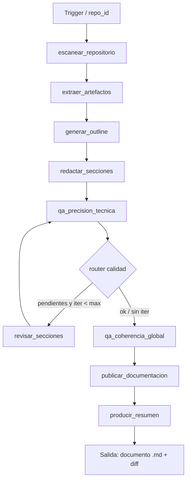

# Caso 21: Documentación Automática

> [!NOTE]
> **Estado**: `OPERATIVO` | **Versión repo**: 4.7.0 | **Tipo**: Pipeline con loop QA condicional | **Puerto**: 8021

Genera documentación técnica desde el código real: escanea el repositorio, extrae artefactos (endpoints, schemas, funciones, tests, changelog), produce un outline adaptado al tipo de proyecto, redacta cada sección con datos del repo, aplica un ciclo de QA con **loop condicional** (tope 3 iteraciones) que corrige las secciones bajo umbral, calcula score global y publica el documento Markdown final con diff.

---

## Objetivo de negocio

La documentación técnica se desactualiza más rápido que el código. Este agente reduce el costo de mantenerla al día reescribiendo cada sección desde la fuente única de verdad (el repo) y verificando con QA que las referencias citadas existen realmente. Sirve como pipeline reutilizable en CI o como herramienta on-demand para preparar docs antes de un release.

## Flujo LangGraph



### Nodos

| Nodo | Descripción |
|---|---|
| `escanear_repositorio` | Carga snapshot del repo (módulos, LOC, tipo, framework) |
| `extraer_artefactos` | Indexa endpoints, schemas, funciones públicas, tests, changelog, ratio docstring |
| `generar_outline` | Selecciona plantilla de outline según tipo (`api_rest`, `integration`) |
| `redactar_secciones` | Genera contenido determinista de cada sección desde los artefactos |
| `qa_precision_tecnica` | Calcula score por sección con penalizaciones (endpoints sin doc, tests fallando, sin README, etc.) |
| `calidad_seccion_router` | **Router**: pendientes y iter<max → revisar; si no → coherencia global |
| `revisar_secciones` | Aplica nota de revisión y sube secciones a estado `revisada` |
| `qa_coherencia_global` | Score global + métrica de coherencia + indicador verde/amarillo/rojo |
| `publicar_documentacion` | Compone Markdown final + diff vs versión previa |
| `producir_resumen` | Resumen ejecutivo (LLM opt-in) para el equipo |

## Reglas de calidad

Configurables en [`data/quality_rules.json`](data/quality_rules.json):

- `max_iteraciones_revision`: 3
- `umbral_score_seccion`: 80 (mínimo para marcar como aprobada)
- Umbrales de riesgo: verde ≥90, amarillo ≥70, rojo <70
- Penalizaciones: endpoint sin doc (8), función sin docstring (4), sin README (15), sin changelog (10), tests fallando (12), cobertura baja <60% (8), sin CI (6)

## Escenarios DEMO

| ID | Repo | Caracterización | Resultado esperado |
|---|---|---|---|
| `DOC-001` | fastapi-orders | API limpia, docstrings 100%, 24 tests OK, cobertura 92%, README + CI | 🟢 Score ≥90 · 0 iteraciones · riesgo BAJO |
| `DOC-002` | billing-service | docstrings ~50%, 2 endpoints sin doc, 1 test fallando, cobertura 71% | 🟡 Score 70-90 · issues detectadas |
| `DOC-003` | legacy-erp-bridge | sin docstrings, sin README, sin CI, 4/6 tests fallando, cobertura 18% | 🔴 Score bajo · 1-3 iteraciones · riesgo ALTO |

## Stack

| Capa | Tecnología |
|---|---|
| Orquestación | LangGraph `StateGraph` + `MemorySaver` |
| API | FastAPI + uvicorn |
| LLM (opt-in) | OpenAI GPT-4o-mini para resumen ejecutivo |
| Tracing (opt-in) | LangSmith |
| Auth (opt-in) | OAuth2/OIDC con JWT (RS256/ES256) o `X-Demo-Token` |

## Endpoints

| Método | Ruta | Descripción |
|---|---|---|
| `GET` | `/health` · `/healthz` | Estado y modo (DEMO/LIVE) |
| `GET` | `/ready` | Readiness check (compila el grafo) |
| `GET` | `/metrics` | Contadores y latencias |
| `POST` | `/api/run` | Genera documentación completa |
| `GET` | `/api/stream` | Stream NDJSON con snapshots por nodo |
| `GET` | `/` | Interfaz web |

## Cómo ejecutar

### Local con uv (recomendado, ~10× más rápido)

```bash
make uv-install-case CASE=21
source cases/21-docs-auto/backend/.venv/Scripts/activate  # o /bin/activate en Linux/macOS
cd cases/21-docs-auto/backend
uvicorn src.api:app --port 8021
# http://localhost:8021/
```

### Local con pip

```bash
cd cases/21-docs-auto/backend
pip install -r requirements.txt
uvicorn src.api:app --host 0.0.0.0 --port 8021
```

### Docker

```bash
cd cases/21-docs-auto/backend
docker compose up --build
```

### Tests

```bash
cd cases/21-docs-auto/backend
pytest -q
# 25 tests
```

## Modo LIVE

Crear `backend/.env` con `OPENAI_API_KEY=sk-...` para activar narrativa LLM en el resumen ejecutivo. El pipeline (escaneo → extracción → outline → redacción → QA → publicación) **es 100% determinista y funciona idéntico en DEMO**.

> [!TIP]
> Casos de referencia para patrones industriales: **06**, **09**, **10**, **13**, **14**.
