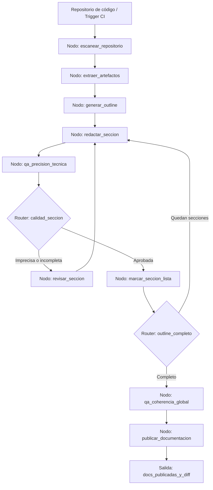

# Caso 21: Documentación Automática

> [!NOTE]
> **Estado**: `SCAFFOLD` | **Versión repo**: 4.0.0 | **Tipo**: Agente con estado y pipeline de escritura

Automatiza la generación y mantenimiento de documentación técnica escaneando el repositorio, generando el outline estructurado, redactando cada sección con contexto del código real y aplicando un ciclo de QA para verificar precisión, completitud y legibilidad antes de publicar. Elimina la documentación desactualizada y reduce el costo de mantener docs al día a medida que el código evoluciona.

---

## Objetivo de negocio

La documentación técnica es críticamente importante pero crónicamente desactualizada: los equipos de ingeniería priorizan el código sobre las docs, y mantenerlas al día requiere un esfuerzo continuo que rara vez se prioriza. Este agente escanea el repositorio completo (código fuente, comentarios, tests, changelogs, arquitectura), infiere la estructura óptima de documentación para el proyecto, redacta cada sección del outline con información extraída directamente del código y los artefactos del repo, aplica un ciclo de QA que verifica coherencia interna, precisión técnica y legibilidad, y publica o actualiza la documentación en la plataforma configurada (MkDocs, Confluence, Notion).

## Flujo propuesto (LangGraph)

### Nodos principales

| Nodo | Descripción |
|---|---|
| `escanear_repositorio` | Indexa archivos de código, configuración, tests, changelog y README existentes |
| `extraer_artefactos` | Extrae docstrings, firmas de funciones, esquemas de API y diagramas existentes |
| `generar_outline` | Propone la estructura de documentación adaptada al tipo de proyecto |
| `redactar_seccion` | Escribe cada sección del outline con información del código real |
| `qa_precision_tecnica` | Verifica que los ejemplos de código ejecuten y la información sea correcta |
| `revisar_seccion` | Corrige imprecisiones y completa información faltante |
| `qa_coherencia_global` | Verifica consistencia terminológica y coherencia entre secciones |
| `publicar_documentacion` | Despliega las docs en la plataforma configurada y genera el diff de cambios |

## Stack técnico previsto

| Capa | Tecnología |
|---|---|
| Orquestación | LangGraph `StateGraph` |
| API | FastAPI + uvicorn |
| LLM | OpenAI GPT-4o-mini (modo LIVE) / respuestas mock (modo DEMO) |
| Análisis de código | tree-sitter, ast (Python), GitHub API |
| Publicación | MkDocs, Confluence API, Notion API |
| Almacenamiento | PostgreSQL (outline, estado de secciones), Git (versionado de docs) |

## Estado actual

Este caso es un **scaffold**: la estructura de la demo estática existe,
la implementación del backend con LangGraph está pendiente.

Para contribuir o elevar este caso, consulta [CONTRIBUTING.md](../../CONTRIBUTING.md).

---

> [!TIP]
> Ver los casos **09**, **10** y **13** como referencia de implementación industrial.
