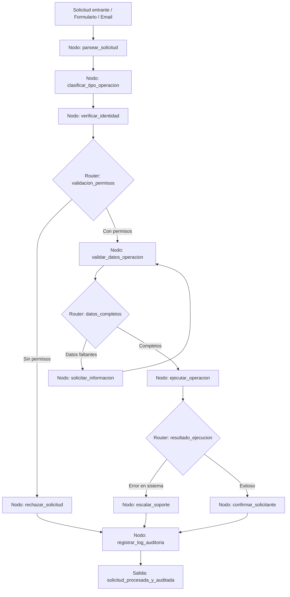

# Caso 22: Backoffice — Automatización de Solicitudes

> [!NOTE]
> **Estado**: `SCAFFOLD` | **Versión repo**: 3.9.0 | **Tipo**: Agente con estado y trazabilidad de operaciones

Automatiza el ciclo completo de solicitudes de backoffice (altas, bajas, modificaciones, reportes) desde la recepción hasta la ejecución y el registro: verifica identidad y permisos, ejecuta la operación en los sistemas internos y deja un log de auditoría inmutable de cada acción. Reduce tiempos de respuesta de días a minutos y elimina errores de procesamiento manual en operaciones de alto volumen.

---

## Objetivo de negocio

Los equipos de backoffice de bancos, aseguradoras, retailers y utilities procesan cientos de solicitudes diarias (apertura de cuentas, cambios de datos, devoluciones, altas de empleados) que requieren verificación, acceso a múltiples sistemas y registro de cada operación para auditoría. Este agente recibe la solicitud vía formulario, chatbot o email, extrae y valida los datos, verifica la identidad del solicitante y sus permisos, ejecuta la operación en los sistemas internos (CRM, ERP, RRHH, core bancario) mediante APIs, confirma la ejecución al solicitante y registra toda la cadena de eventos con timestamp y hash para el log de auditoría regulatorio.

## Flujo propuesto (LangGraph)

### Nodos principales

| Nodo | Descripción |
|---|---|
| `parsear_solicitud` | Extrae el tipo de operación y los datos de la solicitud en cualquier formato |
| `clasificar_tipo_operacion` | Determina la operación exacta y el sistema interno destino |
| `verificar_identidad` | Valida la identidad del solicitante contra el directorio de empleados o clientes |
| `validar_datos_operacion` | Verifica completitud y formato correcto de todos los datos requeridos |
| `solicitar_informacion` | Pide los datos faltantes al solicitante por el canal original |
| `ejecutar_operacion` | Invoca la API del sistema interno para realizar la operación |
| `escalar_soporte` | Notifica al equipo de soporte técnico en caso de error en el sistema |
| `confirmar_solicitante` | Envía la confirmación de ejecución al solicitante con los detalles |
| `registrar_log_auditoria` | Persiste el registro inmutable de la operación con hash para auditoría |

## Stack técnico previsto

| Capa | Tecnología |
|---|---|
| Orquestación | LangGraph `StateGraph` |
| API | FastAPI + uvicorn |
| LLM | OpenAI GPT-4o-mini (modo LIVE) / respuestas mock (modo DEMO) |
| Integraciones | SAP / Salesforce / Active Directory / Core bancario (via API REST) |
| Canales de entrada | Email (IMAP), formulario web, chatbot (Teams/Slack) |
| Almacenamiento | PostgreSQL (solicitudes), log append-only con SHA-256 |

## Estado actual

Este caso es un **scaffold**: la estructura de la demo estática existe,
la implementación del backend con LangGraph está pendiente.

Para contribuir o elevar este caso, consulta [CONTRIBUTING.md](../../CONTRIBUTING.md).

---

> [!TIP]
> Ver los casos **09**, **10** y **13** como referencia de implementación industrial.
