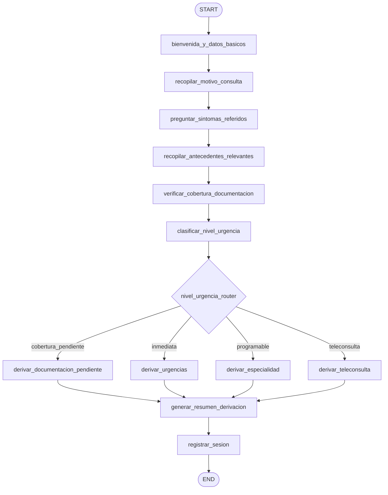

# Caso 23 — Salud: Pre-triage Administrativo

> [!NOTE]
> **Estado**: `✅ OPERATIVO` | **Versión repo**: 4.14.0 | **Puerto**: `8023`
> **Patrón**: Entrevista guiada + clasificación administrativa determinista + router de 4 ramas

> [!WARNING]
> **Este caso realiza CLASIFICACIÓN ADMINISTRATIVA, no diagnóstico médico.**
> El agente recopila motivo, síntomas referidos, antecedentes y cobertura, y
> aplica un protocolo administrativo para derivar al servicio correcto. La
> evaluación clínica la realiza siempre un profesional de salud. Cada salida
> incluye un disclaimer obligatorio que separa la clasificación administrativa
> del acto médico.

Automatiza el pre-triage administrativo en clínicas, hospitales y plataformas de
telemedicina: conduce la entrevista, verifica cobertura y documentación, clasifica
el nivel de urgencia según un protocolo configurable y deriva al servicio (urgencias,
especialidad, teleconsulta o admisión documental) con un resumen estructurado para
el profesional que atenderá.

---

## Flujo (LangGraph)



```
bienvenida_y_datos_basicos
 → recopilar_motivo_consulta
 → preguntar_sintomas_referidos
 → recopilar_antecedentes_relevantes
 → verificar_cobertura_documentacion
 → clasificar_nivel_urgencia
     → nivel_urgencia_router
         ├─ cobertura_pendiente → derivar_documentacion_pendiente
         ├─ inmediata           → derivar_urgencias
         ├─ programable         → derivar_especialidad
         └─ teleconsulta        → derivar_teleconsulta
 → generar_resumen_derivacion → registrar_sesion → END
```

> El router incluye una 4ª rama (`cobertura_pendiente`) que complementa las 3 ramas
> clínico-administrativas del README original — si la documentación está
> incompleta, primero se regulariza la admisión antes de cualquier derivación.

### Nodos

| Nodo | Función |
|---|---|
| `bienvenida_y_datos_basicos` | Saluda e identifica nombre, edad, DNI y cobertura |
| `recopilar_motivo_consulta` | Pregunta el motivo principal en lenguaje natural |
| `preguntar_sintomas_referidos` | Indaga síntomas asociados de forma estructurada |
| `recopilar_antecedentes_relevantes` | Recoge medicamentos, alergias y comorbilidades |
| `verificar_cobertura_documentacion` | Cruza documentación con `policy.json` |
| `clasificar_nivel_urgencia` | Aplica `protocolo_urgencia.json` (determinista, sin diagnóstico) |
| `derivar_documentacion_pendiente` | Devuelve al paciente a admisión para regularizar papeles |
| `derivar_urgencias` | Indica acudir a urgencias / SAMU (puntaje ≥ umbral) |
| `derivar_especialidad` | Asigna especialidad según mapeo motivo/síntoma |
| `derivar_teleconsulta` | Agenda telemedicina para consultas de control / receta |
| `generar_resumen_derivacion` | Produce resumen estructurado con disclaimer obligatorio |
| `registrar_sesion` | Persiste métricas y cierra la sesión |

### Reglas del protocolo administrativo

Configurables en `data/protocolo_urgencia.json` + `data/policy.json`:

- Puntaje por síntoma crítico (ej. dolor torácico = 50, disnea severa = 50).
- Factor de edad (≥ 50 y ≥ 65 suman puntaje).
- Comorbilidades de riesgo (HTA, diabetes, EPOC, ICC, inmunosupresión).
- `umbral_urgencia_inmediata` (default 70) → derivación a urgencias.
- Motivos de control / receta → teleconsulta.
- Motivos con especialidad mapeada → consulta programable.
- Documentación incompleta → admisión documental antes que cualquier clínica.

## Sesiones DEMO

| Sesión | Paciente | Motivo / Síntomas | Resultado esperado |
|---|---|---|---|
| `S-001` | 55a · HTA | Dolor torácico + sudoración + irradiación | `inmediata` → urgencias |
| `S-002` | 28a | Lumbalgia 2 semanas | `programable` → traumatología |
| `S-003` | 35a · HTA | Control de hipertensión estable | `teleconsulta` |
| `S-004` | 42a | Cefalea, faltó credencial de cobertura | `cobertura_pendiente` → admisión |

## Stack

| Capa | Tecnología |
|---|---|
| Orquestación | LangGraph `StateGraph` + `MemorySaver` |
| API | FastAPI + uvicorn (`/health`, `/healthz`, `/ready`, `/metrics`, `/api/run`, `/api/stream`) |
| LLM | OpenAI GPT-4o-mini (modo LIVE, opt-in `OPENAI_API_KEY`) sólo para humanizar el resumen |
| DEMO | Clasificación 100% determinista basada en fixtures JSON |
| Auth | Mismo patrón que casos 04/05/14/21/22 (DEMO sin credenciales u OAuth2/JWT opt-in) |

## Ejecutar localmente

```bash
cd cases/23-salud-pretriage/backend
pip install -r requirements.txt
pytest -x -q
uvicorn src.api:app --port 8023
```

Abre <http://localhost:8023/> para la UI.

## Disclaimer regulatorio

El disclaimer obligatorio se carga desde `policy.json.disclaimer_obligatorio` y
se embebe en cada `resumen_derivacion`. El test
`test_no_emite_lenguaje_de_diagnostico_medico` valida que las palabras
"diagnóstico" e "indicación médica" sólo aparezcan dentro del disclaimer.

---

> Para contribuir o revisar otros casos similares, ver casos **22 (backoffice)**,
> **16 (planificador de viajes)** y **20 (migración legacy)**.
