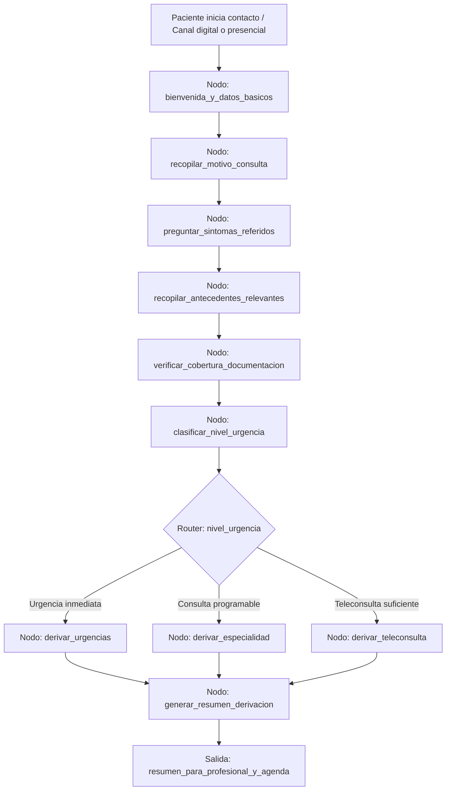

# Caso 23: Salud — Pre-triage Administrativo

> [!NOTE]
> **Estado**: `SCAFFOLD` | **Versión repo**: 4.0.0 | **Tipo**: Agente conversacional con derivación estructurada

Automatiza el pre-triage administrativo de pacientes recopilando motivo de consulta, síntomas referidos y datos relevantes mediante una conversación guiada, y derivando al servicio, especialidad o nivel de urgencia adecuado sin emitir diagnóstico médico. Reduce las esperas en recepción, optimiza la asignación de turnos y mejora la experiencia del paciente en clínicas, hospitales y servicios de salud digital.

---

## Objetivo de negocio

Los centros de salud, clínicas y plataformas de telemedicina reciben una alta demanda de consultas en las que el primer cuello de botella es la recepción y clasificación administrativa: ¿qué especialidad necesita el paciente?, ¿qué nivel de urgencia tiene?, ¿tiene la documentación completa? Este agente conduce una entrevista conversacional con el paciente para recopilar motivo de consulta, síntomas referidos, medicamentos actuales, antecedentes relevantes y cobertura de salud, clasifica administrativamente la consulta según protocolos configurables y deriva al servicio correcto con el resumen del caso, sin emitir en ningún momento un diagnóstico médico.

## Flujo propuesto (LangGraph)

### Nodos principales

| Nodo | Descripción |
|---|---|
| `bienvenida_y_datos_basicos` | Saluda al paciente e identifica nombre, edad, DNI y cobertura de salud |
| `recopilar_motivo_consulta` | Pregunta el motivo principal de la consulta en lenguaje natural |
| `preguntar_sintomas_referidos` | Indaga síntomas asociados con preguntas guiadas y estructuradas |
| `recopilar_antecedentes_relevantes` | Pregunta alergias, medicamentos actuales y antecedentes pertinentes |
| `verificar_cobertura_documentacion` | Verifica que el paciente tiene la documentación y cobertura requerida |
| `clasificar_nivel_urgencia` | Aplica protocolo administrativo para determinar urgencia (sin diagnóstico médico) |
| `derivar_urgencias` | Notifica al área de urgencias con el resumen del caso |
| `derivar_especialidad` | Asigna turno con la especialidad correcta según el motivo referido |
| `derivar_teleconsulta` | Conecta al paciente con el servicio de teleconsulta apropiado |
| `generar_resumen_derivacion` | Produce el resumen estructurado para el profesional de salud que atenderá |

## Stack técnico previsto

| Capa | Tecnología |
|---|---|
| Orquestación | LangGraph `StateGraph` |
| API | FastAPI + uvicorn |
| LLM | OpenAI GPT-4o-mini (modo LIVE) / respuestas mock (modo DEMO) |
| Canales | Chat web, WhatsApp Business API, kiosco presencial |
| HIS / Agenda | Integración con sistema de gestión hospitalaria (HL7/FHIR) |
| Almacenamiento | PostgreSQL (sesiones de pre-triage, resúmenes de derivación) |

## Estado actual

Este caso es un **scaffold**: la estructura de la demo estática existe,
la implementación del backend con LangGraph está pendiente.

Para contribuir o elevar este caso, consulta [CONTRIBUTING.md](../../CONTRIBUTING.md).

---

> [!TIP]
> Ver los casos **09**, **10** y **13** como referencia de implementación industrial.
