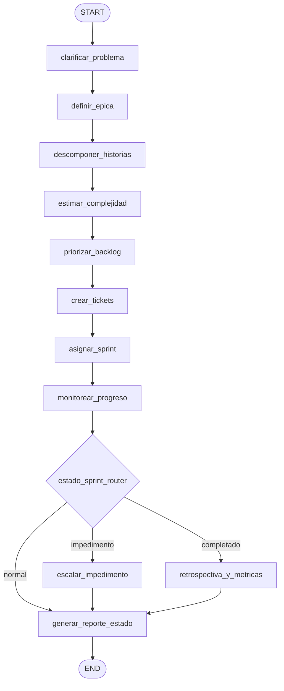

# Caso 24 — Asistente de Product Manager

> [!NOTE]
> **Estado**: `✅ OPERATIVO` | **Versión repo**: 4.14.0 | **Puerto**: `8024`
> **Patrón**: 1 router con 3 ramas + pipeline de gestión de producto end-to-end

Automatiza el ciclo de gestión de producto: transforma ideas, requerimientos y feedback
en épicas estructuradas, las descompone en historias de usuario con formato canónico,
estima complejidad, prioriza el backlog, crea tickets en el sistema de gestión, asigna
sprint según capacidad del equipo y monitorea el progreso emitiendo un reporte ejecutivo
final con alertas de impedimentos o métricas de retrospectiva.

---

## Flujo (LangGraph)



```
clarificar_problema → definir_epica → descomponer_historias → estimar_complejidad
  → priorizar_backlog → crear_tickets → asignar_sprint → monitorear_progreso
     → estado_sprint_router
          ├─ impedimento → escalar_impedimento ────────┐
          ├─ normal      ──────────────────────────────┤
          └─ completado  → retrospectiva_y_metricas ───┤
                                                       └─→ generar_reporte_estado → END
```

### Nodos

| Nodo | Función |
|---|---|
| `clarificar_problema` | Carga la iniciativa y genera preguntas/respuestas clarificadoras según `fuente` (idea / feedback / requerimiento) |
| `definir_epica` | Estructura la épica con objetivo, criterios de aceptación y métricas de éxito |
| `descomponer_historias` | Aplica el formato canónico "Como… quiero… para…" a las historias del fixture |
| `estimar_complejidad` | Mapea t-shirt size (S/M/L/XL) a puntos vía `catalogo_estimacion.json` |
| `priorizar_backlog` | Ordena por `valor_negocio` descendente y `puntos` ascendente |
| `crear_tickets` | Genera IDs deterministas `PROJ-<sha6>` con URL del sistema configurado |
| `asignar_sprint` | Llena el sprint hasta `min(capacidad_equipo, max_puntos_sprint_por_equipo)` |
| `monitorear_progreso` | Calcula `estado_sprint` (`completado` / `impedimento` / `normal`) según progreso e impedimentos críticos (`dias_abierto ≥ umbral`) |
| `escalar_impedimento` | Emite notificaciones al canal Slack configurado por cada impedimento abierto |
| `retrospectiva_y_metricas` | Calcula velocidad, predictibilidad y action items |
| `generar_reporte_estado` | Reporte markdown ejecutivo (DEMO determinista / LIVE con OpenAI) y `estado_final` |

### Router

`estado_sprint_router` evalúa `state["estado_sprint"]` tras `monitorear_progreso` y bifurca en 3 ramas:

- `impedimento` → `escalar_impedimento` → `generar_reporte_estado` (cuando hay impedimentos con `dias_abierto ≥ umbral_impedimento_dias` o historias en estado `bloqueado`)
- `normal` → `generar_reporte_estado` (sprint en curso sin bloqueos)
- `completado` → `retrospectiva_y_metricas` → `generar_reporte_estado` (todas las historias en `hecho` y sin impedimentos críticos)

El `estado_final` resultante es `sprint_con_impedimento`, `sprint_en_curso` o `sprint_completado`.

---

## Stack

| Capa | Tecnología |
|---|---|
| Orquestación | LangGraph `StateGraph` con `MemorySaver` |
| API | FastAPI + uvicorn |
| LLM (opcional) | OpenAI GPT-4o-mini para el reporte ejecutivo (LIVE opt-in con `OPENAI_API_KEY`) |
| Auth | DEMO (sin token) + OAuth2/OIDC JWT opt-in (`USE_OAUTH2=true`) |
| Observabilidad | `/health`, `/healthz`, `/ready`, `/metrics`, logs JSON con `trace_id` |

---

## Cómo correr

```bash
# Tests
cd cases/24-pm-assistant/backend
pip install -r requirements.txt
pytest

# Servidor (DEMO)
uvicorn src.api:app --host 0.0.0.0 --port 8024

# Con Docker
docker compose -f cases/24-pm-assistant/backend/compose.yml up --build
```

### Endpoints

| Método | Ruta | Descripción |
|---|---|---|
| `GET`  | `/health` · `/healthz` · `/ready` · `/metrics` | Observabilidad |
| `POST` | `/api/run` | Ejecuta el pipeline (`{thread_id, iniciativa_id}`) |
| `GET`  | `/api/stream` | Streaming NDJSON con snapshots por nodo |
| `GET`  | `/` · `/web/` | UI mínima |

### Iniciativas DEMO

| ID | Título | Fuente / Escenario | Resultado esperado |
|---|---|---|---|
| `I-001` | Login con Google | Idea, equipo AUTH, progreso en curso sin bloqueos | `sprint_en_curso` (rama `normal`) |
| `I-002` | Refactor sistema de pagos | Requerimiento con impedimento abierto 4 días + 1 historia bloqueada | `sprint_con_impedimento` (rama `impedimento`, notificación Slack) |
| `I-003` | Mejora dashboard analytics | Requerimiento, todas las historias en `hecho`, sin impedimentos | `sprint_completado` (rama `completado` + retrospectiva con métricas) |
| `I-004` | Exportar a Excel | Feedback recurrente, sprint en curso sin bloqueos | `sprint_en_curso` (rama `normal`) |

---

## Datos (`data/`)

| Archivo | Contenido |
|---|---|
| `iniciativas.json` | 4 iniciativas cubriendo las 3 ramas del router (normal, impedimento, completado) |
| `equipos.json` | Equipos con capacidad en puntos por sprint (AUTH, PAYMENTS, DATA, REPORTS) |
| `catalogo_estimacion.json` | Mapeo t-shirt size → puntos de historia (S/M/L/XL) |
| `policy.json` | `sistema_tickets`, `prefijo_ticket`, `max_puntos_sprint_por_equipo`, `umbral_impedimento_dias`, `slack_channel_impedimentos`, `formato_historia` |

---

> [!TIP]
> Patrón análogo: caso **16** (Viajes, routers + pipeline end-to-end) y caso **22** (Backoffice, router multi-rama + auditoría).
