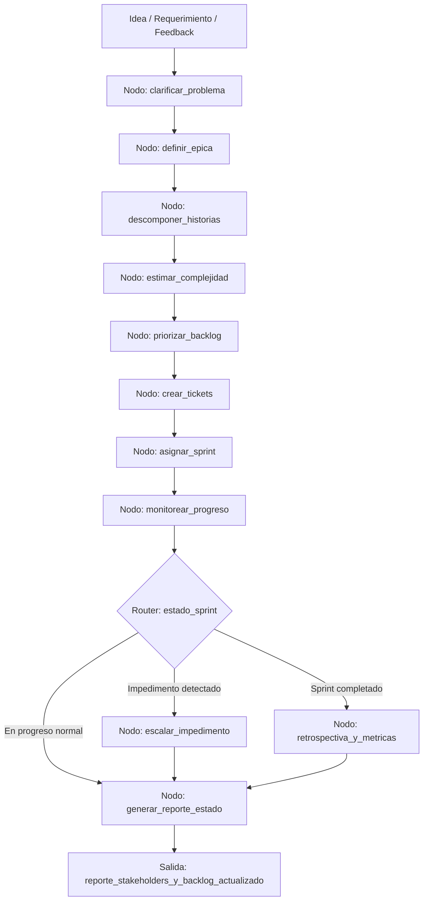

# Caso 24: Asistente de Product Manager

> [!NOTE]
> **Estado**: `SCAFFOLD` | **Versión repo**: 4.0.0 | **Tipo**: Agente con estado y memoria de proyecto

Automatiza el ciclo de gestión de producto desde la captura de ideas hasta el seguimiento de entregables: transforma ideas y requerimientos en épicas estructuradas, descompone épicas en historias de usuario y tareas técnicas, las registra en el sistema de gestión y hace seguimiento del progreso reportando impedimentos y riesgos. Permite que los PMs gestionen carteras de producto más grandes con mayor visibilidad y menor overhead administrativo.

---

## Objetivo de negocio

Los Product Managers dedican una fracción excesiva de su tiempo a trabajo administrativo: redactar historias de usuario, estimar, crear tickets, actualizar el backlog y preparar reportes de estado. Este agente recibe ideas crudas, requerimientos de negocio o feedback de usuarios, los estructura en épicas con criterios de aceptación claros, las descompone en historias de usuario con el formato correcto, estima complejidad relativa, crea los tickets en la herramienta de gestión del equipo, y hace seguimiento automático del progreso generando reportes de estado, alertas de bloqueos y actualizaciones para stakeholders.

## Flujo propuesto (LangGraph)

### Nodos principales

| Nodo | Descripción |
|---|---|
| `clarificar_problema` | Formula preguntas clarificadoras para entender el problema de negocio real |
| `definir_epica` | Estructura la épica con objetivo, criterios de aceptación y métricas de éxito |
| `descomponer_historias` | Divide la épica en historias de usuario con formato "Como… quiero… para…" |
| `estimar_complejidad` | Asigna puntos de historia o t-shirt sizes basándose en complejidad relativa |
| `priorizar_backlog` | Ordena el backlog aplicando criterios de valor de negocio e impacto técnico |
| `crear_tickets` | Crea los tickets en Jira/Linear/GitHub Projects con todos los campos necesarios |
| `asignar_sprint` | Distribuye las historias en el sprint según capacidad del equipo |
| `monitorear_progreso` | Consulta el estado de los tickets y detecta bloqueos o desvíos |
| `escalar_impedimento` | Notifica al PM y al equipo sobre bloqueos que amenazan el sprint |
| `retrospectiva_y_metricas` | Calcula velocidad, predictibilidad y genera el resumen del sprint |

## Stack técnico previsto

| Capa | Tecnología |
|---|---|
| Orquestación | LangGraph `StateGraph` |
| API | FastAPI + uvicorn |
| LLM | OpenAI GPT-4o-mini (modo LIVE) / respuestas mock (modo DEMO) |
| Gestión de proyectos | Jira API / Linear API / GitHub Projects API |
| Comunicación | Slack API / Microsoft Teams (notificaciones y reportes) |
| Almacenamiento | PostgreSQL (proyectos, épicas, historias, métricas) |

## Estado actual

Este caso es un **scaffold**: la estructura de la demo estática existe,
la implementación del backend con LangGraph está pendiente.

Para contribuir o elevar este caso, consulta [CONTRIBUTING.md](../../CONTRIBUTING.md).

---

> [!TIP]
> Ver los casos **09**, **10** y **13** como referencia de implementación industrial.
