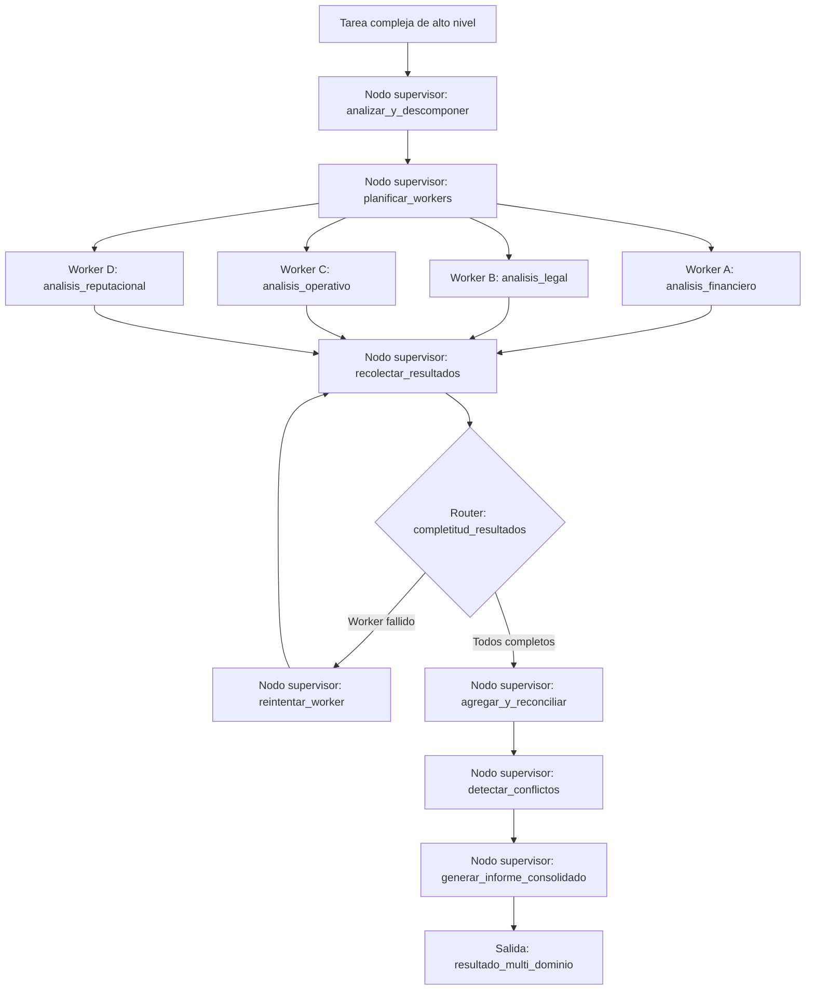

# Caso 25: Supervisor y Workers — Orquestación Multi-agente

> [!NOTE]
> **Estado**: `SCAFFOLD` | **Versión repo**: 3.9.0 | **Tipo**: Multi-agente con orquestación por subtareas paralelas

Implementa el patrón Supervisor-Workers de LangGraph para descomponer tareas complejas en subtareas independientes que se ejecutan en paralelo por agentes especializados, con un supervisor que coordina la distribución del trabajo, agrega los resultados parciales y gestiona los fallos individuales sin interrumpir el flujo global. Demuestra cómo escalar la capacidad de procesamiento mediante especialización y paralelismo en flujos de agentes enterprise.

---

## Objetivo de negocio

Los flujos empresariales complejos que requieren múltiples análisis independientes (due diligence, informes de riesgo multidimensional, auditorías por dominio) se vuelven un cuello de botella cuando se procesan secuencialmente. Este caso demuestra el patrón arquitectónico de Supervisor-Workers de LangGraph en un contexto enterprise: el supervisor recibe la tarea de alto nivel, la descompone en subtareas independientes, las despacha a workers especializados que operan en paralelo, agrega y reconcilia los resultados parciales, gestiona los reintentos ante fallos de workers individuales y produce el resultado consolidado, reduciendo drásticamente el tiempo total de procesamiento.

## Flujo propuesto (LangGraph)

### Nodos principales

| Nodo | Descripción |
|---|---|
| `supervisor: analizar_y_descomponer` | Comprende la tarea de alto nivel y la divide en subtareas independientes |
| `supervisor: planificar_workers` | Determina qué workers especializados se necesitan y con qué contexto |
| `worker: analisis_financiero` | Agente especializado en análisis de estados financieros y métricas económicas |
| `worker: analisis_legal` | Agente especializado en revisión de contratos, litigios y cumplimiento normativo |
| `worker: analisis_operativo` | Agente especializado en procesos, operaciones y cadena de suministro |
| `worker: analisis_reputacional` | Agente especializado en análisis de medios, redes sociales y reputación |
| `supervisor: recolectar_resultados` | Agrega los resultados de los workers conforme van completando |
| `supervisor: reintentar_worker` | Reintenta o reemplaza workers que fallaron sin detener los demás |
| `supervisor: agregar_y_reconciliar` | Combina los análisis parciales en una visión coherente |
| `supervisor: detectar_conflictos` | Identifica y resuelve contradicciones entre los resultados de distintos workers |
| `supervisor: generar_informe_consolidado` | Produce el informe final multi-dominio con las conclusiones integradas |

## Stack técnico previsto

| Capa | Tecnología |
|---|---|
| Orquestación | LangGraph `StateGraph` con nodos paralelos (`Send` API) |
| API | FastAPI + uvicorn |
| LLM | OpenAI GPT-4o-mini (modo LIVE) / respuestas mock (modo DEMO) |
| Paralelismo | LangGraph `Send` para despacho paralelo de workers |
| Gestión de fallos | Reintentos configurables por worker con back-off exponencial |
| Almacenamiento | PostgreSQL (tareas, resultados parciales, informe consolidado) |

## Estado actual

Este caso es un **scaffold**: la estructura de la demo estática existe,
la implementación del backend con LangGraph está pendiente.

Para contribuir o elevar este caso, consulta [CONTRIBUTING.md](../../CONTRIBUTING.md).

---

> [!TIP]
> Ver los casos **09**, **10** y **13** como referencia de implementación industrial.
