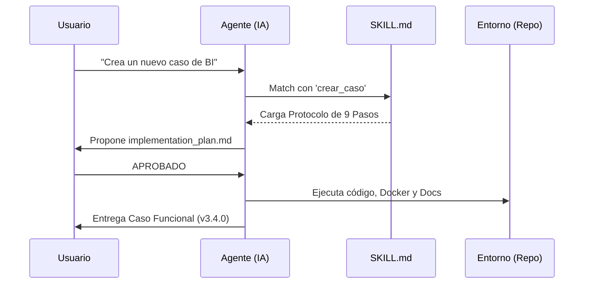

# 🤖 Infraestructura de Agentes y Skills (Industrial SDK)

Este repositorio no es solo un conjunto de ejemplos; es un **Ecosistema Agent-Aware**. Utiliza la carpeta `.agents/` como un "SDK de habilidades" para que la IA (Antigravity) opere el repositorio con la precisión de un ingeniero senior.

---

## 🛰️ Ciclo de Vida del Agente

---

## 📊 Matriz de Capacidades (Skills Catalog)

| Skill | Trigger Típico | Impacto Industrial | Complejidad |
| :--- | :--- | :--- | :---: |
| **Crear Caso** | "necesito un caso de...", "/crear_caso" | Expansión modular sin regresividad. | 🔴 Alta |
| **Actualizar Doc** | "sube esto", "actualiza versión" | Consistencia 100% en portal y wikis. | 🟡 Media |

---

## 🔍 Deep-Dive: Protocolos de Misión Crítica

### 🏗️ Skill: Crear Caso LangGraph
Este skill evita la "deuda técnica" al obligar a la IA a seguir un rigor arquitectónico:
1. **Aislamiento**: Cada caso vive en su propio puerto (80XX) y contenedor.
2. **Pydantic**: Uso obligatorio de esquemas de datos para el estado del grafo.
3. **Modo Híbrido**: El código debe funcionar con `MOCK_DATA` si no hay API Keys.
4. **Registro**: Autoinserción en el `index.html` del portal.

### 🛡️ Skill: Actualizar Documentación
Diseñado para resolver el problema de los "Mismatches de Versión":
- **Surgical Match**: Estrategia de búsqueda por bloques para headers con emojis.
- **Cascada de Verdad**: Primero el Portal, luego el CLI, finalmente las Guías.
- **Auditoría Grep**: Obligación de reportar 0 coincidencias de versiones antiguas.

---

## 🛠️ Extensibilidad: Crea tu propia Habilidad

Cualquier proceso repetitivo (ej: "Optimizar todos los Dockerfiles") puede convertirse en un Skill:

1. **Localización**: Crea `/.agents/skills/[nombre]/SKILL.md`.
2. **Contrato**: Define el YAML con nombre y descripción.
3. **Paso a Paso**: Escribe el "Algoritmo Humano" que la IA debe ejecutar.
4. **Salvaguardas**: Incluye qué archivos **NO** debe tocar la IA bajo ninguna circunstancia.

---

> [!IMPORTANT]
> Los Skills son la diferencia entre una IA que "genera código" y una IA que **"construye sistemas"**. En este repositorio, Antigravity es un constructor.
