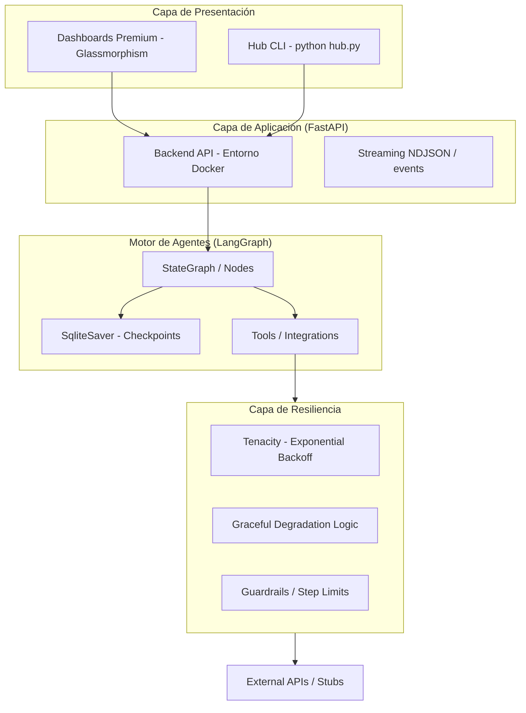
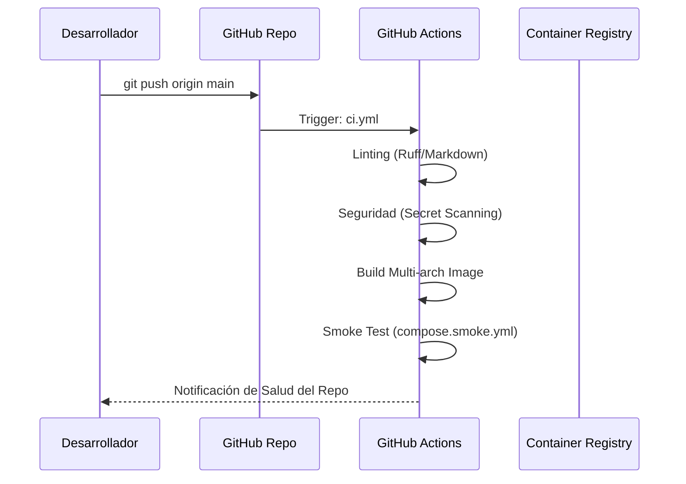

# 🏗️ Arquitectura del Sistema (ARCHITECTURE)

Este documento describe la estructura técnica de **LangGraph Realworld**, centrándose en la orquestación de agentes con estado y el motor de resiliencia del Caso 09.

---

## 🛰️ Visión General

El proyecto está diseñado como un **Monorepo de Casos de Uso**, donde cada "caso" es un ecosistema autocontenido que utiliza un núcleo común de patrones agenticos.

---

## 🔄 Flujo de Ejecución (Estandarizado)

El Caso 09 (Screening + Agenda) actúa como el **modelo de referencia** para el flujo de datos:

1.  **Ingesta**: Carga de datos de entrada (JSON/PDF) y persistencia en el `State`.
2.  **Iteración Resiliente**: Cada nodo del grafo ejecuta llamadas a herramientas envueltas en decoradores de reintento (`tenacity`).
3.  **Manejo de Fallos**: Si una herramienta falla definitivamente, el nodo captura la excepción y emite un evento `error_node` al stream, permitiendo que el flujo continúe (Degradación Graciosa).
4.  **Checkpointing**: Cada paso se guarda en SQLite, permitiendo reanudar el flujo en caso de interrupción del servidor.

---

## 🛠️ Estándares de Implementación

- **LangGraph**: Uso estricto de `StateGraph` con `Annotated` para reducers de estado (ej: `operator.add` para logs de eventos).
- **FastAPI**: Endpoints asíncronos con soporte para `StreamingResponse` para feedback en tiempo real.
- **Docker**: Orquestación multietapa para separar el build de la ejecución, minimizando el tamaño de la imagen.
- **Observabilidad**: Logs en formato JSON estructurado listos para ser ingeridos por pilas ELK o CloudWatch.

---

## ⚙️ Integración Continua (CI/CD)

---

## 📚 Documentos Relacionados

- 📚 [Specs Técnicas](TECHNICAL_SPECS.md): Detalle del stack y protocolos.
- 📋 [Requisitos](REQUIREMENTS.md): Hardware y software necesario.
- 🛡️ [Seguridad](../SECURITY.md): Política de protección de datos y secretos.
