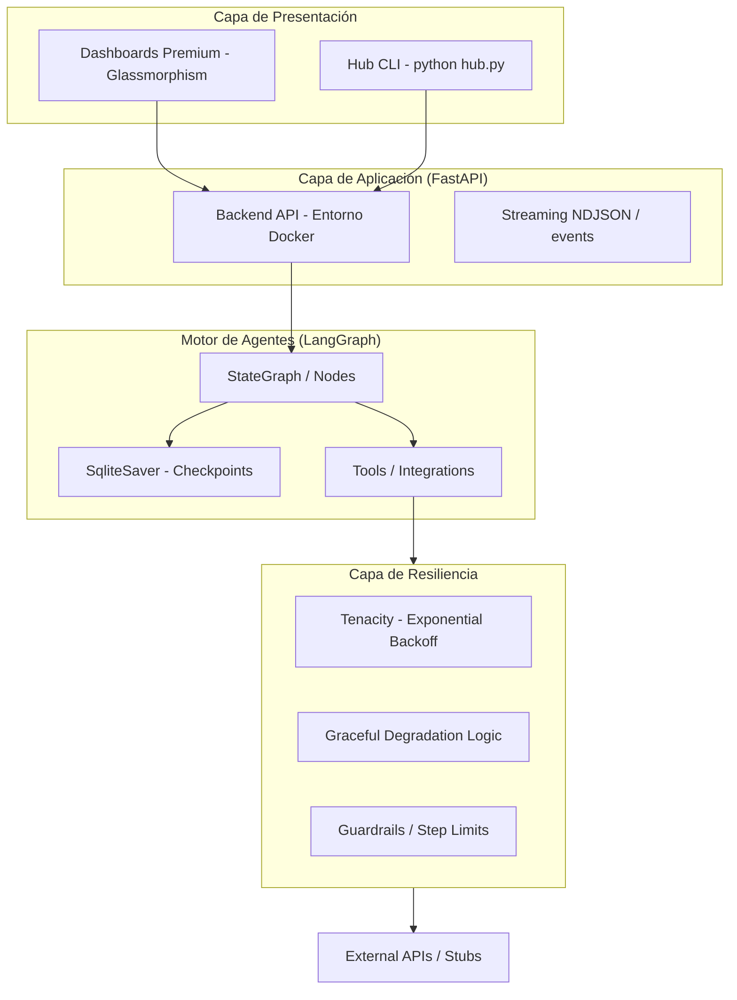
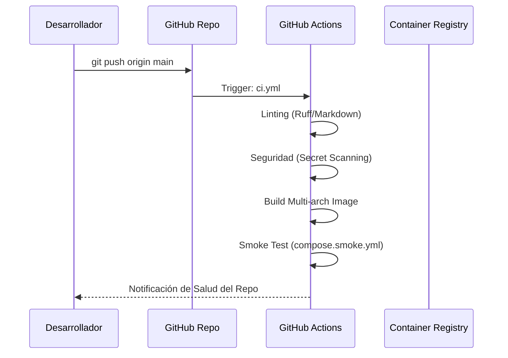

# 🏗️ Arquitectura del Sistema (ARCHITECTURE)

Este documento describe la estructura técnica de **LangGraph Realworld**, centrándose en la orquestación de agentes con estado y el motor de resiliencia del Caso 09.

---

## 🛰️ Visión General

El proyecto está diseñado como un **Monorepo de Casos de Uso**, donde cada "caso" es un ecosistema autocontenido que utiliza un núcleo común de patrones agenticos.

---

## 🛡️ Resiliencia y Persistencia de Estado (Residencia)

Uno de los pilares de este entorno es su capacidad para resolver problemas de **residencia** (persistencia de larga duración) y recuperación ante fallos.

### 1. Persistencia con LangGraph Checkpoints
Utilizamos `SqliteSaver` para registrar el estado completo del grafo tras la ejecución de cada nodo. 
- **Recuperación**: Si el servidor se apaga o el contenedor se reinicia, el agente puede retomar la tarea exactamente donde la dejó usando su `thread_id`.
- **Auditoría**: Cada cambio de estado queda registrado, permitiendo un "viaje en el tiempo" por las decisiones del agente.

### 2. Estrategia de Reintento con Tenacity
Todas las integraciones externas (APIs de OpenAI, Google Calendar, etc.) están protegidas por políticas de reintento:
- **Exponential Backoff**: Los reintentos se espacian matemáticamente para evitar saturar servicios externos.
- **Circuit Breaker**: Si un servicio falla repetidamente, el agente entra en un estado de degradación graciosa en lugar de colapsar.

---

## 🛠️ Estándares de Implementación

- **LangGraph**: Uso estricto de `StateGraph` con `Annotated` para reducers de estado (ej: `operator.add` para logs de eventos).
- **FastAPI**: Endpoints asíncronos con soporte para `StreamingResponse` para feedback en tiempo real.
- **Docker**: Orquestación multietapa para separar el build de la ejecución, minimizando el tamaño de la imagen.
- **Observabilidad**: Logs en formato JSON estructurado listos para ser ingeridos por pilas ELK o CloudWatch.

---

## ⚙️ Integración Continua (CI/CD)

---

## 📚 Documentos Relacionados

- 📚 [Specs Técnicas](TECHNICAL_SPECS.md): Detalle del stack y protocolos.
- 📋 [Requisitos](REQUIREMENTS.md): Hardware y software necesario.
- 🛡️ [Seguridad](../SECURITY.md): Política de protección de datos y secretos.
