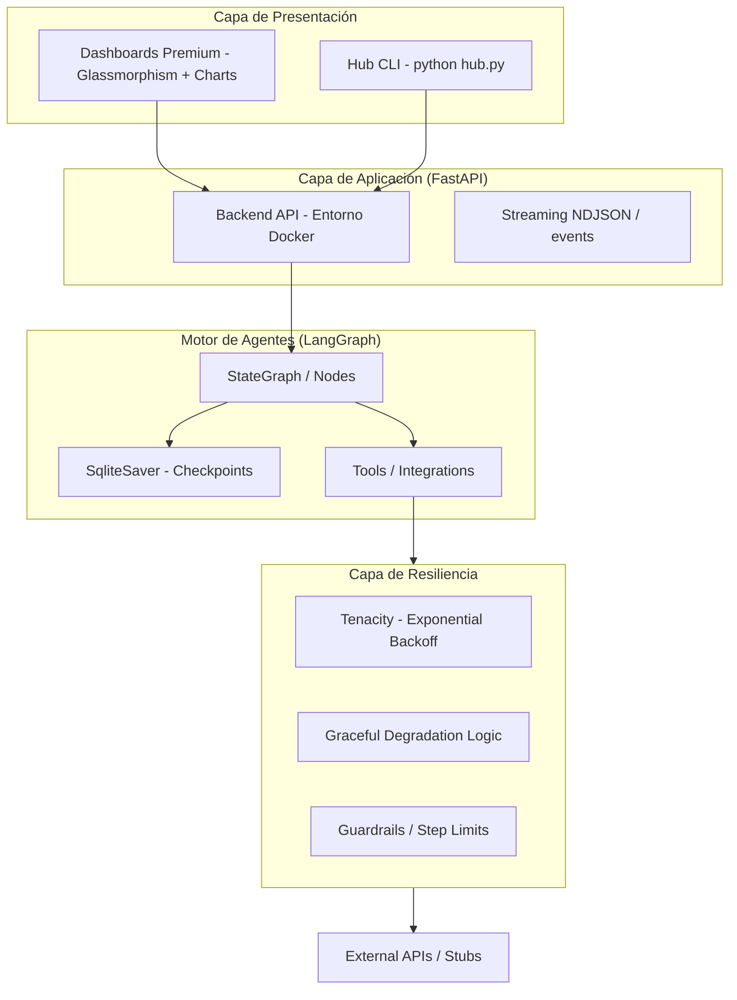
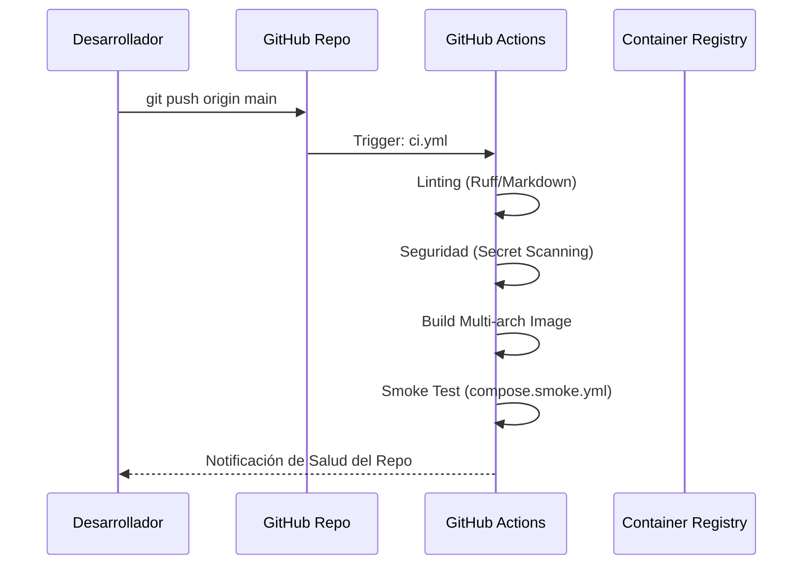

# 🏗️ Arquitectura del Sistema

> [!NOTE]
> **Versión**: 3.4.0 | **Estado**: Industrial | **Audiencia**: Arquitectos, DevOps, Seniors

Este documento describe la estructura técnica de **LangGraph Realworld**, centrándose en la orquestación de agentes con estado y el motor de resiliencia del Caso 09.

---

## 🛰️ Visión General

El proyecto está diseñado como un **Monorepo de Casos de Uso**, donde cada "caso" es un ecosistema autocontenido que sigue un ciclo de vida de cuatro etapas: **Lectura, Análisis, Acción y Notificación**.

### 🔄 El Ciclo de Vida del Agente (4 Fases)

| Fase | Nombre | Responsabilidad Técnica | Nodo LangGraph |
| :--- | :--- | :--- | :--- |
| **Fase 1** | **Lectura** | Ingesta de datos (CVs/Jobs) y normalización. | `load_inputs` |
| **Fase 2** | **Análisis** | Evaluación cognitiva y filtrado (Scoring). | `score_one` / `build_shortlist` |
| **Fase 3** | **Acción** | Ejecución de tareas de infraestructura (Agenda). | `schedule_interviews` |
| **Fase 4** | **Notificación** | Comunicación final con el cliente (Email/WA). | `notify_candidates` |
| **Referencia** | **Caso 10** | **Onboarding de Empleados**: Flujo ramificado por rol (RBAC) y aprovisionamiento. | `classify_role` / `provision_tools` |
| **Referencia** | **Caso 13** | **Analista BI**: SQL Agent con visualización dinámica y dashboard reactivo. | `sql_generator` / `sql_executor` |

```mermaid
graph TD
  subgraph "Capa de Presentación"
    UI[Dashboards Premium - Glassmorphism + Charts]
    CLI[Hub CLI - python hub.py]
  end

  subgraph "Capa de Aplicación (FastAPI)"
    API[Backend API - Entorno Docker]
    Stream[Streaming NDJSON / events]
  end

  subgraph "Motor de Agentes (LangGraph)"
    LG[StateGraph / Nodes]
    Check[SqliteSaver - Checkpoints]
    Tools[Tools / Integrations]
  end

  subgraph Resilience ["Capa de Resiliencia"]
    Ten[Tenacity - Exponential Backoff]
    Deg[Graceful Degradation Logic]
    Guard[Guardrails / Step Limits]
  end

  UI --> API
  CLI --> API
  API --> LG
  LG --> Check
  LG --> Tools
  Tools --> Resilience
  Resilience --> Integrations[External APIs / Stubs]
```

---

## 🛡️ Resiliencia y Persistencia de Estado (Residencia)

Uno de los pilares de este entorno es su capacidad para resolver problemas de **residencia** (persistencia de larga duración) y recuperación ante fallos.

### 1. Persistencia con LangGraph Checkpoints
Utilizamos `SqliteSaver` para registrar el estado completo del grafo tras la ejecución de cada nodo. 
- **Recuperación**: Si el servidor se apaga o el contenedor se reinicia, el agente puede retomar la tarea exactamente donde la dejó usando su `thread_id`.
- **Auditoría**: Cada cambio de estado queda registrado, permitiendo un "viaje en el tiempo" por las decisiones del agente.

### 2. Estrategia de Reintento con Tenacity
Todas las integraciones externas (APIs de OpenAI, Google Calendar, etc.) están protegidas por políticas de reintento:
- **Exponential Backoff**: Los reintentos se espacian matemáticamente para evitar saturar servicios externos.
- **Circuit Breaker**: Si un servicio falla repetidamente, el agente entra en un estado de degradación graciosa en lugar de colapsar.

- **Circuit Breaker**: Si un servicio falla repetidamente, el agente entra en un estado de degradación graciosa en lugar de colapsar.

---

## 🧠 Arquitectura Híbrida (Hybrid AI Aware)

A diferencia de prototipos estáticos, esta arquitectura es "consciente" de su entorno de ejecución:

1. **Detección Dinámica**: El sistema escanea la presencia de `OPENAI_API_KEY` en el entorno local (`.env`).
2. **Switch de Lógica**:
   - **Modo Demo (Determinista)**: Si no hay llave, los nodos de integración inyectan datos simulados pero estructuralmente válidos para pruebas SRE y de flujo.
   - **Modo Real (Cognitivo)**: Si hay llave, se activa el motor de razonamiento LLM, permitiendo juicios semánticos y generación de contenido personalizado.
3. **Puntos de Decisión**: Toda la lógica híbrida reside en `backend/src/integrations.py`, manteniendo el grafo (`graph.py`) puro e independiente del proveedor.

---

## 🏗️ Compatibilidad: Docker vs Python

Este sistema está diseñado bajo una arquitectura de **"Contenedor Primero"**, pero mantiene una alta flexibilidad para el desarrollo local.

- **Modo Docker (Producción/Staging)**: Es el estándar oficial. Garantiza que el software y hardware (residencia de estado en volúmenes, aislamiento de red) funcionen de forma idéntica en cualquier servidor. El fallo de Docker en demostraciones controladas suele deberse a la ausencia del daemon local, no a una limitación del código.
- **Modo Python (Desarrollo/Debug)**: Es una vía rápida para probar la lógica de LangGraph. Permite ejecutar el backend directamente (`uvicorn`) para una iteración más ágil sin el ciclo de build de imágenes.

---

## 🛠️ Estándares de Implementación

- **LangGraph**: Uso estricto de `StateGraph` con `Annotated` para reducers de estado (ej: `operator.add` para logs de eventos).
- **FastAPI**: Endpoints asíncronos con soporte para `StreamingResponse` para feedback en tiempo real.
- **Docker**: Orquestación multietapa para separar el build de la ejecución, minimizando el tamaño de la imagen.
- **Observabilidad**: Logs en formato JSON estructurado listos para ser ingeridos por pilas ELK o CloudWatch.

---

## ⚙️ Integración Continua (CI/CD)

```mermaid
sequenceDiagram
    participant Dev as Desarrollador
    participant GH as GitHub Repo
    participant GA as GitHub Actions
    participant Docker as Container Registry

    Dev->>GH: git push origin main
    GH->>GA: Trigger: ci.yml
    GA->>GA: Linting (Ruff/Markdown)
    GA->>GA: Seguridad (Secret Scanning)
    GA->>GA: Build Multi-arch Image
    GA->>GA: Smoke Test (compose.smoke.yml)
    GA-->>Dev: Notificación de Salud del Repo
```

---

## 🛡️ Estándares Industriales (v3.4)

A partir de la versión 3.4, el repositorio consolida el estándar **Industrial-Grade** para los Casos 09, 10 y 13:

1.  **Validación con Pydantic**: El estado del grafo ya no usa `TypedDict` genéricos, sino modelos de **Pydantic** que garantizan tipos y restricciones en runtime.
2.  **Identificadores de Rastreo (Trace IDs)**: Cada ejecución genera un `trace_id` único inyectado en los logs estructurados, permitiendo el rastreo de errores en flujos asíncronos complejos.
3.  **Observabilidad Distribuida**: Los logs están preparados para ser ingeridos por sistemas como **Datadog**, **ELK** o **OpenTelemetry**.

---

---

## 💎 La Tríada Industrial (Casos de Referencia)

Para una auditoría técnica profunda, se recomienda analizar los siguientes casos que componen el núcleo de "Misión Crítica" del repositorio:

### 1. Caso 09: RRHH Screening & Agenda (Resiliencia Extrema)
- **Desafío**: Manejo de hilos de larga duración y fallos en APIs de terceros.
- **Solución**: Orquestación de 5+ nodos con **SqliteSaver** para persistencia y **Tenacity** para reintentos exponenciales. Implementa un motor híbrido que detecta la ausencia de API Keys y conmuta a un modo heurístico determinista sin romper el flujo.

### 2. Caso 10: Onboarding de Empleados (Complejidad de Flujo)
- **Desafío**: Procesos ramificados basados en roles (RBAC) y validación de checklists dinámicos.
- **Solución**: Grafo cíclico con estados persistentes y sistema de notificaciones multicanal (Email/WhatsApp) con lógica de degradación graciosa (si falla un canal, el otro continúa).

### 3. Caso 13: BI Data Analyst (Integración de Datos y UX)
- **Desafío**: Conversión de lenguaje natural a SQL complejo y visualización reactiva.
- **Solución**: Agente SQL con validación de esquemas en runtime, generación de gráficos dinámicos vía **Chart.js** y un dashboard premium con streaming NDJSON que minimiza la latencia percibida.

---

## 🧭 Navegación
- [⬅️ Volver al README](../README.md)
- [📋 Requisitos](REQUIREMENTS.md)
- [🛠️ Especificaciones Técnicas](TECHNICAL_SPECS.md)
- [🛡️ Seguridad](../SECURITY.md)
